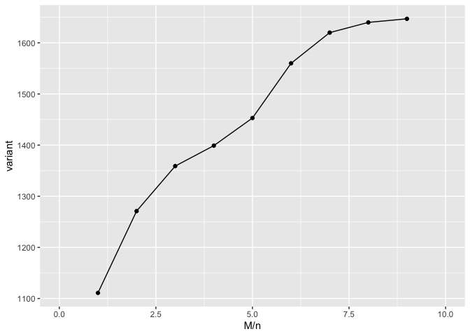

Stacks_analysis
================
Bronwyn
2023-04-17

``` r
library(tidyverse)
library(dplyr)
library(knitr)
```

# Download data

``` bash
mkdir plant
cd plant
wget -q -c -O 13881_3270_187183_HTKYYBGXN_SK_CGATGT_R1.fastq.gz "http://cbsuapps.biohpc.cornell.edu/Sequencing/showseqfile.aspx?mode=http&cntrl=529380291&refid=1015923"
```

# Check quality of data

First create a directory in the workdir of the machine that I reserved
and copy the data from the home directory to the working directory

``` bash
mkdir /workdir/bgb27
cp /home/bgb27/plant/13881_3270_187183_HTKYYBGXN_SK_CGATGT_R1.fastq.gz /workdir/bgb27
```

We will use FastQC
(<https://www.bioinformatics.babraham.ac.uk/projects/fastqc/>) to check
the quality of the data. Check the website above for an overview of the
output and what it means.

``` bash
fastqc 13881_3270_187183_HTKYYBGXN_SK_CGATGT_R1.fastq.gz
```

The .html file is stored in the `results` folder.

    Total Sequences 7668960 
    Sequences flagged as poor quality 0 
    Sequence length 68 
    %GC 44

Overall quality looks good.

# Trim and filter the data

``` bash
#first unzip the data
gunzip 13881_3270_187183_HTKYYBGXN_SK_CGATGT_R1.fastq.gz

##Trim 3' end of all reads to a length of 67 bp (FASTX Trimmer). Just removed 1 base. 
 
fastx_trimmer -f 1 -l 67 -Q33 -i 13881_3270_187183_HTKYYBGXN_SK_CGATGT_R1.fastq -o plant_t.fastq & 

##Eliminate sequences where there is a sinlge Phred score below 10 and then sequences where 5% of reads have a with Phred quality scores below 20 
#100% of the bases in a sequence must have a score of higher than 10 for the sequence to be kept 
fastq_quality_filter -q 10 -p 100 -Q33 -i plant_t.fastq -o plant_tf.fastq &

#95% of the bases in a sequence must have a score of more than 20 for the sequence to be kept 
fastq_quality_filter -q 20 -p 95 -Q33 -i plant_tf.fastq -o plant_tff.fastq & 
```

# Demultiplex data

Using the process radtags function from STACKS. Information about
process_radtags:
<https://catchenlab.life.illinois.edu/stacks/comp/process_radtags.php>

On the biohpc cluster first run the following lines to add STACKS 2 to
the path.

``` bash
# First specify the library path and path to stacks-2.59:

export LD_LIBRARY_PATH=/usr/local/gcc-7.3.0/lib64:/usr/local/gcc-7.3.0/lib

export PATH=/programs/stacks-2.59/bin:$PATH
```

Create an index file for the samples: tab delimited text file with
barcode and adapter sequence. named `plant_index.txt`.

    ATCACG  1
    CGATGT  2
    TTAGGC  3
    TGACCA  4
    ACAGTG  5
    GCCAAT  6
    CTTGA   7
    TCACC   8
    CTAGC   9
    ACAAA   10
    AGCCC   11
    GTATT   12
    CTGTA   13
    AGCAT   14
    ACTAT   15

Run process radtags to demultiplex data

``` bash
mkdir plantraw
mv ./plant_tff.fastq ./plantraw/plant_tff.fastq
mkdir demultfilter
nohup process_radtags -p ./plantraw -b ./plant_index.txt -o ./demultfilter -e pstI -c -q -E phred33 --inline_null -i fastq --adapter_1 GATCGGAAGAGCACACGTCTGAACTCCAGTCACCGATGTATCTCGTATGCCGTCTTCTGCTTG --adapter_mm 1 --filter_illumina &
```

Look at how many reads are in each sample. This information can be found
in the process_radtags log files, but instead of having to open each of
these I just run the wordcount function in linux

``` bash
wc -l *.fq
```

number of reads per sample ranges from 101,938 to 487,063 with a total
number of reads = 4,089,412

    5435366 total sequences
          0 failed Illumina filtered reads (0.0%)
      11425 reads contained adapter sequence (0.2%)
    1218567 barcode not found drops (22.4%)
          0 low quality read drops (0.0%)
     115962 RAD cutsite not found drops (2.1%)
    4089412 retained reads (75.2%)

**Note: there are 22% of the reads where the barcode was not found???**

# Align reads using Denovo pipeline

- information on STACKS can be found here:
  <http://catchenlab.life.illinois.edu/stacks/>

- explanation of how the denovo pipeline works to form stacks and loci
  and what the parameters mean:
  <http://catchenlab.life.illinois.edu/stacks/param_tut.php>

- see this paper for description of the pipeline we will use: Rochette,
  N., Catchen, J. Deriving genotypes from RAD-seq short-read data using
  Stacks. Nat Protoc 12, 2640–2659 (2017).
  <https://doi-org.proxy.library.cornell.edu/10.1038/nprot.2017.123>

Usually we would run just a subset of the samples through this script,
but since we only have 15 samples we will run this on all the samples.

We will run denovo assembly several times to optimize parameters. Fix M
= n, 1-9 (= the number of mismatches between 2 alleles in either a
heterozygote (M) or in population (n)) and keep m = 3 (stack
depth/number of identical reads required to initiate a new allele)

First, create a plant_popmap.txt file: This file should be a tab
delimited file listing your sample names and the population they belong
to (usually just “1”).

    1   1
    2   1
    3   1
    4   1
    5   1
    6   1
    7   1
    8   1
    9   1
    10  1
    11  1
    12  1
    13  1
    14  1
    15  1

Then prepare a script to run the samples through the denovo wrapper
using different M and n parameters. (denovo.sh)

``` bash
##Run 1
mkdir denovo_run1
denovo_map.pl --samples /workdir/bgb27/demultfilter --popmap /workdir/bgb27/plant_popmap.txt -m 3 -M 1 -n 1 -T 24 -o /workdir/bgb27/denovo_run1
populations -P /workdir/bgb27/denovo_run1 -M /workdir/bgb27/plant_popmap.txt -t 24 -r 0.8

# note -T or -t = # of threads/CPUs to use
# for populations: -P = path to directory containing the Stacks files (output from the denovo run)
#                  -M = path to the population map (in thsi case same as used in the denovo trial)
#                  -r = minimum percentage of individuals in a population req to have a locus to process the locus

##Run 2
mkdir denovo_run2
denovo_map.pl --samples /workdir/bgb27/demultfilter --popmap /workdir/bgb27/plant_popmap.txt -m 3 -M 2 -n 2 -T 24 -o /workdir/bgb27/denovo_run2
populations -P /workdir/bgb27/denovo_run2 -M /workdir/bgb27/plant_popmap.txt -t 24 -r 0.8

##Run 3
mkdir denovo_run3
denovo_map.pl --samples /workdir/bgb27/demultfilter --popmap /workdir/bgb27/plant_popmap.txt -m 3 -M 3 -n 3 -T 24 -o /workdir/bgb27/denovo_run3
populations -P /workdir/bgb27/denovo_run3 -M /workdir/bgb27/plant_popmap.txt -t 24 -r 0.8

##Run 4
mkdir denovo_run4
denovo_map.pl --samples /workdir/bgb27/demultfilter --popmap /workdir/bgb27/plant_popmap.txt -m 3 -M 4 -n 4 -T 24 -o /workdir/bgb27/denovo_run4
populations -P /workdir/bgb27/denovo_run4 -M /workdir/bgb27/plant_popmap.txt -t 24 -r 0.8

##Run 5
mkdir denovo_run5
denovo_map.pl --samples /workdir/bgb27/demultfilter --popmap /workdir/bgb27/plant_popmap.txt -m 3 -M 5 -n 5 -T 24 -o /workdir/bgb27/denovo_run5
populations -P /workdir/bgb27/denovo_run5 -M /workdir/bgb27/plant_popmap.txt -t 24 -r 0.8

##Run 6
mkdir denovo_run6
denovo_map.pl --samples /workdir/bgb27/demultfilter --popmap /workdir/bgb27/plant_popmap.txt -m 3 -M 6 -n 6 -T 24 -o /workdir/bgb27/denovo_run6
populations -P /workdir/bgb27/denovo_run6 -M /workdir/bgb27/plant_popmap.txt -t 24 -r 0.8

##Run 7
mkdir denovo_run7
denovo_map.pl --samples /workdir/bgb27/demultfilter --popmap /workdir/bgb27/plant_popmap.txt -m 3 -M 7 -n 7 -T 24 -o /workdir/bgb27/denovo_run7
populations -P /workdir/bgb27/denovo_run7 -M /workdir/bgb27/plant_popmap.txt -t 24 -r 0.8

##Run 8
mkdir denovo_run8
denovo_map.pl --samples /workdir/bgb27/demultfilter --popmap /workdir/bgb27/plant_popmap.txt -m 3 -M 8 -n 8 -T 24 -o /workdir/bgb27/denovo_run8
populations -P /workdir/bgb27/denovo_run8 -M /workdir/bgb27/plant_popmap.txt -t 24 -r 0.8

##Run 9
mkdir denovo_run9
denovo_map.pl --samples /workdir/bgb27/demultfilter --popmap /workdir/bgb27/plant_popmap.txt -m 3 -M 9 -n 9 -T 24 -o /workdir/bgb27/denovo_run9
populations -P /workdir/bgb27/denovo_run9 -M /workdir/bgb27/plant_popmap.txt -t 24 -r 0.8
```

run the script

``` bash
nohup bash denovo.sh &
```

``` r
read_tsv("./results/denovo_parameter_testing", col_types = "iiiiii") %>% 
  kable()
```

| M/n | loci |    all | variant | one_SNP_per_locus |
|----:|-----:|-------:|--------:|------------------:|
|   1 | 5812 | 354719 |    1111 |               739 |
|   2 | 5720 | 349109 |    1271 |               781 |
|   3 | 5641 | 344293 |    1359 |               797 |
|   4 | 5601 | 341858 |    1399 |               795 |
|   5 | 5594 | 341435 |    1453 |               799 |
|   6 | 5589 | 341130 |    1560 |               816 |
|   7 | 5580 | 340584 |    1620 |               821 |
|   8 | 5580 | 340583 |    1640 |               829 |
|   9 | 5585 | 340894 |    1647 |               828 |

plot the number of variants for each M/n parameter:

``` r
read_tsv("./results/denovo_parameter_testing", col_types = "iiiiii") %>% 
ggplot(mapping = aes(x = `M/n`, y = `variant`)) +
  geom_point() +
  geom_line() +
  xlim (0,10)
```

<!-- -->

Based on this plot, I will select the M/n value of 8 and take a look at
that. This time re-run populations with a minium minor allele frequency
filter of 0.05 and only output one SNP (the first one) from each loci
(see number of SNPs when these filters are applied to all denovo runs
added in the table above). Also I’ll output the data in some other
formats (structure, vcf)

``` bash
populations -P /workdir/bgb27/denovo_run8 -M /workdir/bgb27/plant_popmap.txt -r 0.80 -p 1 -t 15 --min-maf 0.05 --write-single-snp --structure --vcf
```

copy the populations.structure file to my computer and take a look at
the data

``` r
read_tsv("./results/populations.structure", skip = 1) %>% 
  rename(sample_ID = ...1, population = ...2) %>% 
  kable()
```

| sample_ID | population | 3_29 | 5_59 | 10_22 | 13_19 | 14_7 | 15_53 | 17_14 | 19_59 | 20_47 | 23_23 | 30_10 | 31_30 | 32_12 | 35_21 | 41_46 | 42_14 | 43_44 | 44_17 | 45_53 | 49_28 | 50_19 | 52_56 | 53_15 | 62_14 | 63_32 | 66_6 | 71_7 | 80_9 | 86_12 | 87_30 | 88_26 | 89_24 | 92_22 | 95_55 | 96_17 | 99_10 | 100_10 | 102_40 | 105_55 | 107_7 | 109_53 | 113_9 | 116_57 | 118_10 | 121_10 | 122_59 | 124_8 | 125_6 | 128_54 | 132_56 | 134_40 | 135_51 | 136_36 | 146_21 | 149_13 | 150_5 | 151_58 | 153_13 | 155_40 | 156_53 | 160_54 | 166_54 | 170_52 | 178_34 | 179_16 | 181_6 | 187_56 | 192_28 | 199_41 | 203_20 | 207_55 | 209_10 | 211_42 | 214_28 | 217_59 | 219_58 | 220_53 | 221_9 | 224_12 | 227_54 | 229_29 | 230_10 | 232_59 | 233_59 | 234_53 | 242_7 | 243_9 | 244_33 | 245_19 | 247_10 | 249_38 | 253_38 | 257_6 | 259_14 | 260_6 | 262_59 | 264_55 | 266_5 | 270_36 | 272_51 | 274_56 | 278_9 | 280_59 | 281_49 | 282_7 | 283_53 | 285_37 | 286_36 | 288_26 | 289_56 | 293_11 | 294_58 | 295_21 | 299_7 | 304_57 | 305_28 | 311_54 | 315_59 | 318_6 | 321_25 | 322_5 | 325_22 | 327_45 | 328_58 | 333_57 | 338_24 | 341_9 | 343_7 | 344_8 | 345_54 | 346_26 | 347_23 | 348_24 | 350_16 | 354_55 | 355_58 | 356_10 | 361_11 | 364_16 | 365_8 | 367_58 | 368_58 | 374_20 | 375_25 | 378_21 | 379_19 | 380_55 | 384_56 | 386_20 | 388_39 | 389_16 | 391_34 | 393_7 | 399_6 | 402_25 | 409_56 | 411_58 | 428_15 | 432_48 | 475_46 | 477_8 | 487_6 | 493_41 | 497_39 | 537_11 | 548_18 | 550_15 | 556_7 | 558_5 | 560_13 | 575_24 | 587_24 | 600_42 | 605_22 | 629_9 | 630_50 | 633_16 | 638_25 | 652_35 | 654_28 | 656_31 | 676_20 | 680_14 | 681_55 | 703_27 | 705_33 | 720_6 | 753_35 | 755_24 | 762_8 | 764_46 | 770_23 | 790_24 | 806_37 | 829_47 | 875_48 | 914_13 | 951_52 | 955_14 | 989_19 | 1040_29 | 1048_36 | 1057_9 | 1060_16 | 1085_27 | 1089_5 | 1094_22 | 1095_46 | 1113_6 | 1121_23 | 1125_52 | 1127_14 | 1145_14 | 1151_25 | 1179_17 | 1215_27 | 1216_44 | 1231_51 | 1239_27 | 1240_43 | 1247_46 | 1262_40 | 1274_34 | 1279_48 | 1295_6 | 1336_54 | 1343_11 | 1344_24 | 1354_56 | 1371_14 | 1403_10 | 1406_14 | 1408_13 | 1416_7 | 1430_25 | 1431_43 | 1449_10 | 1456_32 | 1458_33 | 1459_8 | 1465_36 | 1496_48 | 1533_51 | 1539_26 | 1546_16 | 1552_50 | 1558_19 | 1560_25 | 1572_31 | 1581_46 | 1634_46 | 1638_9 | 1662_15 | 1680_32 | 1698_30 | 1765_6 | 1784_24 | 1800_29 | 1817_58 | 1833_32 | 1841_48 | 1969_24 | 1981_51 | 2048_12 | 2063_49 | 2085_11 | 2086_18 | 2090_59 | 2108_21 | 2114_28 | 2131_12 | 2142_41 | 2192_28 | 2198_55 | 2205_19 | 2210_24 | 2211_36 | 2214_9 | 2220_47 | 2227_37 | 2228_14 | 2236_14 | 2237_52 | 2247_11 | 2258_41 | 2268_57 | 2285_8 | 2289_12 | 2290_14 | 2309_59 | 2323_45 | 2325_49 | 2333_41 | 2334_8 | 2363_44 | 2395_8 | 2460_32 | 2600_21 | 2618_38 | 2620_31 | 2632_20 | 2654_10 | 2657_37 | 2662_31 | 2666_50 | 2669_28 | 2698_29 | 2699_38 | 2725_19 | 2726_34 | 2732_11 | 2739_10 | 2753_30 | 2760_20 | 2773_7 | 2787_14 | 2788_45 | 2800_49 | 2821_33 | 2825_47 | 2826_50 | 2833_5 | 2858_47 | 2862_12 | 2870_41 | 2894_14 | 2903_59 | 2904_43 | 2911_22 | 2929_22 | 2937_7 | 2938_38 | 2968_25 | 2978_23 | 2980_39 | 2987_46 | 2994_7 | 3000_15 | 3001_58 | 3008_54 | 3024_57 | 3029_14 | 3033_14 | 3044_29 | 3065_45 | 3066_5 | 3074_45 | 3092_26 | 3100_48 | 3103_37 | 3113_31 | 3117_5 | 3129_35 | 3139_16 | 3202_16 | 3208_34 | 3238_47 | 3259_17 | 3308_21 | 3316_8 | 3330_39 | 3337_34 | 3345_27 | 3347_31 | 3350_44 | 3372_40 | 3375_24 | 3390_31 | 3433_55 | 3457_34 | 3459_53 | 3460_11 | 3475_20 | 3481_33 | 3483_35 | 3486_20 | 3489_58 | 3491_54 | 3506_45 | 3508_6 | 3515_5 | 3517_9 | 3529_13 | 3539_39 | 3550_34 | 3570_10 | 3574_29 | 3575_36 | 3580_49 | 3589_57 | 3591_14 | 3593_31 | 3594_16 | 3596_24 | 3599_48 | 3603_39 | 3625_32 | 3634_37 | 3646_36 | 3655_11 | 3660_44 | 3669_27 | 3673_49 | 3685_40 | 3690_21 | 3707_32 | 3711_11 | 3729_19 | 3731_25 | 3734_32 | 3757_20 | 3782_7 | 3820_11 | 3827_25 | 3833_7 | 3843_18 | 3849_11 | 3852_36 | 3859_11 | 3861_37 | 3871_55 | 3876_39 | 3891_51 | 3911_18 | 3914_25 | 3917_53 | 3923_29 | 3933_23 | 3993_52 | 4010_39 | 4035_55 | 4046_21 | 4061_52 | 4062_38 | 4075_54 | 4085_53 | 4095_30 | 4115_34 | 4128_49 | 4136_5 | 4159_35 | 4180_45 | 4207_45 | 4230_52 | 4274_55 | 4284_14 | 4285_18 | 4286_46 | 4290_54 | 4293_6 | 4318_18 | 4322_49 | 4325_28 | 4343_21 | 4348_37 | 4357_28 | 4383_43 | 4426_8 | 4428_41 | 4431_21 | 4442_50 | 4457_30 | 4463_40 | 4464_26 | 4465_47 | 4476_7 | 4485_54 | 4489_41 | 4493_35 | 4507_19 | 4530_32 | 4536_34 | 4538_34 | 4541_25 | 4544_40 | 4560_16 | 4577_7 | 4579_23 | 4585_21 | 4590_24 | 4599_18 | 4612_13 | 4618_23 | 4624_5 | 4628_5 | 4639_37 | 4654_23 | 4663_37 | 4670_6 | 4689_55 | 4699_45 | 4708_24 | 4755_47 | 4760_44 | 4766_24 | 4768_26 | 4804_39 | 4813_31 | 4827_11 | 4834_22 | 4937_59 | 4966_9 | 4993_10 | 5010_38 | 5033_50 | 5063_9 | 5112_53 | 5113_34 | 5114_14 | 5118_19 | 5130_55 | 5140_26 | 5152_26 | 5157_14 | 5190_25 | 5200_8 | 5222_52 | 5249_10 | 5265_46 | 5275_39 | 5281_11 | 5290_46 | 5336_37 | 5377_56 | 5403_46 | 5424_29 | 5453_37 | 5472_48 | 5474_20 | 5476_20 | 5478_36 | 5498_39 | 5526_18 | 5550_39 | 5567_8 | 5568_20 | 5582_13 | 5584_44 | 5590_40 | 5600_22 | 5614_27 | 5615_27 | 5636_10 | 5637_17 | 5652_32 | 5663_28 | 5665_21 | 5668_20 | 5692_55 | 5713_38 | 5717_49 | 5730_38 | 5736_28 | 5742_30 | 5743_15 | 5750_12 | 5759_19 | 5774_26 | 5776_14 | 5779_57 | 5783_38 | 5816_48 | 5817_22 | 5822_19 | 5827_51 | 5835_36 | 5838_27 | 5845_17 | 5848_36 | 5889_17 | 5895_16 | 5902_5 | 5924_29 | 5958_42 | 5967_6 | 5975_18 | 5976_19 | 6024_19 | 6052_28 | 6054_33 | 6057_27 | 6065_32 | 6096_58 | 6130_46 | 6144_57 | 6149_30 | 6153_9 | 6154_9 | 6170_51 | 6185_7 | 6190_23 | 6192_33 | 6193_45 | 6230_19 | 6255_55 | 6258_35 | 6262_16 | 6273_32 | 6282_53 | 6285_37 | 6287_11 | 6301_54 | 6312_37 | 6379_25 | 6409_24 | 6412_41 | 6440_55 | 6442_5 | 6446_40 | 6507_8 | 6510_28 | 6521_59 | 6536_20 | 6546_58 | 6577_36 | 6589_37 | 6600_34 | 6607_43 | 6656_37 | 6730_12 | 6787_16 | 6794_59 | 6796_16 | 6802_6 | 6819_21 | 6820_47 | 6831_15 | 6843_35 | 6853_42 | 6874_32 | 6878_41 | 6903_36 | 6922_8 | 6946_8 | 6955_13 | 6956_47 | 6968_39 | 6974_58 | 6980_19 | 6987_16 | 7010_54 | 7014_13 | 7032_8 | 7037_9 | 7066_7 | 7073_33 | 7082_30 | 7094_51 | 7107_36 | 7129_11 | 7143_34 | 7149_20 | 7157_35 | 7178_28 | 7195_45 | 7208_10 | 7226_7 | 7236_20 | 7244_23 | 7252_15 | 7262_35 | 7270_8 | 7277_37 | 7280_6 | 7307_57 | 7331_50 | 7334_12 | 7350_13 | 7366_37 | 7381_5 | 7407_18 | 7411_27 | 7435_18 | 7439_37 | 7441_40 | 7471_37 | 7473_27 | 7475_48 | 7495_53 | 7499_20 | 7507_37 | 7514_39 | 7523_19 | 7527_37 | 7556_52 | 7577_43 | 7590_44 | 7615_10 | 7648_21 | 7654_7 | 7665_7 | 7673_10 | 7677_15 | 7692_39 | 7696_20 | 7703_28 | 7809_23 | 7835_6 | 7853_39 | 7870_7 | 7928_28 | 7956_34 | 7974_11 | 7991_58 | 8001_9 | 8027_26 | 8057_32 | 8061_15 | 8068_32 | 8081_14 | 8083_24 | 8094_56 | 8119_11 | 8129_40 | 8149_45 | 8152_22 | 8185_10 | 8199_19 | 8212_11 | 8217_25 | 8233_20 | 8249_13 | 8272_9 | 8274_35 | 8278_40 | 8296_48 | 8305_5 | 8312_18 | 8327_51 | 8340_27 | 8347_45 | 8353_8 | 8442_12 | 8447_34 | 8461_52 | 8479_8 | 8481_40 | 8554_7 | 8585_22 | 8593_42 | 8597_5 | 8641_17 | 8661_48 | 8670_6 | 8721_18 | 8722_13 | 8737_8 | 8753_8 | 8797_49 | 8799_10 | 8805_31 | 8820_43 | 8822_34 | 8835_23 | 8838_31 | 8862_17 | 8877_9 | 8888_29 | 8929_47 | 8972_27 | 8986_6 | 8989_41 | 9003_53 | 9037_29 | 9038_19 | 9061_17 | 9070_51 | 9075_21 | 9082_15 | 9095_18 | 9097_22 | 9127_39 | 9147_42 | 9173_43 | 9197_32 | 9210_29 | 9297_10 | 9322_22 | 9337_19 | 9352_25 | 9355_6 | 9359_45 | 9367_44 | 9374_15 | 9394_58 | 9422_19 | 9431_34 | 9434_17 | 9441_18 | 9482_16 | 9484_46 | 9501_42 | 9503_17 | 9510_15 | 9514_50 | 9517_24 | 9520_7 | 9531_52 | 9532_17 | 9538_20 | 9556_12 | 9568_41 | 9584_20 | 9612_10 | 9615_17 | 9626_41 | 9635_59 | 9666_31 | 9671_47 | 9684_25 | 9695_24 | 9705_27 | 9709_22 | 9752_43 | 9783_29 | 9803_56 | 9816_18 | 9829_11 | 9832_15 | 9841_23 | 9844_56 | 9863_31 | 9887_32 | 9932_17 | 9949_28 | 9980_56 | 10161_33 | 10278_59 | 12506_5 |
|----------:|-----------:|-----:|-----:|------:|------:|-----:|------:|------:|------:|------:|------:|------:|------:|------:|------:|------:|------:|------:|------:|------:|------:|------:|------:|------:|------:|------:|-----:|-----:|-----:|------:|------:|------:|------:|------:|------:|------:|------:|-------:|-------:|-------:|------:|-------:|------:|-------:|-------:|-------:|-------:|------:|------:|-------:|-------:|-------:|-------:|-------:|-------:|-------:|------:|-------:|-------:|-------:|-------:|-------:|-------:|-------:|-------:|-------:|------:|-------:|-------:|-------:|-------:|-------:|-------:|-------:|-------:|-------:|-------:|-------:|------:|-------:|-------:|-------:|-------:|-------:|-------:|-------:|------:|------:|-------:|-------:|-------:|-------:|-------:|------:|-------:|------:|-------:|-------:|------:|-------:|-------:|-------:|------:|-------:|-------:|------:|-------:|-------:|-------:|-------:|-------:|-------:|-------:|-------:|------:|-------:|-------:|-------:|-------:|------:|-------:|------:|-------:|-------:|-------:|-------:|-------:|------:|------:|------:|-------:|-------:|-------:|-------:|-------:|-------:|-------:|-------:|-------:|-------:|------:|-------:|-------:|-------:|-------:|-------:|-------:|-------:|-------:|-------:|-------:|-------:|-------:|------:|------:|-------:|-------:|-------:|-------:|-------:|-------:|------:|------:|-------:|-------:|-------:|-------:|-------:|------:|------:|-------:|-------:|-------:|-------:|-------:|------:|-------:|-------:|-------:|-------:|-------:|-------:|-------:|-------:|-------:|-------:|-------:|------:|-------:|-------:|------:|-------:|-------:|-------:|-------:|-------:|-------:|-------:|-------:|-------:|-------:|--------:|--------:|-------:|--------:|--------:|-------:|--------:|--------:|-------:|--------:|--------:|--------:|--------:|--------:|--------:|--------:|--------:|--------:|--------:|--------:|--------:|--------:|--------:|--------:|-------:|--------:|--------:|--------:|--------:|--------:|--------:|--------:|--------:|-------:|--------:|--------:|--------:|--------:|--------:|-------:|--------:|--------:|--------:|--------:|--------:|--------:|--------:|--------:|--------:|--------:|--------:|-------:|--------:|--------:|--------:|-------:|--------:|--------:|--------:|--------:|--------:|--------:|--------:|--------:|--------:|--------:|--------:|--------:|--------:|--------:|--------:|--------:|--------:|--------:|--------:|--------:|--------:|-------:|--------:|--------:|--------:|--------:|--------:|--------:|--------:|--------:|-------:|--------:|--------:|--------:|--------:|--------:|--------:|-------:|--------:|-------:|--------:|--------:|--------:|--------:|--------:|--------:|--------:|--------:|--------:|--------:|--------:|--------:|--------:|--------:|--------:|--------:|--------:|--------:|-------:|--------:|--------:|--------:|--------:|--------:|--------:|-------:|--------:|--------:|--------:|--------:|--------:|--------:|--------:|--------:|-------:|--------:|--------:|--------:|--------:|--------:|-------:|--------:|--------:|--------:|--------:|--------:|--------:|--------:|--------:|-------:|--------:|--------:|--------:|--------:|--------:|-------:|--------:|--------:|--------:|--------:|--------:|--------:|--------:|-------:|--------:|--------:|--------:|--------:|--------:|--------:|--------:|--------:|--------:|--------:|--------:|--------:|--------:|--------:|--------:|--------:|--------:|--------:|--------:|-------:|-------:|-------:|--------:|--------:|--------:|--------:|--------:|--------:|--------:|--------:|--------:|--------:|--------:|--------:|--------:|--------:|--------:|--------:|--------:|--------:|--------:|--------:|--------:|--------:|--------:|--------:|--------:|--------:|--------:|--------:|--------:|-------:|--------:|--------:|-------:|--------:|--------:|--------:|--------:|--------:|--------:|--------:|--------:|--------:|--------:|--------:|--------:|--------:|--------:|--------:|--------:|--------:|--------:|--------:|--------:|--------:|--------:|--------:|--------:|-------:|--------:|--------:|--------:|--------:|--------:|--------:|--------:|--------:|--------:|-------:|--------:|--------:|--------:|--------:|--------:|--------:|--------:|-------:|--------:|--------:|--------:|--------:|--------:|--------:|--------:|-------:|--------:|--------:|--------:|--------:|--------:|--------:|--------:|--------:|--------:|--------:|-------:|--------:|--------:|--------:|--------:|--------:|--------:|-------:|-------:|--------:|--------:|--------:|-------:|--------:|--------:|--------:|--------:|--------:|--------:|--------:|--------:|--------:|--------:|--------:|--------:|-------:|--------:|--------:|--------:|-------:|--------:|--------:|--------:|--------:|--------:|--------:|--------:|--------:|--------:|-------:|--------:|--------:|--------:|--------:|--------:|--------:|--------:|--------:|--------:|--------:|--------:|--------:|--------:|--------:|--------:|--------:|--------:|--------:|-------:|--------:|--------:|--------:|--------:|--------:|--------:|--------:|--------:|--------:|--------:|--------:|--------:|--------:|--------:|--------:|--------:|--------:|--------:|--------:|--------:|--------:|--------:|--------:|--------:|--------:|--------:|--------:|--------:|--------:|--------:|--------:|--------:|--------:|--------:|--------:|--------:|-------:|--------:|--------:|-------:|--------:|--------:|--------:|--------:|--------:|--------:|--------:|--------:|--------:|--------:|--------:|-------:|-------:|--------:|-------:|--------:|--------:|--------:|--------:|--------:|--------:|--------:|--------:|--------:|--------:|--------:|--------:|--------:|--------:|--------:|--------:|--------:|-------:|--------:|-------:|--------:|--------:|--------:|--------:|--------:|--------:|--------:|--------:|--------:|--------:|--------:|--------:|--------:|-------:|--------:|--------:|--------:|--------:|--------:|--------:|--------:|--------:|-------:|-------:|--------:|--------:|--------:|--------:|--------:|--------:|--------:|--------:|-------:|-------:|-------:|--------:|--------:|--------:|--------:|--------:|--------:|--------:|--------:|--------:|--------:|--------:|-------:|--------:|--------:|--------:|--------:|-------:|--------:|-------:|--------:|--------:|--------:|--------:|--------:|-------:|--------:|--------:|--------:|--------:|--------:|--------:|--------:|--------:|--------:|--------:|--------:|--------:|--------:|--------:|--------:|--------:|--------:|--------:|--------:|-------:|-------:|--------:|--------:|--------:|--------:|--------:|--------:|-------:|--------:|-------:|--------:|--------:|--------:|--------:|-------:|--------:|--------:|--------:|--------:|--------:|--------:|--------:|--------:|--------:|--------:|--------:|--------:|--------:|--------:|--------:|--------:|--------:|-------:|--------:|--------:|--------:|-------:|--------:|--------:|--------:|--------:|-------:|--------:|--------:|--------:|-------:|--------:|-------:|--------:|--------:|-------:|--------:|--------:|-------:|--------:|--------:|-------:|-------:|--------:|--------:|--------:|--------:|--------:|--------:|--------:|--------:|-------:|--------:|--------:|--------:|-------:|--------:|--------:|--------:|--------:|--------:|--------:|--------:|--------:|--------:|--------:|--------:|--------:|--------:|--------:|--------:|--------:|--------:|--------:|--------:|-------:|--------:|--------:|--------:|--------:|--------:|--------:|--------:|--------:|--------:|--------:|--------:|--------:|--------:|--------:|--------:|-------:|--------:|--------:|--------:|--------:|--------:|--------:|--------:|--------:|--------:|--------:|--------:|--------:|--------:|--------:|--------:|--------:|--------:|--------:|--------:|--------:|--------:|--------:|--------:|--------:|--------:|--------:|--------:|--------:|--------:|---------:|---------:|--------:|
|         1 |          1 |    2 |    1 |     2 |     2 |    2 |     2 |     4 |     1 |     2 |     2 |     1 |     1 |     1 |     1 |     2 |     1 |     1 |     1 |     1 |     1 |     1 |     1 |     2 |     1 |     1 |    2 |    1 |    1 |     2 |     2 |     1 |     1 |     2 |     2 |     3 |     1 |      4 |      1 |      2 |     1 |      2 |     4 |      1 |      1 |      1 |      3 |     2 |     1 |      1 |      1 |      3 |      1 |      2 |      2 |      1 |     1 |      3 |      1 |      2 |      1 |      2 |      1 |      1 |      2 |      2 |     2 |      1 |      2 |      1 |      2 |      3 |      2 |      1 |      1 |      1 |      1 |      1 |     1 |      2 |      2 |      2 |      2 |      1 |      1 |      1 |     2 |     1 |      2 |      1 |      2 |      2 |      1 |     1 |      2 |     1 |      1 |      3 |     2 |      2 |      1 |      1 |     2 |      1 |      3 |     2 |      3 |      2 |      1 |      1 |      2 |      1 |      1 |      2 |     1 |      2 |      1 |      2 |      1 |     1 |      2 |     2 |      2 |      1 |      1 |      3 |      1 |     1 |     1 |     2 |      1 |      3 |      1 |      1 |      2 |      1 |      2 |      1 |      1 |      2 |     1 |      1 |      1 |      1 |      2 |      1 |      1 |      1 |      1 |      1 |      3 |      1 |      1 |     1 |     2 |      2 |      1 |      1 |      2 |      2 |      1 |     2 |     2 |      2 |      1 |      2 |      4 |      2 |     3 |     4 |      1 |      3 |      3 |      3 |      1 |     3 |      1 |      2 |      1 |      1 |      3 |      2 |      1 |      3 |      2 |      1 |      3 |     1 |      2 |      2 |     2 |      1 |      1 |      2 |      3 |      4 |      1 |      2 |      4 |      1 |      2 |       3 |       2 |      3 |       3 |       2 |      2 |       4 |       2 |      3 |       1 |       3 |       3 |       4 |       1 |       1 |       2 |       3 |       2 |       3 |       1 |       1 |       4 |       1 |       1 |      1 |       4 |       2 |       1 |       4 |       4 |       1 |       1 |       1 |      2 |       1 |       1 |       1 |       1 |       4 |      2 |       1 |       2 |       1 |       2 |       1 |       1 |       2 |       2 |       1 |       1 |       4 |      4 |       3 |       4 |       3 |      2 |       3 |       1 |       3 |       4 |       2 |       3 |       3 |       1 |       2 |       4 |       4 |       3 |       2 |       2 |       2 |       4 |       1 |       1 |       1 |       4 |       2 |      3 |       2 |       3 |       4 |       3 |       1 |       4 |       1 |       1 |      4 |       2 |       2 |       4 |       1 |       3 |       2 |      2 |       1 |      1 |       4 |       1 |       3 |       1 |       2 |       4 |       2 |       1 |       1 |       1 |       2 |       1 |       3 |       2 |       2 |       3 |       4 |       3 |      2 |       2 |       2 |       1 |       2 |       1 |       1 |      1 |       1 |       1 |       1 |       2 |       4 |       4 |       1 |       2 |      4 |       1 |       1 |       2 |       1 |       2 |      2 |       4 |       2 |       3 |       3 |       4 |       3 |       2 |       2 |      1 |       3 |       1 |       2 |       1 |       1 |      1 |       3 |       1 |       2 |       4 |       1 |       3 |       2 |      3 |       1 |       1 |       2 |       1 |       3 |       2 |       1 |       1 |       3 |       1 |       2 |       1 |       1 |       1 |       2 |       4 |       3 |       1 |       1 |      2 |      2 |      2 |       2 |       2 |       3 |       2 |       1 |       1 |       2 |       3 |       1 |       2 |       1 |       2 |       1 |       2 |       1 |       1 |       3 |       1 |       1 |       2 |       1 |       2 |       3 |       2 |       1 |       1 |       1 |       1 |       3 |      1 |       1 |       1 |      2 |       2 |       1 |       1 |       1 |       1 |       4 |       1 |       3 |       3 |       3 |       1 |       4 |       2 |       2 |       3 |       3 |       2 |       1 |       2 |       3 |       1 |       4 |       3 |       4 |      3 |       2 |       1 |       1 |       2 |       4 |       1 |       2 |       4 |       4 |      4 |       1 |       2 |       1 |       2 |       4 |       4 |       2 |      2 |       2 |       2 |       1 |       2 |       1 |       1 |       1 |      3 |       4 |       2 |       2 |       2 |       1 |       1 |       3 |       3 |       1 |       1 |      3 |       1 |       2 |       1 |       2 |       2 |       4 |      1 |      1 |       4 |       2 |       1 |      3 |       4 |       3 |       3 |       1 |       1 |       3 |       3 |       2 |       1 |       2 |       4 |       1 |      1 |       3 |       2 |       3 |      1 |       2 |       1 |       3 |       2 |       2 |       1 |       3 |       2 |       2 |      3 |       2 |       1 |       1 |       2 |       3 |       2 |       2 |       4 |       3 |       3 |       4 |       1 |       1 |       2 |       2 |       1 |       1 |       2 |      1 |       2 |       1 |       1 |       1 |       3 |       1 |       3 |       1 |       3 |       3 |       2 |       2 |       1 |       3 |       2 |       1 |       2 |       2 |       2 |       2 |       2 |       3 |       1 |       4 |       4 |       1 |       4 |       1 |       1 |       2 |       1 |       1 |       2 |       1 |       2 |       1 |      2 |       1 |       1 |      1 |       1 |       3 |       2 |       1 |       1 |       3 |       2 |       4 |       1 |       1 |       3 |      1 |      1 |       3 |      1 |       1 |       2 |       1 |       4 |       4 |       1 |       2 |       4 |       4 |       1 |       1 |       1 |       3 |       1 |       2 |       1 |       2 |      2 |       2 |      3 |       2 |       1 |       3 |       3 |       4 |       3 |       2 |       3 |       1 |       2 |       2 |       4 |       1 |      1 |       2 |       3 |       2 |       4 |       2 |       2 |       1 |       1 |      4 |      4 |       3 |       1 |       1 |       4 |       3 |       3 |       1 |       4 |      1 |      4 |      1 |       2 |       3 |       2 |       1 |       2 |       2 |       2 |       3 |       3 |       2 |       2 |      2 |       1 |       3 |       2 |       1 |      3 |       4 |      2 |       3 |       2 |       2 |       2 |       1 |      1 |       2 |       2 |       2 |       3 |       4 |       4 |       1 |       4 |       4 |       3 |       4 |       2 |       1 |       1 |       2 |       1 |       1 |       2 |       3 |      1 |      3 |       1 |       2 |       1 |       4 |       2 |       2 |      1 |       1 |      2 |       4 |       4 |       1 |       3 |      1 |       4 |       4 |       3 |       2 |       4 |       1 |       2 |       1 |       3 |       3 |       2 |       1 |       1 |       3 |       2 |       2 |       1 |      1 |       2 |       1 |       4 |      3 |       1 |       2 |       4 |       2 |      2 |       2 |       4 |       3 |      2 |       1 |      2 |       1 |       1 |      2 |       2 |       2 |      1 |       2 |       4 |      1 |      3 |       1 |       1 |       2 |       3 |       1 |       1 |       3 |       2 |      2 |       1 |       3 |       4 |      3 |       3 |       1 |       1 |       4 |       2 |       4 |       1 |       3 |       2 |       2 |       2 |       1 |       1 |       2 |       1 |       1 |       2 |       1 |       2 |      3 |       1 |       1 |       2 |       2 |       3 |       2 |       3 |       3 |       1 |       1 |       1 |       1 |       4 |       3 |       2 |      2 |       1 |       1 |       2 |       4 |       1 |       1 |       2 |       4 |       1 |       3 |       1 |       3 |       1 |       4 |       3 |       2 |       4 |       3 |       2 |       1 |       2 |       3 |       1 |       3 |       4 |       4 |       2 |       4 |       4 |        0 |        0 |       0 |
|         1 |          1 |    4 |    3 |     3 |     4 |    4 |     4 |     4 |     4 |     4 |     4 |     3 |     3 |     3 |     3 |     4 |     3 |     3 |     3 |     3 |     3 |     3 |     3 |     4 |     4 |     2 |    4 |    3 |    2 |     4 |     4 |     2 |     4 |     4 |     3 |     4 |     3 |      4 |      3 |      4 |     3 |      4 |     4 |      3 |      4 |      2 |      3 |     2 |     3 |      3 |      4 |      4 |      4 |      3 |      4 |      4 |     2 |      4 |      3 |      3 |      2 |      4 |      3 |      3 |      4 |      4 |     3 |      4 |      4 |      1 |      3 |      4 |      4 |      3 |      2 |      3 |      4 |      3 |     3 |      4 |      4 |      4 |      4 |      3 |      1 |      4 |     4 |     3 |      4 |      2 |      4 |      4 |      3 |     3 |      4 |     2 |      3 |      4 |     4 |      4 |      3 |      4 |     4 |      1 |      3 |     4 |      4 |      3 |      3 |      2 |      3 |      3 |      3 |      4 |     4 |      4 |      3 |      4 |      3 |     3 |      2 |     4 |      4 |      3 |      4 |      4 |      3 |     3 |     2 |     3 |      3 |      4 |      2 |      3 |      4 |      4 |      4 |      4 |      3 |      4 |     2 |      3 |      2 |      3 |      4 |      4 |      2 |      4 |      4 |      4 |      4 |      2 |      3 |     3 |     4 |      4 |      3 |      3 |      4 |      4 |      3 |     2 |     2 |      2 |      4 |      3 |      4 |      3 |     3 |     4 |      4 |      4 |      4 |      3 |      4 |     4 |      1 |      2 |      3 |      3 |      4 |      2 |      3 |      4 |      2 |      3 |      3 |     4 |      4 |      4 |     4 |      3 |      4 |      4 |      3 |      4 |      1 |      4 |      4 |      2 |      2 |       3 |       3 |      3 |       4 |       3 |      4 |       4 |       2 |      3 |       1 |       3 |       3 |       4 |       3 |       1 |       4 |       3 |       2 |       4 |       1 |       3 |       4 |       1 |       1 |      4 |       4 |       4 |       3 |       4 |       4 |       4 |       3 |       3 |      2 |       3 |       4 |       1 |       3 |       4 |      4 |       4 |       2 |       3 |       4 |       4 |       1 |       2 |       4 |       3 |       4 |       4 |      4 |       3 |       4 |       3 |      2 |       3 |       2 |       3 |       4 |       2 |       3 |       3 |       2 |       4 |       4 |       4 |       3 |       2 |       4 |       2 |       4 |       4 |       1 |       3 |       4 |       2 |      3 |       4 |       4 |       4 |       3 |       2 |       4 |       2 |       1 |      4 |       4 |       4 |       4 |       3 |       3 |       2 |      4 |       3 |      1 |       4 |       3 |       3 |       2 |       4 |       4 |       2 |       2 |       1 |       3 |       4 |       4 |       3 |       4 |       4 |       3 |       4 |       3 |      4 |       4 |       2 |       2 |       4 |       2 |       3 |      3 |       2 |       4 |       3 |       4 |       4 |       4 |       3 |       4 |      4 |       2 |       1 |       2 |       3 |       4 |      4 |       4 |       2 |       3 |       3 |       4 |       4 |       3 |       4 |      3 |       3 |       3 |       2 |       3 |       3 |      3 |       3 |       3 |       4 |       4 |       1 |       4 |       2 |      3 |       1 |       1 |       4 |       1 |       3 |       4 |       1 |       3 |       3 |       3 |       3 |       3 |       1 |       1 |       4 |       4 |       3 |       1 |       2 |      2 |      3 |      2 |       4 |       4 |       3 |       2 |       4 |       3 |       2 |       3 |       4 |       4 |       3 |       3 |       1 |       4 |       2 |       1 |       3 |       4 |       4 |       4 |       4 |       4 |       3 |       3 |       4 |       3 |       2 |       3 |       4 |      1 |       3 |       3 |      2 |       3 |       4 |       3 |       3 |       3 |       4 |       4 |       3 |       3 |       3 |       1 |       4 |       2 |       4 |       3 |       3 |       2 |       4 |       2 |       3 |       1 |       4 |       3 |       4 |      4 |       4 |       2 |       1 |       2 |       4 |       1 |       2 |       4 |       4 |      4 |       1 |       3 |       3 |       2 |       4 |       4 |       4 |      4 |       4 |       3 |       1 |       4 |       3 |       1 |       4 |      4 |       4 |       4 |       2 |       3 |       1 |       1 |       3 |       4 |       3 |       4 |      4 |       3 |       2 |       3 |       3 |       4 |       4 |      2 |      2 |       4 |       2 |       1 |      3 |       4 |       3 |       3 |       4 |       1 |       3 |       3 |       2 |       1 |       4 |       4 |       1 |      1 |       3 |       2 |       3 |      1 |       2 |       2 |       3 |       3 |       2 |       3 |       3 |       2 |       4 |      3 |       2 |       2 |       4 |       2 |       4 |       4 |       4 |       4 |       4 |       3 |       4 |       3 |       3 |       3 |       2 |       2 |       1 |       4 |      2 |       4 |       2 |       2 |       3 |       3 |       3 |       3 |       3 |       4 |       3 |       4 |       4 |       1 |       3 |       2 |       1 |       2 |       2 |       4 |       2 |       4 |       3 |       1 |       4 |       4 |       3 |       4 |       3 |       3 |       2 |       3 |       2 |       4 |       4 |       4 |       4 |      4 |       2 |       3 |      4 |       1 |       4 |       4 |       3 |       1 |       3 |       2 |       4 |       1 |       1 |       3 |      2 |      4 |       4 |      1 |       2 |       2 |       3 |       4 |       4 |       1 |       2 |       4 |       4 |       1 |       1 |       1 |       3 |       1 |       2 |       1 |       2 |      3 |       4 |      3 |       4 |       1 |       3 |       3 |       4 |       3 |       2 |       3 |       3 |       2 |       3 |       4 |       1 |      3 |       4 |       3 |       4 |       4 |       2 |       2 |       1 |       1 |      4 |      4 |       4 |       1 |       1 |       4 |       3 |       3 |       1 |       4 |      3 |      4 |      3 |       2 |       3 |       2 |       1 |       3 |       4 |       2 |       3 |       3 |       2 |       4 |      3 |       1 |       4 |       4 |       1 |      4 |       4 |      4 |       3 |       2 |       4 |       3 |       1 |      1 |       4 |       3 |       2 |       3 |       4 |       4 |       1 |       4 |       4 |       3 |       4 |       2 |       3 |       3 |       4 |       3 |       1 |       2 |       3 |      1 |      3 |       1 |       2 |       4 |       4 |       2 |       4 |      3 |       1 |      4 |       4 |       4 |       3 |       3 |      1 |       4 |       4 |       4 |       4 |       4 |       1 |       2 |       4 |       3 |       3 |       3 |       1 |       3 |       3 |       4 |       4 |       3 |      3 |       2 |       1 |       4 |      4 |       3 |       3 |       4 |       2 |      3 |       2 |       4 |       3 |      2 |       3 |      2 |       3 |       3 |      4 |       4 |       2 |      1 |       4 |       4 |      1 |      3 |       2 |       1 |       2 |       3 |       1 |       1 |       3 |       2 |      2 |       3 |       3 |       4 |      3 |       3 |       1 |       3 |       4 |       2 |       4 |       1 |       3 |       2 |       4 |       4 |       1 |       1 |       3 |       1 |       4 |       4 |       1 |       4 |      3 |       3 |       1 |       2 |       2 |       3 |       4 |       4 |       3 |       3 |       1 |       3 |       2 |       4 |       4 |       2 |      2 |       1 |       2 |       2 |       4 |       1 |       1 |       4 |       4 |       2 |       3 |       3 |       3 |       1 |       4 |       3 |       2 |       4 |       3 |       2 |       1 |       4 |       3 |       3 |       3 |       4 |       4 |       2 |       4 |       4 |        0 |        0 |       0 |
|         2 |          1 |    0 |    0 |     0 |     0 |    0 |     0 |     0 |     0 |     0 |     0 |     0 |     0 |     0 |     0 |     0 |     0 |     0 |     0 |     0 |     3 |     0 |     0 |     0 |     0 |     0 |    0 |    0 |    0 |     0 |     0 |     0 |     0 |     0 |     0 |     0 |     0 |      0 |      0 |      0 |     0 |      0 |     0 |      0 |      0 |      0 |      0 |     0 |     0 |      0 |      0 |      3 |      0 |      0 |      0 |      0 |     0 |      0 |      0 |      0 |      0 |      0 |      0 |      0 |      0 |      0 |     0 |      0 |      0 |      0 |      0 |      0 |      0 |      0 |      0 |      0 |      0 |      0 |     0 |      0 |      2 |      0 |      0 |      0 |      0 |      0 |     0 |     0 |      0 |      0 |      0 |      0 |      0 |     0 |      0 |     0 |      0 |      0 |     0 |      0 |      0 |      0 |     0 |      0 |      0 |     0 |      0 |      0 |      0 |      0 |      0 |      0 |      0 |      0 |     0 |      0 |      0 |      0 |      0 |     0 |      0 |     0 |      0 |      1 |      0 |      0 |      0 |     0 |     0 |     0 |      0 |      0 |      0 |      0 |      0 |      0 |      0 |      0 |      0 |      0 |     0 |      0 |      0 |      0 |      0 |      0 |      0 |      0 |      0 |      0 |      0 |      0 |      0 |     0 |     0 |      0 |      0 |      0 |      0 |      0 |      0 |     0 |     0 |      0 |      0 |      0 |      0 |      0 |     0 |     0 |      0 |      0 |      0 |      0 |      0 |     0 |      0 |      0 |      0 |      0 |      0 |      0 |      0 |      0 |      0 |      0 |      0 |     0 |      0 |      0 |     0 |      0 |      0 |      0 |      0 |      0 |      0 |      0 |      0 |      0 |      0 |       0 |       0 |      0 |       0 |       0 |      0 |       0 |       0 |      0 |       0 |       0 |       0 |       0 |       0 |       0 |       0 |       0 |       0 |       0 |       0 |       0 |       0 |       0 |       0 |      0 |       0 |       0 |       0 |       0 |       0 |       0 |       0 |       0 |      0 |       0 |       0 |       0 |       0 |       0 |      0 |       0 |       0 |       0 |       0 |       0 |       0 |       0 |       0 |       0 |       0 |       0 |      0 |       0 |       0 |       0 |      0 |       0 |       0 |       0 |       0 |       0 |       0 |       0 |       0 |       0 |       0 |       0 |       0 |       0 |       0 |       0 |       0 |       0 |       0 |       0 |       0 |       0 |      0 |       0 |       0 |       0 |       0 |       0 |       0 |       0 |       0 |      0 |       0 |       0 |       0 |       0 |       0 |       0 |      0 |       0 |      0 |       0 |       0 |       0 |       0 |       0 |       0 |       0 |       0 |       0 |       0 |       0 |       0 |       0 |       0 |       0 |       0 |       0 |       0 |      0 |       0 |       0 |       0 |       0 |       0 |       0 |      0 |       0 |       0 |       0 |       0 |       0 |       0 |       0 |       0 |      0 |       0 |       0 |       0 |       0 |       0 |      0 |       0 |       0 |       0 |       0 |       0 |       0 |       0 |       0 |      0 |       0 |       0 |       0 |       0 |       0 |      0 |       0 |       0 |       0 |       0 |       0 |       0 |       0 |      0 |       0 |       0 |       0 |       0 |       0 |       0 |       0 |       0 |       3 |       0 |       0 |       0 |       0 |       0 |       0 |       0 |       0 |       0 |       0 |      0 |      0 |      0 |       0 |       0 |       0 |       0 |       0 |       0 |       0 |       0 |       0 |       0 |       0 |       0 |       0 |       0 |       0 |       0 |       0 |       0 |       0 |       0 |       0 |       0 |       0 |       0 |       0 |       0 |       0 |       0 |       0 |      0 |       0 |       0 |      0 |       0 |       0 |       0 |       0 |       0 |       0 |       0 |       0 |       0 |       0 |       0 |       0 |       0 |       0 |       0 |       0 |       0 |       0 |       0 |       0 |       0 |       0 |       0 |       0 |      0 |       0 |       0 |       0 |       0 |       0 |       0 |       0 |       0 |       0 |      0 |       0 |       0 |       0 |       0 |       0 |       0 |       0 |      0 |       0 |       0 |       0 |       0 |       0 |       0 |       0 |      0 |       0 |       0 |       0 |       0 |       0 |       0 |       0 |       0 |       0 |       0 |      0 |       0 |       0 |       0 |       0 |       0 |       0 |      0 |      0 |       0 |       0 |       0 |      0 |       0 |       0 |       0 |       0 |       0 |       0 |       0 |       0 |       0 |       0 |       0 |       0 |      0 |       0 |       0 |       0 |      0 |       0 |       0 |       0 |       0 |       0 |       0 |       0 |       0 |       0 |      0 |       0 |       0 |       0 |       0 |       0 |       0 |       0 |       0 |       0 |       0 |       0 |       0 |       0 |       0 |       0 |       0 |       0 |       0 |      0 |       0 |       0 |       0 |       0 |       0 |       0 |       0 |       0 |       0 |       0 |       0 |       0 |       0 |       0 |       0 |       0 |       0 |       0 |       0 |       0 |       0 |       0 |       0 |       0 |       0 |       0 |       0 |       0 |       0 |       0 |       0 |       0 |       0 |       0 |       0 |       0 |      0 |       0 |       0 |      0 |       0 |       0 |       0 |       0 |       0 |       0 |       0 |       0 |       0 |       0 |       0 |      0 |      0 |       0 |      0 |       0 |       0 |       0 |       0 |       0 |       0 |       0 |       0 |       0 |       0 |       0 |       0 |       0 |       0 |       0 |       0 |       0 |      0 |       0 |      0 |       0 |       0 |       0 |       0 |       0 |       0 |       0 |       0 |       0 |       0 |       0 |       0 |       0 |      0 |       0 |       0 |       0 |       0 |       0 |       0 |       0 |       0 |      0 |      0 |       0 |       0 |       0 |       0 |       0 |       0 |       0 |       0 |      0 |      0 |      0 |       0 |       0 |       0 |       0 |       0 |       0 |       0 |       0 |       0 |       0 |       0 |      0 |       0 |       0 |       0 |       0 |      0 |       0 |      0 |       0 |       0 |       0 |       0 |       0 |      0 |       0 |       0 |       0 |       0 |       0 |       0 |       0 |       0 |       0 |       0 |       0 |       0 |       0 |       0 |       0 |       0 |       0 |       0 |       0 |      0 |      0 |       0 |       0 |       0 |       0 |       0 |       0 |      0 |       0 |      0 |       0 |       0 |       0 |       0 |      0 |       0 |       0 |       0 |       0 |       0 |       0 |       0 |       0 |       0 |       0 |       0 |       0 |       0 |       0 |       0 |       0 |       0 |      0 |       0 |       0 |       0 |      0 |       0 |       0 |       0 |       0 |      0 |       0 |       0 |       0 |      0 |       0 |      0 |       0 |       0 |      0 |       0 |       0 |      0 |       0 |       0 |      0 |      0 |       0 |       0 |       0 |       0 |       0 |       0 |       0 |       0 |      0 |       0 |       0 |       0 |      0 |       0 |       0 |       0 |       0 |       0 |       0 |       0 |       0 |       0 |       0 |       0 |       0 |       0 |       0 |       0 |       0 |       0 |       0 |       0 |      0 |       0 |       0 |       0 |       0 |       0 |       0 |       0 |       0 |       0 |       0 |       0 |       0 |       0 |       0 |       0 |      0 |       0 |       0 |       0 |       0 |       0 |       0 |       0 |       0 |       0 |       0 |       0 |       0 |       0 |       0 |       0 |       0 |       0 |       0 |       0 |       0 |       0 |       0 |       0 |       0 |       0 |       0 |       0 |       0 |       0 |        0 |        2 |       4 |
|         2 |          1 |    0 |    0 |     0 |     0 |    0 |     0 |     0 |     0 |     0 |     0 |     0 |     0 |     0 |     0 |     0 |     0 |     0 |     0 |     0 |     3 |     0 |     0 |     0 |     0 |     0 |    0 |    0 |    0 |     0 |     0 |     0 |     0 |     0 |     0 |     0 |     0 |      0 |      0 |      0 |     0 |      0 |     0 |      0 |      0 |      0 |      0 |     0 |     0 |      0 |      0 |      3 |      0 |      0 |      0 |      0 |     0 |      0 |      0 |      0 |      0 |      0 |      0 |      0 |      0 |      0 |     0 |      0 |      0 |      0 |      0 |      0 |      0 |      0 |      0 |      0 |      0 |      0 |     0 |      0 |      4 |      0 |      0 |      0 |      0 |      0 |     0 |     0 |      0 |      0 |      0 |      0 |      0 |     0 |      0 |     0 |      0 |      0 |     0 |      0 |      0 |      0 |     0 |      0 |      0 |     0 |      0 |      0 |      0 |      0 |      0 |      0 |      0 |      0 |     0 |      0 |      0 |      0 |      0 |     0 |      0 |     0 |      0 |      3 |      0 |      0 |      0 |     0 |     0 |     0 |      0 |      0 |      0 |      0 |      0 |      0 |      0 |      0 |      0 |      0 |     0 |      0 |      0 |      0 |      0 |      0 |      0 |      0 |      0 |      0 |      0 |      0 |      0 |     0 |     0 |      0 |      0 |      0 |      0 |      0 |      0 |     0 |     0 |      0 |      0 |      0 |      0 |      0 |     0 |     0 |      0 |      0 |      0 |      0 |      0 |     0 |      0 |      0 |      0 |      0 |      0 |      0 |      0 |      0 |      0 |      0 |      0 |     0 |      0 |      0 |     0 |      0 |      0 |      0 |      0 |      0 |      0 |      0 |      0 |      0 |      0 |       0 |       0 |      0 |       0 |       0 |      0 |       0 |       0 |      0 |       0 |       0 |       0 |       0 |       0 |       0 |       0 |       0 |       0 |       0 |       0 |       0 |       0 |       0 |       0 |      0 |       0 |       0 |       0 |       0 |       0 |       0 |       0 |       0 |      0 |       0 |       0 |       0 |       0 |       0 |      0 |       0 |       0 |       0 |       0 |       0 |       0 |       0 |       0 |       0 |       0 |       0 |      0 |       0 |       0 |       0 |      0 |       0 |       0 |       0 |       0 |       0 |       0 |       0 |       0 |       0 |       0 |       0 |       0 |       0 |       0 |       0 |       0 |       0 |       0 |       0 |       0 |       0 |      0 |       0 |       0 |       0 |       0 |       0 |       0 |       0 |       0 |      0 |       0 |       0 |       0 |       0 |       0 |       0 |      0 |       0 |      0 |       0 |       0 |       0 |       0 |       0 |       0 |       0 |       0 |       0 |       0 |       0 |       0 |       0 |       0 |       0 |       0 |       0 |       0 |      0 |       0 |       0 |       0 |       0 |       0 |       0 |      0 |       0 |       0 |       0 |       0 |       0 |       0 |       0 |       0 |      0 |       0 |       0 |       0 |       0 |       0 |      0 |       0 |       0 |       0 |       0 |       0 |       0 |       0 |       0 |      0 |       0 |       0 |       0 |       0 |       0 |      0 |       0 |       0 |       0 |       0 |       0 |       0 |       0 |      0 |       0 |       0 |       0 |       0 |       0 |       0 |       0 |       0 |       3 |       0 |       0 |       0 |       0 |       0 |       0 |       0 |       0 |       0 |       0 |      0 |      0 |      0 |       0 |       0 |       0 |       0 |       0 |       0 |       0 |       0 |       0 |       0 |       0 |       0 |       0 |       0 |       0 |       0 |       0 |       0 |       0 |       0 |       0 |       0 |       0 |       0 |       0 |       0 |       0 |       0 |       0 |      0 |       0 |       0 |      0 |       0 |       0 |       0 |       0 |       0 |       0 |       0 |       0 |       0 |       0 |       0 |       0 |       0 |       0 |       0 |       0 |       0 |       0 |       0 |       0 |       0 |       0 |       0 |       0 |      0 |       0 |       0 |       0 |       0 |       0 |       0 |       0 |       0 |       0 |      0 |       0 |       0 |       0 |       0 |       0 |       0 |       0 |      0 |       0 |       0 |       0 |       0 |       0 |       0 |       0 |      0 |       0 |       0 |       0 |       0 |       0 |       0 |       0 |       0 |       0 |       0 |      0 |       0 |       0 |       0 |       0 |       0 |       0 |      0 |      0 |       0 |       0 |       0 |      0 |       0 |       0 |       0 |       0 |       0 |       0 |       0 |       0 |       0 |       0 |       0 |       0 |      0 |       0 |       0 |       0 |      0 |       0 |       0 |       0 |       0 |       0 |       0 |       0 |       0 |       0 |      0 |       0 |       0 |       0 |       0 |       0 |       0 |       0 |       0 |       0 |       0 |       0 |       0 |       0 |       0 |       0 |       0 |       0 |       0 |      0 |       0 |       0 |       0 |       0 |       0 |       0 |       0 |       0 |       0 |       0 |       0 |       0 |       0 |       0 |       0 |       0 |       0 |       0 |       0 |       0 |       0 |       0 |       0 |       0 |       0 |       0 |       0 |       0 |       0 |       0 |       0 |       0 |       0 |       0 |       0 |       0 |      0 |       0 |       0 |      0 |       0 |       0 |       0 |       0 |       0 |       0 |       0 |       0 |       0 |       0 |       0 |      0 |      0 |       0 |      0 |       0 |       0 |       0 |       0 |       0 |       0 |       0 |       0 |       0 |       0 |       0 |       0 |       0 |       0 |       0 |       0 |       0 |      0 |       0 |      0 |       0 |       0 |       0 |       0 |       0 |       0 |       0 |       0 |       0 |       0 |       0 |       0 |       0 |      0 |       0 |       0 |       0 |       0 |       0 |       0 |       0 |       0 |      0 |      0 |       0 |       0 |       0 |       0 |       0 |       0 |       0 |       0 |      0 |      0 |      0 |       0 |       0 |       0 |       0 |       0 |       0 |       0 |       0 |       0 |       0 |       0 |      0 |       0 |       0 |       0 |       0 |      0 |       0 |      0 |       0 |       0 |       0 |       0 |       0 |      0 |       0 |       0 |       0 |       0 |       0 |       0 |       0 |       0 |       0 |       0 |       0 |       0 |       0 |       0 |       0 |       0 |       0 |       0 |       0 |      0 |      0 |       0 |       0 |       0 |       0 |       0 |       0 |      0 |       0 |      0 |       0 |       0 |       0 |       0 |      0 |       0 |       0 |       0 |       0 |       0 |       0 |       0 |       0 |       0 |       0 |       0 |       0 |       0 |       0 |       0 |       0 |       0 |      0 |       0 |       0 |       0 |      0 |       0 |       0 |       0 |       0 |      0 |       0 |       0 |       0 |      0 |       0 |      0 |       0 |       0 |      0 |       0 |       0 |      0 |       0 |       0 |      0 |      0 |       0 |       0 |       0 |       0 |       0 |       0 |       0 |       0 |      0 |       0 |       0 |       0 |      0 |       0 |       0 |       0 |       0 |       0 |       0 |       0 |       0 |       0 |       0 |       0 |       0 |       0 |       0 |       0 |       0 |       0 |       0 |       0 |      0 |       0 |       0 |       0 |       0 |       0 |       0 |       0 |       0 |       0 |       0 |       0 |       0 |       0 |       0 |       0 |      0 |       0 |       0 |       0 |       0 |       0 |       0 |       0 |       0 |       0 |       0 |       0 |       0 |       0 |       0 |       0 |       0 |       0 |       0 |       0 |       0 |       0 |       0 |       0 |       0 |       0 |       0 |       0 |       0 |       0 |        0 |        2 |       4 |
|         3 |          1 |    2 |    1 |     2 |     2 |    4 |     2 |     4 |     1 |     2 |     2 |     1 |     3 |     1 |     1 |     2 |     1 |     1 |     1 |     1 |     1 |     1 |     1 |     4 |     1 |     1 |    2 |    1 |    1 |     2 |     2 |     1 |     1 |     2 |     2 |     3 |     1 |      4 |      3 |      2 |     1 |      2 |     4 |      3 |      1 |      1 |      3 |     2 |     1 |      1 |      1 |      3 |      1 |      2 |      2 |      1 |     1 |      3 |      1 |      2 |      1 |      2 |      1 |      1 |      2 |      2 |     2 |      1 |      4 |      1 |      2 |      3 |      2 |      1 |      1 |      1 |      4 |      1 |     1 |      2 |      2 |      2 |      2 |      3 |      1 |      4 |     2 |     1 |      2 |      1 |      2 |      2 |      1 |     1 |      2 |     1 |      3 |      4 |     2 |      2 |      1 |      1 |     2 |      2 |      3 |     2 |      3 |      2 |      1 |      1 |      2 |      1 |      1 |      2 |     1 |      2 |      1 |      2 |      3 |     1 |      2 |     2 |      4 |      1 |      1 |      3 |      1 |     1 |     1 |     2 |      1 |      3 |      1 |      1 |      4 |      1 |      2 |      1 |      3 |      2 |     1 |      1 |      2 |      1 |      2 |      1 |      1 |      1 |      4 |      1 |      3 |      1 |      1 |     1 |     2 |      2 |      1 |      1 |      2 |      4 |      3 |     2 |     2 |      1 |      1 |      2 |      4 |      2 |     3 |     4 |      4 |      3 |      3 |      1 |      1 |     3 |      1 |      2 |      1 |      1 |      3 |      2 |      3 |      3 |      2 |      1 |      3 |     1 |      2 |      2 |     2 |      1 |      1 |      2 |      3 |      1 |      2 |      2 |      4 |      1 |      2 |       3 |       3 |      3 |       3 |       2 |      2 |       4 |       2 |      3 |       1 |       3 |       3 |       1 |       1 |       1 |       2 |       2 |       1 |       3 |       1 |       1 |       4 |       1 |       1 |      1 |       4 |       2 |       1 |       4 |       4 |       1 |       1 |       1 |      2 |       1 |       1 |       1 |       1 |       4 |      2 |       1 |       2 |       3 |       2 |       1 |       1 |       2 |       2 |       1 |       1 |       4 |      1 |       3 |       4 |       3 |      1 |       1 |       1 |       3 |       2 |       2 |       3 |       3 |       1 |       2 |       2 |       1 |       3 |       2 |       2 |       2 |       4 |       1 |       4 |       1 |       2 |       2 |      3 |       2 |       3 |       4 |       3 |       2 |       4 |       2 |       1 |      2 |       4 |       2 |       4 |       1 |       3 |       2 |      2 |       1 |      4 |       2 |       1 |       2 |       2 |       2 |       1 |       2 |       2 |       4 |       1 |       2 |       1 |       3 |       2 |       2 |       1 |       4 |       3 |      2 |       4 |       2 |       1 |       2 |       1 |       1 |      1 |       2 |       4 |       1 |       2 |       4 |       4 |       1 |       4 |      4 |       1 |       1 |       2 |       1 |       4 |      2 |       2 |       2 |       3 |       3 |       4 |       4 |       2 |       2 |      1 |       3 |       3 |       2 |       1 |       1 |      1 |       3 |       1 |       2 |       3 |       1 |       3 |       2 |      3 |       1 |       1 |       2 |       1 |       2 |       2 |       1 |       1 |       1 |       1 |       2 |       1 |       1 |       1 |       2 |       4 |       1 |       1 |       1 |      1 |      2 |      2 |       2 |       2 |       1 |       2 |       1 |       1 |       2 |       3 |       1 |       4 |       1 |       2 |       1 |       2 |       1 |       1 |       1 |       1 |       1 |       2 |       4 |       4 |       3 |       2 |       1 |       3 |       1 |       1 |       3 |      1 |       1 |       1 |      2 |       2 |       1 |       3 |       1 |       1 |       4 |       1 |       3 |       3 |       3 |       1 |       4 |       2 |       2 |       3 |       3 |       2 |       1 |       1 |       3 |       1 |       4 |       3 |       4 |      3 |       2 |       1 |       2 |       2 |       4 |       3 |       4 |       3 |       4 |      2 |       1 |       3 |       1 |       2 |       4 |       1 |       2 |      2 |       2 |       2 |       3 |       4 |       1 |       1 |       1 |      3 |       4 |       2 |       2 |       2 |       1 |       3 |       2 |       3 |       1 |       1 |      4 |       3 |       2 |       1 |       2 |       4 |       4 |      1 |      1 |       4 |       1 |       1 |      3 |       4 |       3 |       2 |       4 |       1 |       3 |       3 |       2 |       1 |       4 |       1 |       1 |      1 |       1 |       2 |       3 |      1 |       2 |       1 |       3 |       2 |       2 |       1 |       1 |       2 |       2 |      3 |       2 |       1 |       1 |       2 |       3 |       4 |       2 |       1 |       3 |       3 |       3 |       1 |       3 |       2 |       2 |       1 |       1 |       2 |      1 |       2 |       1 |       2 |       1 |       1 |       1 |       3 |       1 |       3 |       1 |       2 |       2 |       1 |       3 |       2 |       1 |       4 |       2 |       2 |       2 |       2 |       3 |       1 |       4 |       4 |       1 |       3 |       1 |       3 |       2 |       1 |       1 |       2 |       1 |       2 |       1 |      2 |       1 |       3 |      1 |       1 |       3 |       2 |       1 |       1 |       3 |       2 |       4 |       1 |       1 |       3 |      1 |      4 |       3 |      1 |       1 |       1 |       1 |       4 |       3 |       3 |       2 |       4 |       3 |       1 |       1 |       1 |       1 |       1 |       2 |       1 |       1 |      2 |       2 |      3 |       2 |       1 |       3 |       3 |       2 |       3 |       2 |       1 |       1 |       2 |       2 |       4 |       2 |      1 |       2 |       3 |       2 |       2 |       2 |       2 |       1 |       1 |      3 |      3 |       4 |       1 |       1 |       4 |       3 |       3 |       4 |       2 |      1 |      4 |      1 |       2 |       3 |       3 |       1 |       2 |       4 |       2 |       1 |       2 |       2 |       2 |      2 |       1 |       3 |       2 |       1 |      3 |       4 |      2 |       3 |       2 |       0 |       2 |       1 |      1 |       2 |       2 |       2 |       3 |       4 |       4 |       1 |       2 |       4 |       3 |       2 |       4 |       1 |       1 |       2 |       1 |       1 |       2 |       1 |      1 |      3 |       3 |       2 |       1 |       4 |       2 |       2 |      1 |       1 |      2 |       1 |       2 |       1 |       3 |      1 |       4 |       4 |       4 |       2 |       2 |       1 |       2 |       1 |       3 |       3 |       2 |       1 |       1 |       1 |       2 |       2 |       1 |      1 |       2 |       1 |       4 |      4 |       1 |       3 |       2 |       2 |      2 |       2 |       2 |       3 |      1 |       1 |      4 |       3 |       1 |      4 |       2 |       2 |      1 |       2 |       2 |      1 |      3 |       1 |       1 |       2 |       3 |       1 |       1 |       3 |       2 |      2 |       1 |       3 |       1 |      1 |       3 |       1 |       1 |       4 |       2 |       2 |       1 |       1 |       2 |       4 |       4 |       1 |       1 |       2 |       1 |       1 |       2 |       1 |       2 |      3 |       1 |       1 |       2 |       2 |       3 |       2 |       3 |       3 |       1 |       1 |       1 |       2 |       4 |       3 |       2 |      2 |       1 |       1 |       2 |       2 |       3 |       1 |       4 |       1 |       2 |       1 |       1 |       3 |       1 |       3 |       1 |       2 |       4 |       3 |       2 |       1 |       2 |       3 |       1 |       3 |       2 |       2 |       4 |       3 |       2 |        1 |        1 |       4 |
|         3 |          1 |    4 |    3 |     3 |     4 |    4 |     4 |     4 |     4 |     2 |     4 |     3 |     3 |     3 |     3 |     4 |     3 |     1 |     3 |     3 |     3 |     3 |     3 |     4 |     4 |     2 |    4 |    3 |    2 |     4 |     4 |     2 |     4 |     4 |     3 |     4 |     3 |      4 |      3 |      4 |     3 |      2 |     4 |      3 |      4 |      1 |      3 |     2 |     3 |      3 |      4 |      3 |      4 |      3 |      4 |      1 |     2 |      4 |      3 |      3 |      2 |      2 |      3 |      3 |      4 |      4 |     3 |      4 |      4 |      3 |      3 |      4 |      4 |      3 |      2 |      3 |      4 |      3 |     3 |      4 |      4 |      4 |      4 |      3 |      2 |      4 |     4 |     3 |      4 |      1 |      4 |      4 |      3 |     3 |      4 |     1 |      3 |      4 |     4 |      4 |      3 |      1 |     4 |      2 |      3 |     4 |      4 |      3 |      3 |      2 |      2 |      3 |      1 |      4 |     4 |      4 |      3 |      2 |      3 |     3 |      2 |     4 |      4 |      3 |      4 |      3 |      3 |     3 |     2 |     3 |      3 |      4 |      2 |      3 |      4 |      1 |      4 |      4 |      3 |      4 |     2 |      3 |      2 |      3 |      4 |      4 |      2 |      4 |      4 |      4 |      4 |      2 |      3 |     3 |     4 |      4 |      3 |      3 |      4 |      4 |      3 |     3 |     2 |      2 |      4 |      3 |      4 |      2 |     3 |     4 |      4 |      3 |      3 |      3 |      4 |     4 |      1 |      2 |      3 |      3 |      4 |      2 |      3 |      4 |      2 |      1 |      3 |     4 |      2 |      4 |     4 |      1 |      4 |      4 |      3 |      1 |      2 |      4 |      4 |      2 |      2 |       3 |       3 |      3 |       4 |       2 |      4 |       4 |       2 |      3 |       1 |       3 |       4 |       4 |       1 |       1 |       4 |       2 |       1 |       4 |       1 |       3 |       4 |       3 |       1 |      1 |       4 |       4 |       3 |       4 |       4 |       4 |       3 |       3 |      4 |       3 |       4 |       1 |       3 |       4 |      4 |       1 |       2 |       3 |       4 |       4 |       1 |       2 |       4 |       3 |       4 |       4 |      4 |       3 |       4 |       3 |      2 |       3 |       2 |       3 |       4 |       4 |       3 |       3 |       2 |       4 |       2 |       4 |       3 |       2 |       4 |       2 |       4 |       1 |       4 |       3 |       2 |       4 |      3 |       4 |       4 |       4 |       3 |       2 |       4 |       2 |       1 |      2 |       4 |       4 |       4 |       1 |       3 |       3 |      4 |       3 |      4 |       4 |       3 |       3 |       2 |       4 |       4 |       2 |       2 |       4 |       3 |       4 |       1 |       3 |       4 |       4 |       1 |       4 |       3 |      4 |       4 |       2 |       1 |       4 |       1 |       3 |      3 |       2 |       4 |       1 |       4 |       4 |       4 |       3 |       4 |      4 |       1 |       1 |       4 |       1 |       4 |      4 |       4 |       2 |       3 |       3 |       4 |       4 |       2 |       4 |      1 |       3 |       3 |       4 |       3 |       3 |      3 |       3 |       3 |       4 |       4 |       1 |       4 |       2 |      3 |       1 |       3 |       2 |       1 |       3 |       2 |       1 |       3 |       3 |       1 |       3 |       3 |       1 |       1 |       2 |       4 |       3 |       1 |       1 |      1 |      3 |      2 |       4 |       4 |       1 |       2 |       4 |       3 |       2 |       3 |       4 |       4 |       3 |       3 |       1 |       4 |       2 |       3 |       3 |       1 |       4 |       4 |       4 |       4 |       3 |       3 |       4 |       3 |       2 |       3 |       3 |      1 |       3 |       3 |      2 |       3 |       4 |       3 |       3 |       3 |       4 |       4 |       3 |       3 |       3 |       4 |       4 |       2 |       4 |       3 |       3 |       2 |       1 |       2 |       3 |       1 |       4 |       3 |       4 |      4 |       2 |       1 |       2 |       2 |       4 |       3 |       4 |       4 |       4 |      4 |       1 |       3 |       1 |       2 |       4 |       4 |       4 |      4 |       4 |       2 |       3 |       4 |       3 |       1 |       4 |      4 |       4 |       4 |       4 |       3 |       1 |       3 |       3 |       4 |       1 |       4 |      4 |       3 |       2 |       3 |       2 |       4 |       4 |      2 |      2 |       4 |       2 |       1 |      3 |       4 |       4 |       3 |       4 |       1 |       3 |       3 |       2 |       1 |       4 |       1 |       3 |      1 |       3 |       2 |       3 |      2 |       2 |       2 |       3 |       3 |       2 |       1 |       1 |       2 |       4 |      3 |       4 |       2 |       1 |       2 |       3 |       4 |       4 |       1 |       3 |       3 |       4 |       3 |       3 |       3 |       2 |       1 |       1 |       4 |      2 |       4 |       2 |       2 |       1 |       3 |       3 |       4 |       1 |       4 |       3 |       4 |       2 |       4 |       3 |       2 |       1 |       4 |       4 |       4 |       2 |       4 |       3 |       1 |       4 |       4 |       3 |       3 |       3 |       3 |       2 |       3 |       2 |       4 |       4 |       2 |       1 |      4 |       1 |       3 |      4 |       1 |       3 |       4 |       3 |       1 |       3 |       2 |       4 |       1 |       1 |       3 |      2 |      4 |       4 |      1 |       1 |       2 |       3 |       4 |       4 |       3 |       2 |       4 |       3 |       1 |       4 |       1 |       3 |       1 |       2 |       1 |       1 |      3 |       4 |      3 |       4 |       3 |       3 |       3 |       2 |       3 |       3 |       3 |       3 |       4 |       3 |       4 |       2 |      3 |       4 |       3 |       4 |       4 |       2 |       2 |       1 |       1 |      4 |      4 |       4 |       4 |       4 |       4 |       4 |       4 |       4 |       4 |      3 |      4 |      3 |       2 |       3 |       3 |       1 |       3 |       4 |       2 |       3 |       2 |       2 |       4 |      3 |       1 |       4 |       4 |       1 |      4 |       4 |      4 |       3 |       2 |       0 |       3 |       1 |      3 |       4 |       3 |       2 |       3 |       4 |       4 |       3 |       4 |       4 |       3 |       4 |       4 |       3 |       3 |       4 |       3 |       1 |       2 |       3 |      1 |      3 |       3 |       2 |       1 |       4 |       2 |       4 |      3 |       1 |      4 |       1 |       2 |       1 |       3 |      2 |       4 |       4 |       4 |       4 |       4 |       1 |       2 |       4 |       3 |       3 |       2 |       4 |       3 |       3 |       4 |       4 |       1 |      1 |       2 |       3 |       4 |      4 |       3 |       3 |       2 |       3 |      2 |       4 |       2 |       3 |      2 |       3 |      4 |       3 |       3 |      4 |       4 |       2 |      4 |       2 |       4 |      1 |      3 |       1 |       1 |       2 |       3 |       4 |       1 |       4 |       2 |      2 |       3 |       4 |       4 |      3 |       3 |       1 |       3 |       4 |       3 |       4 |       1 |       3 |       2 |       4 |       4 |       1 |       1 |       2 |       1 |       4 |       2 |       1 |       4 |      3 |       3 |       1 |       2 |       2 |       3 |       2 |       4 |       4 |       3 |       2 |       1 |       2 |       4 |       3 |       2 |      4 |       3 |       2 |       2 |       4 |       3 |       3 |       4 |       4 |       2 |       3 |       3 |       3 |       4 |       4 |       3 |       2 |       4 |       3 |       4 |       2 |       4 |       4 |       3 |       3 |       4 |       4 |       4 |       4 |       4 |        3 |        2 |       4 |
|         4 |          1 |    2 |    1 |     2 |     2 |    4 |     2 |     4 |     4 |     2 |     2 |     1 |     1 |     1 |     1 |     2 |     1 |     1 |     1 |     1 |     1 |     1 |     1 |     2 |     4 |     1 |    2 |    1 |    1 |     2 |     2 |     1 |     1 |     2 |     2 |     3 |     1 |      4 |      1 |      2 |     1 |      2 |     4 |      3 |      1 |      1 |      3 |     2 |     1 |      1 |      4 |      3 |      1 |      2 |      2 |      1 |     1 |      3 |      1 |      3 |      1 |      2 |      1 |      1 |      2 |      2 |     2 |      1 |      2 |      1 |      2 |      3 |      2 |      1 |      1 |      1 |      1 |      1 |     1 |      2 |      2 |      2 |      2 |      1 |      1 |      1 |     2 |     1 |      4 |      1 |      2 |      2 |      1 |     1 |      2 |     1 |      3 |      3 |     2 |      2 |      3 |      1 |     2 |      1 |      3 |     2 |      3 |      2 |      1 |      1 |      2 |      1 |      3 |      2 |     1 |      2 |      1 |      2 |      3 |     1 |      2 |     2 |      2 |      1 |      1 |      3 |      1 |     1 |     1 |     2 |      1 |      3 |      1 |      1 |      2 |      1 |      4 |      1 |      1 |      2 |     1 |      3 |      2 |      1 |      0 |      1 |      1 |      1 |      4 |      1 |      3 |      1 |      1 |     1 |     2 |      2 |      1 |      1 |      4 |      2 |      1 |     2 |     2 |      1 |      1 |      2 |      4 |      2 |     1 |     1 |      4 |      3 |      3 |      3 |      1 |     3 |      1 |      2 |      1 |      3 |      3 |      1 |      1 |      3 |      2 |      3 |      3 |     4 |      2 |      2 |     2 |      1 |      4 |      2 |      3 |      4 |      2 |      2 |      4 |      1 |      2 |       3 |       2 |      3 |       3 |       2 |      2 |       4 |       2 |      3 |       1 |       3 |       3 |       4 |       1 |       1 |       2 |       2 |       2 |       3 |       1 |       1 |       4 |       1 |       1 |      1 |       4 |       2 |       1 |       2 |       4 |       1 |       1 |       1 |      2 |       3 |       1 |       1 |       1 |       4 |      2 |       1 |       2 |       3 |       2 |       4 |       1 |       2 |       2 |       1 |       1 |       4 |      4 |       3 |       2 |       3 |      1 |       1 |       2 |       3 |       4 |       2 |       3 |       3 |       1 |       2 |       2 |       1 |       3 |       2 |       2 |       2 |       4 |       1 |       4 |       1 |       2 |       2 |      1 |       2 |       3 |       4 |       3 |       1 |       4 |       2 |       3 |      4 |       4 |       4 |       4 |       1 |       3 |       2 |      2 |       1 |      4 |       4 |       1 |       2 |       1 |       2 |       4 |       2 |       2 |       4 |       1 |       2 |       1 |       3 |       2 |       2 |       3 |       4 |       1 |      4 |       2 |       2 |       1 |       2 |       1 |       1 |      1 |       2 |       4 |       1 |       2 |       4 |       4 |       1 |       2 |      1 |       1 |       1 |       2 |       1 |       2 |      2 |       2 |       2 |       3 |       3 |       4 |       3 |       2 |       2 |      1 |       3 |       1 |       2 |       1 |       1 |      1 |       3 |       1 |       2 |       4 |       1 |       3 |       2 |      1 |       1 |       1 |       2 |       1 |       3 |       2 |       1 |       1 |       3 |       1 |       2 |       1 |       1 |       1 |       2 |       4 |       3 |       1 |       1 |      1 |      2 |      2 |       2 |       2 |       1 |       2 |       1 |       3 |       2 |       3 |       1 |       2 |       1 |       2 |       1 |       2 |       1 |       1 |       3 |       1 |       1 |       2 |       1 |       2 |       1 |       2 |       1 |       1 |       1 |       1 |       3 |      1 |       3 |       1 |      2 |       2 |       1 |       3 |       1 |       1 |       3 |       1 |       2 |       3 |       3 |       1 |       4 |       2 |       0 |       3 |       3 |       2 |       1 |       1 |       3 |       1 |       3 |       3 |       4 |      3 |       2 |       1 |       2 |       2 |       4 |       3 |       4 |       4 |       4 |      4 |       1 |       2 |       1 |       2 |       2 |       1 |       2 |      2 |       4 |       2 |       3 |       2 |       1 |       1 |       1 |      4 |       4 |       2 |       2 |       2 |       1 |       1 |       3 |       3 |       1 |       1 |      4 |       3 |       2 |       1 |       2 |       4 |       4 |      1 |      1 |       4 |       2 |       4 |      3 |       4 |       3 |       3 |       4 |       1 |       3 |       3 |       2 |       1 |       2 |       1 |       1 |      1 |       1 |       2 |       3 |      1 |       2 |       1 |       1 |       2 |       2 |       1 |       1 |       2 |       2 |      1 |       2 |       1 |       1 |       2 |       3 |       2 |       2 |       1 |       3 |       3 |       4 |       3 |       3 |       2 |       2 |       1 |       1 |       2 |      1 |       2 |       1 |       1 |       1 |       1 |       1 |       3 |       1 |       3 |       1 |       2 |       2 |       1 |       1 |       2 |       1 |       2 |       2 |       2 |       2 |       2 |       3 |       1 |       4 |       4 |       1 |       3 |       1 |       3 |       2 |       1 |       1 |       2 |       1 |       2 |       1 |      2 |       1 |       1 |      1 |       1 |       3 |       2 |       1 |       1 |       3 |       2 |       1 |       1 |       1 |       1 |      2 |      4 |       3 |      1 |       1 |       1 |       1 |       4 |       3 |       1 |       2 |       4 |       4 |       1 |       1 |       1 |       3 |       1 |       2 |       1 |       2 |      2 |       2 |      1 |       2 |       1 |       3 |       2 |       4 |       3 |       2 |       3 |       3 |       2 |       2 |       2 |       1 |      1 |       2 |       3 |       2 |       2 |       1 |       2 |       1 |       1 |      4 |      4 |       4 |       1 |       4 |       1 |       3 |       3 |       1 |       4 |      1 |      1 |      1 |       1 |       2 |       2 |       1 |       2 |       2 |       2 |       3 |       3 |       2 |       2 |      2 |       1 |       3 |       2 |       1 |      3 |       4 |      2 |       1 |       3 |       4 |       2 |       1 |      1 |       2 |       2 |       2 |       3 |       1 |       4 |       1 |       4 |       4 |       3 |       4 |       2 |       3 |       1 |       2 |       1 |       1 |       2 |       1 |      1 |      3 |       3 |       2 |       1 |       4 |       2 |       2 |      1 |       1 |      2 |       1 |       2 |       1 |       3 |      1 |       4 |       4 |       3 |       4 |       4 |       1 |       2 |       1 |       3 |       3 |       2 |       1 |       1 |       1 |       2 |       2 |       1 |      1 |       1 |       1 |       4 |      4 |       1 |       3 |       4 |       2 |      2 |       4 |       2 |       3 |      1 |       3 |      2 |       1 |       1 |      4 |       2 |       2 |      4 |       4 |       2 |      1 |      1 |       1 |       1 |       2 |       1 |       1 |       1 |       3 |       2 |      1 |       1 |       4 |       1 |      1 |       3 |       1 |       1 |       1 |       2 |       2 |       1 |       3 |       2 |       4 |       4 |       1 |       1 |       2 |       1 |       1 |       2 |       1 |       4 |      3 |       1 |       1 |       2 |       2 |       1 |       2 |       3 |       3 |       1 |       1 |       1 |       1 |       4 |       3 |       2 |      4 |       0 |       1 |       2 |       4 |       1 |       1 |       4 |       4 |       1 |       3 |       1 |       3 |       1 |       4 |       3 |       2 |       2 |       1 |       2 |       1 |       2 |       3 |       1 |       1 |       2 |       4 |       2 |       3 |       4 |        1 |        1 |       4 |
|         4 |          1 |    4 |    3 |     3 |     4 |    4 |     4 |     4 |     4 |     2 |     4 |     3 |     3 |     3 |     3 |     4 |     3 |     1 |     3 |     3 |     3 |     3 |     3 |     4 |     4 |     2 |    4 |    3 |    2 |     4 |     4 |     2 |     4 |     4 |     3 |     4 |     3 |      4 |      1 |      4 |     3 |      4 |     4 |      3 |      4 |      1 |      4 |     2 |     3 |      3 |      4 |      4 |      4 |      3 |      4 |      4 |     2 |      4 |      3 |      3 |      2 |      2 |      3 |      3 |      4 |      4 |     2 |      4 |      4 |      1 |      3 |      3 |      4 |      3 |      2 |      3 |      4 |      3 |     3 |      4 |      4 |      4 |      4 |      3 |      2 |      4 |     4 |     3 |      4 |      1 |      4 |      4 |      3 |     3 |      4 |     1 |      3 |      4 |     4 |      4 |      3 |      1 |     4 |      1 |      3 |     4 |      4 |      3 |      3 |      2 |      2 |      3 |      3 |      4 |     4 |      4 |      3 |      4 |      3 |     3 |      4 |     4 |      4 |      3 |      1 |      3 |      3 |     3 |     2 |     3 |      3 |      4 |      2 |      3 |      4 |      1 |      4 |      4 |      1 |      4 |     2 |      3 |      2 |      3 |      0 |      4 |      2 |      4 |      4 |      4 |      4 |      2 |      3 |     3 |     4 |      4 |      3 |      3 |      4 |      2 |      3 |     2 |     4 |      1 |      4 |      3 |      4 |      2 |     3 |     4 |      4 |      3 |      3 |      3 |      4 |     4 |      3 |      2 |      3 |      3 |      3 |      2 |      3 |      4 |      2 |      3 |      3 |     4 |      4 |      4 |     4 |      3 |      4 |      4 |      3 |      4 |      2 |      4 |      4 |      2 |      2 |       3 |       3 |      3 |       3 |       2 |      4 |       4 |       2 |      3 |       1 |       3 |       4 |       4 |       1 |       3 |       4 |       3 |       2 |       4 |       1 |       3 |       4 |       1 |       1 |      1 |       4 |       4 |       3 |       4 |       4 |       4 |       3 |       3 |      4 |       3 |       4 |       1 |       3 |       4 |      4 |       4 |       2 |       3 |       4 |       4 |       1 |       2 |       4 |       3 |       4 |       4 |      4 |       3 |       4 |       3 |      2 |       3 |       2 |       3 |       4 |       2 |       3 |       3 |       2 |       4 |       4 |       1 |       3 |       2 |       4 |       2 |       4 |       1 |       4 |       3 |       4 |       2 |      3 |       4 |       4 |       4 |       3 |       2 |       4 |       2 |       3 |      4 |       4 |       4 |       4 |       1 |       3 |       3 |      4 |       1 |      4 |       4 |       3 |       3 |       2 |       4 |       4 |       4 |       2 |       4 |       3 |       4 |       4 |       3 |       4 |       4 |       3 |       4 |       3 |      4 |       2 |       2 |       1 |       2 |       2 |       3 |      3 |       2 |       4 |       1 |       4 |       4 |       4 |       3 |       4 |      4 |       2 |       2 |       4 |       3 |       4 |      4 |       4 |       2 |       3 |       3 |       4 |       4 |       3 |       4 |      3 |       3 |       3 |       2 |       1 |       3 |      3 |       3 |       3 |       4 |       4 |       1 |       4 |       4 |      3 |       1 |       1 |       2 |       1 |       3 |       2 |       1 |       3 |       3 |       1 |       3 |       3 |       3 |       1 |       2 |       4 |       3 |       3 |       2 |      2 |      3 |      2 |       4 |       4 |       3 |       2 |       4 |       3 |       2 |       3 |       1 |       4 |       3 |       3 |       1 |       4 |       2 |       1 |       3 |       1 |       4 |       4 |       4 |       2 |       3 |       3 |       4 |       1 |       2 |       3 |       4 |      1 |       3 |       3 |      2 |       3 |       4 |       3 |       3 |       3 |       4 |       4 |       3 |       3 |       3 |       1 |       4 |       2 |       0 |       3 |       3 |       4 |       4 |       1 |       3 |       2 |       4 |       3 |       4 |      4 |       4 |       1 |       2 |       3 |       4 |       3 |       4 |       4 |       4 |      4 |       1 |       3 |       1 |       2 |       4 |       1 |       4 |      4 |       4 |       2 |       3 |       4 |       3 |       2 |       4 |      4 |       4 |       4 |       2 |       3 |       1 |       1 |       3 |       4 |       1 |       4 |      4 |       3 |       2 |       3 |       2 |       4 |       4 |      2 |      2 |       4 |       2 |       4 |      3 |       4 |       3 |       3 |       4 |       1 |       3 |       3 |       2 |       1 |       4 |       4 |       3 |      1 |       3 |       4 |       3 |      2 |       4 |       2 |       3 |       3 |       2 |       1 |       1 |       4 |       4 |      3 |       2 |       2 |       1 |       2 |       3 |       2 |       4 |       4 |       4 |       3 |       4 |       3 |       3 |       3 |       2 |       2 |       1 |       2 |      2 |       4 |       2 |       1 |       1 |       3 |       3 |       4 |       1 |       3 |       3 |       4 |       4 |       4 |       1 |       2 |       1 |       4 |       4 |       2 |       2 |       4 |       3 |       3 |       4 |       4 |       3 |       4 |       3 |       3 |       4 |       1 |       2 |       4 |       1 |       4 |       1 |      4 |       2 |       1 |      4 |       1 |       3 |       4 |       3 |       3 |       3 |       2 |       1 |       3 |       1 |       3 |      2 |      4 |       3 |      3 |       2 |       2 |       3 |       4 |       3 |       1 |       4 |       4 |       4 |       1 |       1 |       1 |       3 |       1 |       2 |       2 |       2 |      3 |       4 |      3 |       4 |       1 |       3 |       3 |       4 |       4 |       2 |       3 |       3 |       2 |       3 |       4 |       1 |      3 |       4 |       3 |       4 |       4 |       2 |       2 |       1 |       1 |      4 |      4 |       4 |       1 |       4 |       4 |       4 |       3 |       4 |       4 |      3 |      4 |      3 |       2 |       3 |       2 |       2 |       3 |       4 |       2 |       3 |       3 |       3 |       4 |      3 |       4 |       4 |       4 |       1 |      4 |       4 |      4 |       3 |       3 |       4 |       3 |       1 |      3 |       4 |       3 |       2 |       3 |       1 |       4 |       3 |       4 |       4 |       3 |       4 |       4 |       3 |       3 |       4 |       3 |       1 |       2 |       3 |      1 |      3 |       3 |       2 |       4 |       4 |       2 |       4 |      3 |       4 |      4 |       4 |       4 |       3 |       3 |      1 |       4 |       4 |       4 |       4 |       4 |       3 |       2 |       4 |       3 |       3 |       3 |       4 |       3 |       3 |       4 |       4 |       3 |      3 |       2 |       1 |       4 |      4 |       3 |       3 |       4 |       3 |      2 |       4 |       2 |       3 |      2 |       3 |      2 |       3 |       1 |      4 |       2 |       2 |      4 |       4 |       4 |      1 |      3 |       1 |       3 |       2 |       3 |       4 |       1 |       4 |       2 |      2 |       3 |       4 |       4 |      3 |       3 |       1 |       3 |       4 |       3 |       4 |       1 |       3 |       2 |       4 |       4 |       1 |       1 |       3 |       4 |       4 |       2 |       3 |       4 |      3 |       3 |       1 |       2 |       4 |       3 |       4 |       4 |       3 |       3 |       2 |       1 |       2 |       4 |       4 |       4 |      4 |       0 |       2 |       4 |       4 |       1 |       3 |       4 |       4 |       2 |       3 |       3 |       3 |       1 |       4 |       3 |       2 |       4 |       3 |       2 |       1 |       4 |       3 |       3 |       3 |       4 |       4 |       2 |       4 |       4 |        3 |        2 |       4 |
|         5 |          1 |    2 |    1 |     2 |     2 |    4 |     2 |     4 |     1 |     2 |     2 |     1 |     3 |     1 |     1 |     2 |     1 |     1 |     1 |     1 |     1 |     1 |     1 |     2 |     1 |     1 |    2 |    1 |    1 |     2 |     2 |     1 |     1 |     2 |     2 |     4 |     1 |      4 |      1 |      2 |     1 |      2 |     4 |      3 |      1 |      1 |      3 |     2 |     1 |      1 |      1 |      3 |      1 |      2 |      2 |      1 |     1 |      3 |      1 |      2 |      1 |      2 |      1 |      0 |      2 |      2 |     3 |      1 |      2 |      1 |      2 |      3 |      2 |      1 |      1 |      1 |      1 |      1 |     1 |      2 |      2 |      2 |      2 |      1 |      1 |      4 |     2 |     1 |      2 |      1 |      2 |      2 |      1 |     1 |      2 |     2 |      3 |      4 |     2 |      2 |      3 |      1 |     2 |      1 |      3 |     2 |      3 |      2 |      1 |      1 |      2 |      1 |      1 |      2 |     1 |      2 |      1 |      2 |      1 |     1 |      2 |     2 |      2 |      1 |      1 |      4 |      1 |     1 |     1 |     2 |      1 |      3 |      1 |      1 |      4 |      1 |      4 |      1 |      1 |      2 |     1 |      3 |      1 |      1 |      2 |      1 |      1 |      1 |      4 |      1 |      3 |      1 |      1 |     1 |     2 |      2 |      1 |      1 |      2 |      2 |      3 |     2 |     2 |      1 |      1 |      2 |      4 |      2 |     1 |     4 |      4 |      3 |      3 |      3 |      1 |     3 |      1 |      2 |      3 |      1 |      3 |      1 |      1 |      3 |      2 |      1 |      1 |     1 |      2 |      2 |     2 |      1 |      4 |      2 |      3 |      4 |      1 |      2 |      4 |      1 |      2 |       3 |       2 |      1 |       3 |       2 |      2 |       2 |       2 |      3 |       2 |       1 |       4 |       1 |       1 |       1 |       2 |       3 |       2 |       3 |       1 |       1 |       3 |       1 |       1 |      4 |       2 |       2 |       1 |       4 |       2 |       1 |       1 |       1 |      2 |       3 |       1 |       1 |       1 |       4 |      2 |       1 |       2 |       3 |       2 |       1 |       1 |       2 |       2 |       1 |       1 |       4 |      4 |       3 |       2 |       3 |      1 |       1 |       2 |       3 |       4 |       2 |       3 |       1 |       1 |       2 |       2 |       4 |       3 |       2 |       4 |       2 |       3 |       1 |       4 |       1 |       2 |       4 |      1 |       2 |       3 |       2 |       3 |       1 |       2 |       1 |       1 |      4 |       4 |       2 |       4 |       1 |       3 |       2 |      2 |       1 |      1 |       4 |       1 |       2 |       1 |       2 |       4 |       2 |       2 |       4 |       3 |       2 |       1 |       3 |       2 |       2 |       3 |       4 |       3 |      2 |       4 |       2 |       1 |       2 |       2 |       1 |      1 |       2 |       4 |       1 |       2 |       4 |       4 |       1 |       4 |      4 |       1 |       1 |       2 |       1 |       2 |      2 |       4 |       2 |       3 |       3 |       4 |       4 |       2 |       4 |      1 |       3 |       3 |       2 |       1 |       1 |      1 |       3 |       1 |       2 |       4 |       1 |       3 |       2 |      1 |       1 |       1 |       2 |       1 |       2 |       2 |       1 |       1 |       3 |       1 |       2 |       1 |       1 |       1 |       2 |       4 |       1 |       1 |       1 |      1 |      2 |      1 |       2 |       2 |       1 |       2 |       1 |       3 |       2 |       3 |       1 |       2 |       1 |       2 |       1 |       2 |       1 |       3 |       1 |       1 |       1 |       2 |       1 |       2 |       3 |       2 |       1 |       3 |       1 |       3 |       3 |      1 |       3 |       1 |      2 |       2 |       1 |       3 |       1 |       1 |       4 |       4 |       2 |       3 |       3 |       1 |       4 |       2 |       2 |       1 |       1 |       2 |       1 |       1 |       3 |       1 |       4 |       3 |       4 |      3 |       2 |       1 |       2 |       2 |       4 |       1 |       2 |       4 |       4 |      4 |       1 |       3 |       1 |       2 |       4 |       4 |       2 |      2 |       4 |       2 |       3 |       2 |       1 |       1 |       1 |      4 |       4 |       2 |       2 |       2 |       1 |       1 |       3 |       3 |       1 |       1 |      4 |       1 |       2 |       1 |       2 |       2 |       4 |      1 |      1 |       4 |       1 |       1 |      3 |       4 |       3 |       3 |       1 |       1 |       3 |       3 |       4 |       1 |       4 |       1 |       3 |      1 |       1 |       2 |       3 |      1 |       2 |       1 |       3 |       2 |       2 |       1 |       1 |       2 |       2 |      1 |       2 |       1 |       1 |       2 |       3 |       2 |       2 |       1 |       4 |       3 |       4 |       1 |       3 |       2 |       2 |       2 |       1 |       2 |      1 |       2 |       1 |       1 |       1 |       1 |       3 |       3 |       1 |       3 |       3 |       2 |       2 |       1 |       1 |       2 |       1 |       2 |       2 |       2 |       2 |       2 |       3 |       1 |       4 |       4 |       1 |       3 |       1 |       3 |       2 |       1 |       1 |       2 |       1 |       2 |       1 |      2 |       1 |       1 |      1 |       1 |       3 |       2 |       1 |       1 |       3 |       2 |       1 |       1 |       1 |       3 |      2 |      1 |       3 |      1 |       1 |       1 |       1 |       4 |       3 |       1 |       2 |       4 |       3 |       1 |       1 |       1 |       3 |       1 |       2 |       1 |       1 |      2 |       2 |      1 |       4 |       1 |       3 |       3 |       4 |       3 |       2 |       1 |       3 |       2 |       2 |       4 |       1 |      3 |       2 |       2 |       2 |       4 |       2 |       4 |       1 |       1 |      4 |      4 |       4 |       1 |       1 |       1 |       4 |       3 |       4 |       4 |      1 |      4 |      0 |       1 |       3 |       2 |       1 |       3 |       2 |       2 |       3 |       2 |       2 |       2 |      2 |       1 |       3 |       2 |       1 |      3 |       4 |      2 |       1 |       2 |       2 |       2 |       1 |      1 |       2 |       2 |       2 |       3 |       4 |       4 |       1 |       4 |       4 |       3 |       4 |       2 |       3 |       1 |       2 |       1 |       1 |       2 |       1 |      1 |      3 |       1 |       2 |       1 |       4 |       2 |       2 |      1 |       1 |      2 |       1 |       2 |       1 |       3 |      1 |       4 |       4 |       3 |       4 |       4 |       1 |       2 |       4 |       3 |       3 |       2 |       1 |       1 |       3 |       2 |       2 |       1 |      1 |       2 |       1 |       3 |      4 |       1 |       3 |       2 |       2 |      2 |       2 |       2 |       3 |      1 |       1 |      2 |       1 |       1 |      4 |       2 |       2 |      1 |       4 |       4 |      1 |      1 |       1 |       1 |       2 |       1 |       1 |       1 |       3 |       2 |      2 |       1 |       3 |       4 |      3 |       1 |       1 |       1 |       1 |       2 |       4 |       1 |       3 |       2 |       4 |       4 |       1 |       1 |       2 |       1 |       1 |       2 |       1 |       4 |      3 |       1 |       1 |       2 |       2 |       3 |       2 |       3 |       3 |       1 |       1 |       1 |       2 |       4 |       3 |       2 |      2 |       1 |       1 |       2 |       4 |       1 |       1 |       4 |       1 |       2 |       3 |       1 |       3 |       1 |       4 |       1 |       2 |       2 |       1 |       2 |       1 |       2 |       3 |       0 |       3 |       4 |       2 |       2 |       4 |       4 |        1 |        2 |       4 |
|         5 |          1 |    4 |    3 |     3 |     4 |    4 |     4 |     4 |     4 |     4 |     4 |     3 |     3 |     3 |     3 |     4 |     3 |     1 |     3 |     3 |     3 |     3 |     3 |     4 |     1 |     2 |    4 |    3 |    2 |     4 |     4 |     2 |     4 |     4 |     3 |     4 |     3 |      4 |      3 |      4 |     3 |      2 |     4 |      3 |      4 |      2 |      3 |     3 |     3 |      3 |      4 |      3 |      4 |      3 |      4 |      4 |     2 |      4 |      3 |      3 |      1 |      4 |      3 |      0 |      4 |      4 |     3 |      4 |      4 |      1 |      3 |      3 |      4 |      3 |      2 |      3 |      4 |      3 |     3 |      4 |      4 |      4 |      4 |      3 |      1 |      4 |     4 |     3 |      4 |      1 |      4 |      4 |      3 |     3 |      4 |     2 |      3 |      4 |     4 |      4 |      3 |      4 |     4 |      1 |      3 |     4 |      3 |      3 |      3 |      2 |      2 |      3 |      1 |      4 |     4 |      2 |      3 |      2 |      3 |     3 |      2 |     4 |      4 |      3 |      4 |      4 |      3 |     3 |     2 |     3 |      3 |      4 |      2 |      3 |      4 |      4 |      4 |      4 |      3 |      4 |     2 |      3 |      2 |      3 |      2 |      4 |      2 |      4 |      4 |      4 |      4 |      2 |      3 |     3 |     4 |      4 |      3 |      3 |      2 |      4 |      3 |     3 |     2 |      2 |      4 |      3 |      4 |      2 |     3 |     4 |      4 |      3 |      3 |      3 |      4 |     4 |      3 |      2 |      3 |      3 |      3 |      1 |      3 |      4 |      4 |      3 |      3 |     4 |      4 |      4 |     4 |      1 |      4 |      4 |      3 |      4 |      1 |      4 |      4 |      2 |      2 |       3 |       3 |      3 |       4 |       2 |      4 |       4 |       2 |      3 |       2 |       3 |       4 |       4 |       1 |       1 |       4 |       3 |       2 |       4 |       4 |       3 |       4 |       1 |       1 |      4 |       2 |       4 |       3 |       4 |       4 |       4 |       3 |       3 |      4 |       3 |       4 |       1 |       3 |       4 |      4 |       4 |       2 |       3 |       4 |       4 |       3 |       2 |       4 |       3 |       4 |       4 |      4 |       3 |       4 |       3 |      1 |       3 |       2 |       3 |       4 |       2 |       3 |       3 |       2 |       4 |       2 |       4 |       3 |       2 |       4 |       2 |       4 |       1 |       4 |       3 |       2 |       4 |      3 |       4 |       4 |       4 |       3 |       2 |       4 |       2 |       1 |      4 |       4 |       4 |       4 |       1 |       3 |       2 |      4 |       3 |      1 |       4 |       3 |       3 |       1 |       4 |       4 |       2 |       2 |       4 |       3 |       4 |       4 |       3 |       4 |       4 |       3 |       4 |       3 |      2 |       4 |       4 |       1 |       4 |       2 |       3 |      3 |       2 |       4 |       1 |       4 |       4 |       4 |       3 |       4 |      4 |       2 |       2 |       2 |       1 |       2 |      4 |       4 |       2 |       3 |       3 |       4 |       4 |       3 |       4 |      3 |       3 |       3 |       4 |       1 |       1 |      3 |       3 |       1 |       4 |       4 |       1 |       4 |       2 |      3 |       4 |       1 |       2 |       3 |       3 |       2 |       1 |       3 |       3 |       1 |       3 |       3 |       1 |       2 |       4 |       4 |       3 |       1 |       1 |      2 |      3 |      2 |       4 |       4 |       3 |       2 |       4 |       3 |       2 |       3 |       1 |       4 |       3 |       3 |       1 |       4 |       2 |       3 |       3 |       1 |       4 |       4 |       4 |       4 |       3 |       3 |       1 |       3 |       2 |       3 |       4 |      1 |       3 |       3 |      4 |       3 |       4 |       3 |       3 |       3 |       4 |       4 |       3 |       3 |       3 |       4 |       4 |       2 |       2 |       3 |       3 |       2 |       1 |       1 |       3 |       1 |       4 |       3 |       4 |      4 |       2 |       1 |       2 |       2 |       4 |       3 |       2 |       4 |       4 |      4 |       1 |       3 |       1 |       4 |       4 |       4 |       4 |      4 |       4 |       2 |       3 |       4 |       3 |       1 |       4 |      4 |       4 |       4 |       4 |       3 |       1 |       1 |       3 |       4 |       1 |       4 |      4 |       3 |       2 |       3 |       2 |       4 |       4 |      2 |      2 |       4 |       2 |       1 |      3 |       4 |       3 |       3 |       4 |       1 |       3 |       3 |       4 |       2 |       4 |       1 |       3 |      3 |       3 |       2 |       3 |      2 |       4 |       2 |       3 |       3 |       2 |       1 |       3 |       2 |       4 |      3 |       2 |       2 |       1 |       3 |       4 |       4 |       4 |       1 |       4 |       3 |       4 |       3 |       3 |       3 |       2 |       2 |       3 |       2 |      2 |       4 |       2 |       1 |       3 |       1 |       3 |       4 |       1 |       3 |       3 |       4 |       4 |       4 |       3 |       4 |       1 |       4 |       4 |       2 |       2 |       4 |       3 |       1 |       4 |       4 |       3 |       3 |       3 |       3 |       4 |       1 |       2 |       4 |       4 |       4 |       1 |      4 |       2 |       1 |      4 |       4 |       3 |       4 |       3 |       3 |       3 |       2 |       4 |       3 |       2 |       3 |      2 |      4 |       4 |      1 |       1 |       2 |       3 |       4 |       3 |       3 |       4 |       4 |       4 |       1 |       1 |       4 |       3 |       1 |       2 |       2 |       2 |      3 |       4 |      3 |       4 |       3 |       3 |       3 |       4 |       4 |       3 |       3 |       3 |       2 |       3 |       4 |       1 |      3 |       4 |       2 |       4 |       4 |       2 |       4 |       3 |       3 |      4 |      4 |       4 |       1 |       4 |       4 |       4 |       3 |       4 |       4 |      3 |      4 |      0 |       2 |       3 |       2 |       1 |       3 |       2 |       2 |       3 |       3 |       2 |       4 |      3 |       1 |       4 |       4 |       1 |      4 |       4 |      4 |       3 |       2 |       2 |       3 |       1 |      3 |       4 |       3 |       2 |       3 |       4 |       4 |       3 |       4 |       4 |       3 |       4 |       4 |       3 |       3 |       4 |       3 |       1 |       4 |       1 |      1 |      3 |       3 |       2 |       1 |       4 |       3 |       4 |      3 |       1 |      4 |       1 |       4 |       1 |       3 |      1 |       4 |       4 |       4 |       4 |       4 |       1 |       2 |       4 |       3 |       3 |       3 |       4 |       1 |       3 |       4 |       4 |       3 |      3 |       2 |       1 |       4 |      4 |       3 |       3 |       4 |       3 |      3 |       4 |       2 |       3 |      2 |       3 |      2 |       1 |       3 |      4 |       4 |       2 |      4 |       4 |       4 |      1 |      1 |       1 |       1 |       2 |       3 |       4 |       1 |       3 |       2 |      2 |       3 |       4 |       4 |      3 |       3 |       1 |       3 |       4 |       3 |       4 |       4 |       3 |       2 |       4 |       4 |       1 |       3 |       2 |       1 |       4 |       4 |       1 |       4 |      3 |       3 |       3 |       3 |       2 |       3 |       4 |       4 |       3 |       3 |       1 |       3 |       2 |       4 |       3 |       4 |      2 |       3 |       2 |       2 |       4 |       1 |       3 |       4 |       4 |       2 |       3 |       3 |       3 |       1 |       4 |       3 |       2 |       4 |       3 |       2 |       1 |       2 |       3 |       0 |       3 |       4 |       4 |       2 |       4 |       4 |        3 |        2 |       4 |
|         6 |          1 |    0 |    1 |     0 |     0 |    0 |     0 |     4 |     0 |     0 |     0 |     0 |     0 |     0 |     0 |     0 |     0 |     0 |     0 |     0 |     3 |     0 |     0 |     0 |     0 |     0 |    0 |    0 |    0 |     0 |     2 |     0 |     0 |     0 |     0 |     0 |     0 |      0 |      0 |      0 |     0 |      0 |     0 |      0 |      0 |      0 |      0 |     0 |     0 |      0 |      0 |      0 |      0 |      0 |      0 |      0 |     0 |      0 |      0 |      0 |      0 |      0 |      0 |      0 |      0 |      0 |     0 |      0 |      0 |      0 |      0 |      0 |      0 |      0 |      0 |      0 |      0 |      0 |     0 |      0 |      2 |      0 |      0 |      0 |      0 |      0 |     0 |     0 |      0 |      0 |      0 |      0 |      0 |     0 |      0 |     0 |      0 |      0 |     0 |      0 |      0 |      0 |     0 |      0 |      0 |     0 |      0 |      0 |      0 |      0 |      0 |      0 |      0 |      0 |     0 |      0 |      0 |      2 |      0 |     0 |      0 |     0 |      0 |      1 |      0 |      0 |      0 |     0 |     0 |     0 |      0 |      0 |      0 |      0 |      0 |      0 |      0 |      1 |      0 |      0 |     0 |      0 |      1 |      0 |      0 |      0 |      0 |      1 |      0 |      0 |      0 |      0 |      0 |     0 |     0 |      0 |      0 |      0 |      0 |      0 |      0 |     0 |     0 |      0 |      0 |      0 |      0 |      0 |     0 |     0 |      0 |      0 |      0 |      0 |      0 |     0 |      0 |      0 |      0 |      0 |      0 |      0 |      0 |      0 |      0 |      0 |      0 |     0 |      0 |      0 |     0 |      0 |      0 |      0 |      0 |      0 |      0 |      0 |      0 |      0 |      0 |       0 |       0 |      0 |       0 |       0 |      0 |       0 |       0 |      3 |       0 |       0 |       0 |       0 |       0 |       0 |       0 |       0 |       0 |       0 |       0 |       0 |       0 |       0 |       0 |      0 |       0 |       0 |       0 |       0 |       0 |       0 |       0 |       0 |      0 |       0 |       0 |       1 |       0 |       0 |      0 |       0 |       0 |       0 |       0 |       0 |       0 |       0 |       0 |       0 |       0 |       0 |      0 |       0 |       0 |       0 |      0 |       0 |       0 |       0 |       0 |       0 |       0 |       0 |       0 |       0 |       0 |       0 |       0 |       0 |       0 |       0 |       0 |       0 |       0 |       0 |       0 |       0 |      0 |       0 |       0 |       0 |       0 |       0 |       0 |       0 |       0 |      0 |       0 |       0 |       0 |       0 |       0 |       0 |      0 |       0 |      0 |       0 |       0 |       0 |       0 |       0 |       0 |       0 |       0 |       0 |       0 |       0 |       0 |       0 |       0 |       0 |       0 |       0 |       0 |      0 |       0 |       0 |       0 |       0 |       0 |       0 |      0 |       0 |       0 |       0 |       0 |       0 |       0 |       0 |       0 |      0 |       0 |       0 |       0 |       0 |       0 |      0 |       0 |       0 |       0 |       0 |       0 |       0 |       0 |       0 |      0 |       0 |       3 |       2 |       0 |       0 |      0 |       0 |       0 |       0 |       0 |       0 |       0 |       0 |      0 |       0 |       0 |       0 |       0 |       0 |       0 |       0 |       0 |       0 |       0 |       3 |       0 |       0 |       0 |       0 |       0 |       0 |       0 |       0 |      0 |      0 |      0 |       0 |       2 |       0 |       0 |       0 |       0 |       0 |       0 |       0 |       0 |       0 |       0 |       0 |       0 |       0 |       0 |       0 |       0 |       0 |       0 |       0 |       0 |       0 |       0 |       0 |       0 |       1 |       0 |       0 |      0 |       0 |       0 |      0 |       0 |       0 |       0 |       0 |       0 |       0 |       0 |       0 |       0 |       0 |       0 |       0 |       0 |       0 |       0 |       0 |       0 |       0 |       0 |       0 |       0 |       0 |       0 |       0 |      0 |       0 |       0 |       0 |       0 |       0 |       0 |       0 |       0 |       0 |      0 |       0 |       0 |       0 |       0 |       0 |       0 |       0 |      0 |       0 |       0 |       0 |       0 |       0 |       0 |       0 |      0 |       0 |       0 |       0 |       0 |       0 |       0 |       0 |       0 |       0 |       0 |      0 |       0 |       0 |       0 |       0 |       0 |       0 |      0 |      0 |       0 |       0 |       0 |      0 |       0 |       0 |       3 |       0 |       0 |       0 |       0 |       0 |       0 |       0 |       4 |       0 |      0 |       3 |       0 |       0 |      0 |       0 |       0 |       0 |       0 |       0 |       0 |       0 |       0 |       0 |      0 |       0 |       0 |       0 |       0 |       0 |       0 |       0 |       0 |       0 |       0 |       0 |       0 |       0 |       0 |       0 |       0 |       0 |       0 |      0 |       0 |       0 |       0 |       0 |       0 |       0 |       0 |       0 |       0 |       0 |       0 |       0 |       0 |       0 |       0 |       0 |       0 |       0 |       0 |       0 |       0 |       0 |       0 |       0 |       0 |       0 |       0 |       0 |       0 |       0 |       0 |       0 |       0 |       0 |       0 |       0 |      0 |       0 |       0 |      0 |       0 |       0 |       0 |       0 |       0 |       0 |       0 |       0 |       1 |       0 |       0 |      0 |      0 |       0 |      0 |       0 |       0 |       0 |       0 |       0 |       0 |       0 |       0 |       0 |       0 |       0 |       0 |       0 |       0 |       0 |       0 |       0 |      0 |       0 |      0 |       0 |       0 |       0 |       0 |       0 |       0 |       0 |       0 |       0 |       0 |       0 |       0 |       0 |      1 |       0 |       0 |       0 |       0 |       0 |       0 |       0 |       0 |      0 |      0 |       0 |       0 |       0 |       0 |       0 |       0 |       0 |       0 |      1 |      0 |      1 |       0 |       0 |       0 |       0 |       0 |       0 |       0 |       0 |       0 |       0 |       0 |      0 |       0 |       0 |       0 |       0 |      0 |       0 |      0 |       0 |       0 |       0 |       0 |       0 |      0 |       0 |       0 |       0 |       0 |       0 |       0 |       0 |       0 |       0 |       0 |       0 |       0 |       0 |       0 |       0 |       0 |       0 |       0 |       0 |      0 |      0 |       0 |       0 |       0 |       0 |       0 |       0 |      0 |       0 |      0 |       0 |       0 |       0 |       0 |      0 |       0 |       0 |       0 |       0 |       0 |       0 |       0 |       0 |       0 |       0 |       0 |       0 |       0 |       0 |       0 |       0 |       0 |      0 |       0 |       0 |       0 |      0 |       0 |       0 |       0 |       0 |      0 |       0 |       0 |       0 |      0 |       0 |      0 |       0 |       0 |      0 |       0 |       0 |      0 |       0 |       0 |      0 |      0 |       0 |       0 |       0 |       0 |       0 |       0 |       0 |       0 |      0 |       0 |       0 |       0 |      0 |       0 |       0 |       0 |       0 |       0 |       0 |       0 |       0 |       0 |       0 |       0 |       0 |       0 |       0 |       0 |       0 |       0 |       0 |       0 |      0 |       0 |       0 |       0 |       2 |       0 |       0 |       0 |       0 |       0 |       0 |       0 |       0 |       0 |       0 |       0 |      0 |       0 |       0 |       0 |       0 |       0 |       0 |       0 |       0 |       0 |       0 |       0 |       0 |       0 |       0 |       0 |       0 |       0 |       0 |       0 |       0 |       0 |       0 |       1 |       0 |       0 |       0 |       0 |       0 |       0 |        0 |        0 |       4 |
|         6 |          1 |    0 |    3 |     0 |     0 |    0 |     0 |     4 |     0 |     0 |     0 |     0 |     0 |     0 |     0 |     0 |     0 |     0 |     0 |     0 |     3 |     0 |     0 |     0 |     0 |     0 |    0 |    0 |    0 |     0 |     4 |     0 |     0 |     0 |     0 |     0 |     0 |      0 |      0 |      0 |     0 |      0 |     0 |      0 |      0 |      0 |      0 |     0 |     0 |      0 |      0 |      0 |      0 |      0 |      0 |      0 |     0 |      0 |      0 |      0 |      0 |      0 |      0 |      0 |      0 |      0 |     0 |      0 |      0 |      0 |      0 |      0 |      0 |      0 |      0 |      0 |      0 |      0 |     0 |      0 |      4 |      0 |      0 |      0 |      0 |      0 |     0 |     0 |      0 |      0 |      0 |      0 |      0 |     0 |      0 |     0 |      0 |      0 |     0 |      0 |      0 |      0 |     0 |      0 |      0 |     0 |      0 |      0 |      0 |      0 |      0 |      0 |      0 |      0 |     0 |      0 |      0 |      2 |      0 |     0 |      0 |     0 |      0 |      3 |      0 |      0 |      0 |     0 |     0 |     0 |      0 |      0 |      0 |      0 |      0 |      0 |      0 |      4 |      0 |      0 |     0 |      0 |      2 |      0 |      0 |      0 |      0 |      4 |      0 |      0 |      0 |      0 |      0 |     0 |     0 |      0 |      0 |      0 |      0 |      0 |      0 |     0 |     0 |      0 |      0 |      0 |      0 |      0 |     0 |     0 |      0 |      0 |      0 |      0 |      0 |     0 |      0 |      0 |      0 |      0 |      0 |      0 |      0 |      0 |      0 |      0 |      0 |     0 |      0 |      0 |     0 |      0 |      0 |      0 |      0 |      0 |      0 |      0 |      0 |      0 |      0 |       0 |       0 |      0 |       0 |       0 |      0 |       0 |       0 |      3 |       0 |       0 |       0 |       0 |       0 |       0 |       0 |       0 |       0 |       0 |       0 |       0 |       0 |       0 |       0 |      0 |       0 |       0 |       0 |       0 |       0 |       0 |       0 |       0 |      0 |       0 |       0 |       1 |       0 |       0 |      0 |       0 |       0 |       0 |       0 |       0 |       0 |       0 |       0 |       0 |       0 |       0 |      0 |       0 |       0 |       0 |      0 |       0 |       0 |       0 |       0 |       0 |       0 |       0 |       0 |       0 |       0 |       0 |       0 |       0 |       0 |       0 |       0 |       0 |       0 |       0 |       0 |       0 |      0 |       0 |       0 |       0 |       0 |       0 |       0 |       0 |       0 |      0 |       0 |       0 |       0 |       0 |       0 |       0 |      0 |       0 |      0 |       0 |       0 |       0 |       0 |       0 |       0 |       0 |       0 |       0 |       0 |       0 |       0 |       0 |       0 |       0 |       0 |       0 |       0 |      0 |       0 |       0 |       0 |       0 |       0 |       0 |      0 |       0 |       0 |       0 |       0 |       0 |       0 |       0 |       0 |      0 |       0 |       0 |       0 |       0 |       0 |      0 |       0 |       0 |       0 |       0 |       0 |       0 |       0 |       0 |      0 |       0 |       3 |       2 |       0 |       0 |      0 |       0 |       0 |       0 |       0 |       0 |       0 |       0 |      0 |       0 |       0 |       0 |       0 |       0 |       0 |       0 |       0 |       0 |       0 |       3 |       0 |       0 |       0 |       0 |       0 |       0 |       0 |       0 |      0 |      0 |      0 |       0 |       4 |       0 |       0 |       0 |       0 |       0 |       0 |       0 |       0 |       0 |       0 |       0 |       0 |       0 |       0 |       0 |       0 |       0 |       0 |       0 |       0 |       0 |       0 |       0 |       0 |       2 |       0 |       0 |      0 |       0 |       0 |      0 |       0 |       0 |       0 |       0 |       0 |       0 |       0 |       0 |       0 |       0 |       0 |       0 |       0 |       0 |       0 |       0 |       0 |       0 |       0 |       0 |       0 |       0 |       0 |       0 |      0 |       0 |       0 |       0 |       0 |       0 |       0 |       0 |       0 |       0 |      0 |       0 |       0 |       0 |       0 |       0 |       0 |       0 |      0 |       0 |       0 |       0 |       0 |       0 |       0 |       0 |      0 |       0 |       0 |       0 |       0 |       0 |       0 |       0 |       0 |       0 |       0 |      0 |       0 |       0 |       0 |       0 |       0 |       0 |      0 |      0 |       0 |       0 |       0 |      0 |       0 |       0 |       3 |       0 |       0 |       0 |       0 |       0 |       0 |       0 |       4 |       0 |      0 |       3 |       0 |       0 |      0 |       0 |       0 |       0 |       0 |       0 |       0 |       0 |       0 |       0 |      0 |       0 |       0 |       0 |       0 |       0 |       0 |       0 |       0 |       0 |       0 |       0 |       0 |       0 |       0 |       0 |       0 |       0 |       0 |      0 |       0 |       0 |       0 |       0 |       0 |       0 |       0 |       0 |       0 |       0 |       0 |       0 |       0 |       0 |       0 |       0 |       0 |       0 |       0 |       0 |       0 |       0 |       0 |       0 |       0 |       0 |       0 |       0 |       0 |       0 |       0 |       0 |       0 |       0 |       0 |       0 |      0 |       0 |       0 |      0 |       0 |       0 |       0 |       0 |       0 |       0 |       0 |       0 |       1 |       0 |       0 |      0 |      0 |       0 |      0 |       0 |       0 |       0 |       0 |       0 |       0 |       0 |       0 |       0 |       0 |       0 |       0 |       0 |       0 |       0 |       0 |       0 |      0 |       0 |      0 |       0 |       0 |       0 |       0 |       0 |       0 |       0 |       0 |       0 |       0 |       0 |       0 |       0 |      3 |       0 |       0 |       0 |       0 |       0 |       0 |       0 |       0 |      0 |      0 |       0 |       0 |       0 |       0 |       0 |       0 |       0 |       0 |      3 |      0 |      1 |       0 |       0 |       0 |       0 |       0 |       0 |       0 |       0 |       0 |       0 |       0 |      0 |       0 |       0 |       0 |       0 |      0 |       0 |      0 |       0 |       0 |       0 |       0 |       0 |      0 |       0 |       0 |       0 |       0 |       0 |       0 |       0 |       0 |       0 |       0 |       0 |       0 |       0 |       0 |       0 |       0 |       0 |       0 |       0 |      0 |      0 |       0 |       0 |       0 |       0 |       0 |       0 |      0 |       0 |      0 |       0 |       0 |       0 |       0 |      0 |       0 |       0 |       0 |       0 |       0 |       0 |       0 |       0 |       0 |       0 |       0 |       0 |       0 |       0 |       0 |       0 |       0 |      0 |       0 |       0 |       0 |      0 |       0 |       0 |       0 |       0 |      0 |       0 |       0 |       0 |      0 |       0 |      0 |       0 |       0 |      0 |       0 |       0 |      0 |       0 |       0 |      0 |      0 |       0 |       0 |       0 |       0 |       0 |       0 |       0 |       0 |      0 |       0 |       0 |       0 |      0 |       0 |       0 |       0 |       0 |       0 |       0 |       0 |       0 |       0 |       0 |       0 |       0 |       0 |       0 |       0 |       0 |       0 |       0 |       0 |      0 |       0 |       0 |       0 |       2 |       0 |       0 |       0 |       0 |       0 |       0 |       0 |       0 |       0 |       0 |       0 |      0 |       0 |       0 |       0 |       0 |       0 |       0 |       0 |       0 |       0 |       0 |       0 |       0 |       0 |       0 |       0 |       0 |       0 |       0 |       0 |       0 |       0 |       0 |       3 |       0 |       0 |       0 |       0 |       0 |       0 |        0 |        0 |       4 |
|         7 |          1 |    2 |    1 |     2 |     0 |    0 |     0 |     0 |     1 |     0 |     2 |     0 |     0 |     0 |     1 |     4 |     1 |     1 |     1 |     1 |     3 |     1 |     0 |     2 |     0 |     0 |    2 |    1 |    0 |     0 |     2 |     0 |     0 |     0 |     0 |     3 |     1 |      0 |      0 |      2 |     0 |      2 |     0 |      3 |      0 |      0 |      0 |     2 |     0 |      0 |      0 |      3 |      1 |      2 |      2 |      0 |     2 |      0 |      0 |      0 |      2 |      2 |      0 |      1 |      0 |      0 |     0 |      0 |      4 |      0 |      2 |      3 |      2 |      1 |      1 |      0 |      0 |      3 |     0 |      0 |      2 |      0 |      0 |      1 |      1 |      1 |     2 |     0 |      0 |      0 |      0 |      0 |      1 |     1 |      0 |     0 |      0 |      0 |     0 |      2 |      0 |      0 |     0 |      2 |      0 |     0 |      0 |      2 |      1 |      1 |      0 |      1 |      0 |      2 |     1 |      0 |      1 |      2 |      0 |     0 |      0 |     2 |      0 |      0 |      0 |      0 |      1 |     0 |     0 |     0 |      1 |      3 |      1 |      0 |      0 |      0 |      0 |      0 |      1 |      2 |     1 |      3 |      2 |      0 |      2 |      1 |      1 |      1 |      0 |      1 |      3 |      1 |      0 |     0 |     2 |      0 |      3 |      0 |      0 |      2 |      3 |     0 |     0 |      0 |      0 |      0 |      0 |      0 |     3 |     0 |      0 |      3 |      0 |      3 |      1 |     0 |      0 |      0 |      0 |      1 |      0 |      0 |      0 |      3 |      2 |      0 |      0 |     0 |      2 |      0 |     2 |      0 |      1 |      0 |      0 |      4 |      0 |      0 |      0 |      2 |      2 |       0 |       2 |      0 |       0 |       2 |      0 |       0 |       0 |      3 |       0 |       0 |       0 |       4 |       0 |       0 |       0 |       0 |       2 |       0 |       0 |       1 |       4 |       1 |       1 |      1 |       4 |       2 |       0 |       0 |       0 |       0 |       0 |       0 |      0 |       0 |       0 |       0 |       0 |       0 |      0 |       0 |       0 |       0 |       0 |       1 |       0 |       2 |       0 |       1 |       0 |       0 |      0 |       0 |       4 |       3 |      0 |       3 |       0 |       0 |       0 |       0 |       3 |       3 |       1 |       0 |       0 |       0 |       0 |       0 |       0 |       2 |       0 |       0 |       0 |       0 |       0 |       0 |      0 |       0 |       0 |       0 |       0 |       0 |       0 |       1 |       0 |      0 |       0 |       0 |       0 |       1 |       0 |       2 |      2 |       1 |      0 |       0 |       0 |       0 |       0 |       0 |       1 |       0 |       1 |       0 |       0 |       0 |       4 |       0 |       2 |       0 |       0 |       0 |       0 |      2 |       0 |       0 |       0 |       0 |       0 |       1 |      0 |       2 |       4 |       0 |       2 |       0 |       4 |       0 |       0 |      0 |       1 |       1 |       0 |       1 |       0 |      0 |       0 |       0 |       0 |       0 |       0 |       0 |       0 |       0 |      0 |       1 |       0 |       2 |       0 |       0 |      1 |       0 |       1 |       2 |       0 |       1 |       0 |       2 |      0 |       0 |       1 |       0 |       0 |       0 |       0 |       0 |       1 |       3 |       0 |       0 |       0 |       0 |       0 |       0 |       0 |       0 |       0 |       1 |      0 |      0 |      0 |       2 |       2 |       0 |       2 |       4 |       3 |       0 |       3 |       1 |       0 |       0 |       2 |       0 |       2 |       0 |       0 |       0 |       1 |       0 |       2 |       0 |       4 |       0 |       2 |       0 |       0 |       0 |       1 |       3 |      1 |       0 |       1 |      2 |       2 |       1 |       0 |       1 |       0 |       0 |       0 |       0 |       3 |       0 |       0 |       0 |       0 |       2 |       0 |       3 |       2 |       0 |       0 |       0 |       1 |       0 |       0 |       4 |      0 |       0 |       1 |       0 |       0 |       0 |       3 |       0 |       4 |       0 |      4 |       0 |       0 |       0 |       2 |       4 |       0 |       2 |      2 |       4 |       0 |       0 |       0 |       1 |       0 |       1 |      3 |       4 |       2 |       2 |       2 |       0 |       0 |       0 |       0 |       1 |       0 |      0 |       0 |       2 |       0 |       0 |       0 |       0 |      1 |      1 |       0 |       0 |       0 |      0 |       4 |       0 |       0 |       4 |       1 |       3 |       0 |       0 |       0 |       0 |       0 |       3 |      0 |       0 |       0 |       3 |      0 |       0 |       0 |       0 |       2 |       0 |       0 |       0 |       0 |       2 |      0 |       0 |       0 |       0 |       0 |       0 |       0 |       2 |       1 |       0 |       0 |       0 |       3 |       0 |       0 |       0 |       0 |       1 |       0 |      0 |       2 |       1 |       0 |       1 |       0 |       0 |       0 |       1 |       0 |       0 |       2 |       2 |       4 |       0 |       0 |       0 |       0 |       2 |       2 |       0 |       2 |       0 |       0 |       4 |       0 |       0 |       0 |       1 |       3 |       0 |       1 |       0 |       2 |       0 |       0 |       0 |      2 |       0 |       1 |      1 |       1 |       0 |       0 |       1 |       0 |       3 |       2 |       0 |       1 |       0 |       3 |      0 |      0 |       3 |      1 |       1 |       0 |       1 |       0 |       0 |       0 |       2 |       4 |       0 |       0 |       0 |       1 |       0 |       0 |       0 |       1 |       0 |      0 |       2 |      3 |       0 |       0 |       3 |       0 |       4 |       0 |       0 |       0 |       0 |       0 |       2 |       0 |       0 |      1 |       2 |       0 |       2 |       4 |       2 |       2 |       0 |       0 |      4 |      0 |       4 |       0 |       0 |       0 |       0 |       0 |       0 |       0 |      0 |      0 |      1 |       0 |       3 |       0 |       1 |       2 |       0 |       2 |       0 |       0 |       0 |       2 |      2 |       0 |       0 |       0 |       0 |      3 |       0 |      0 |       0 |       0 |       4 |       0 |       0 |      0 |       0 |       2 |       2 |       3 |       0 |       0 |       0 |       4 |       2 |       3 |       0 |       0 |       0 |       1 |       0 |       0 |       0 |       0 |       0 |      0 |      0 |       0 |       2 |       0 |       4 |       0 |       0 |      0 |       0 |      2 |       0 |       0 |       0 |       1 |      0 |       0 |       0 |       0 |       0 |       4 |       1 |       0 |       0 |       3 |       3 |       2 |       0 |       0 |       3 |       2 |       0 |       0 |      0 |       2 |       1 |       0 |      0 |       1 |       3 |       0 |       0 |      2 |       0 |       0 |       3 |      0 |       0 |      2 |       0 |       0 |      0 |       0 |       0 |      0 |       4 |       0 |      0 |      0 |       0 |       1 |       0 |       0 |       1 |       0 |       0 |       0 |      0 |       0 |       4 |       1 |      0 |       1 |       1 |       1 |       4 |       0 |       0 |       0 |       3 |       2 |       0 |       4 |       1 |       1 |       0 |       1 |       1 |       0 |       0 |       4 |      1 |       0 |       0 |       2 |       2 |       3 |       0 |       0 |       0 |       1 |       1 |       0 |       2 |       2 |       3 |       0 |      2 |       1 |       0 |       0 |       0 |       0 |       0 |       4 |       4 |       2 |       3 |       0 |       0 |       1 |       0 |       0 |       0 |       4 |       0 |       2 |       0 |       0 |       0 |       0 |       0 |       0 |       4 |       2 |       4 |       4 |        1 |        1 |       0 |
|         7 |          1 |    4 |    3 |     3 |     0 |    0 |     0 |     0 |     4 |     0 |     4 |     0 |     0 |     0 |     3 |     4 |     3 |     1 |     3 |     3 |     3 |     3 |     0 |     2 |     0 |     0 |    4 |    3 |    0 |     0 |     4 |     0 |     0 |     0 |     0 |     4 |     3 |      0 |      0 |      4 |     0 |      2 |     0 |      3 |      0 |      0 |      0 |     2 |     0 |      0 |      0 |      3 |      4 |      3 |      4 |      0 |     2 |      0 |      0 |      0 |      2 |      2 |      0 |      3 |      0 |      0 |     0 |      0 |      4 |      0 |      3 |      4 |      2 |      3 |      2 |      0 |      0 |      3 |     0 |      0 |      4 |      0 |      0 |      3 |      2 |      4 |     4 |     0 |      0 |      0 |      0 |      0 |      3 |     3 |      0 |     0 |      0 |      0 |     0 |      4 |      0 |      0 |     0 |      2 |      0 |     0 |      0 |      3 |      3 |      2 |      0 |      3 |      0 |      4 |     4 |      0 |      3 |      4 |      0 |     0 |      0 |     4 |      0 |      0 |      0 |      0 |      3 |     0 |     0 |     0 |      1 |      4 |      2 |      0 |      0 |      0 |      0 |      0 |      3 |      4 |     2 |      3 |      2 |      0 |      2 |      4 |      2 |      4 |      0 |      4 |      4 |      2 |      0 |     0 |     4 |      0 |      3 |      0 |      0 |      2 |      3 |     0 |     0 |      0 |      0 |      0 |      0 |      0 |     3 |     0 |      0 |      3 |      0 |      3 |      4 |     0 |      0 |      0 |      0 |      1 |      0 |      0 |      0 |      4 |      2 |      0 |      0 |     0 |      2 |      0 |     4 |      0 |      4 |      0 |      0 |      4 |      0 |      0 |      0 |      2 |      2 |       0 |       3 |      0 |       0 |       2 |      0 |       0 |       0 |      3 |       0 |       0 |       0 |       4 |       0 |       0 |       0 |       0 |       2 |       0 |       0 |       3 |       4 |       1 |       1 |      1 |       4 |       4 |       0 |       0 |       0 |       0 |       0 |       0 |      0 |       0 |       0 |       0 |       0 |       0 |      0 |       0 |       0 |       0 |       0 |       4 |       0 |       4 |       0 |       3 |       0 |       0 |      0 |       0 |       4 |       3 |      0 |       3 |       0 |       0 |       0 |       0 |       3 |       3 |       2 |       0 |       0 |       0 |       0 |       0 |       0 |       2 |       0 |       0 |       0 |       0 |       0 |       0 |      0 |       0 |       0 |       0 |       0 |       0 |       0 |       2 |       0 |      0 |       0 |       0 |       0 |       1 |       0 |       2 |      4 |       3 |      0 |       0 |       0 |       0 |       0 |       0 |       4 |       0 |       1 |       0 |       0 |       0 |       4 |       0 |       4 |       0 |       0 |       0 |       0 |      4 |       0 |       0 |       0 |       0 |       0 |       3 |      0 |       2 |       4 |       0 |       4 |       0 |       4 |       0 |       0 |      0 |       2 |       1 |       0 |       1 |       0 |      0 |       0 |       0 |       0 |       0 |       0 |       0 |       0 |       0 |      0 |       1 |       0 |       2 |       0 |       0 |      3 |       0 |       3 |       4 |       0 |       1 |       0 |       2 |      0 |       0 |       3 |       0 |       0 |       0 |       0 |       0 |       3 |       3 |       0 |       0 |       0 |       0 |       0 |       0 |       0 |       0 |       0 |       1 |      0 |      0 |      0 |       4 |       4 |       0 |       2 |       4 |       3 |       0 |       3 |       1 |       0 |       0 |       3 |       0 |       4 |       0 |       0 |       0 |       4 |       0 |       4 |       0 |       4 |       0 |       3 |       0 |       0 |       0 |       3 |       3 |      1 |       0 |       3 |      2 |       3 |       4 |       0 |       3 |       0 |       0 |       0 |       0 |       3 |       0 |       0 |       0 |       0 |       2 |       0 |       3 |       2 |       0 |       0 |       0 |       2 |       0 |       0 |       4 |      0 |       0 |       1 |       0 |       0 |       0 |       3 |       0 |       4 |       0 |      4 |       0 |       0 |       0 |       2 |       4 |       0 |       4 |      4 |       4 |       0 |       0 |       0 |       3 |       0 |       4 |      4 |       4 |       4 |       4 |       3 |       0 |       0 |       0 |       0 |       3 |       0 |      0 |       0 |       2 |       0 |       0 |       0 |       0 |      2 |      2 |       0 |       0 |       0 |      0 |       4 |       0 |       0 |       4 |       1 |       3 |       0 |       0 |       0 |       0 |       0 |       3 |      0 |       0 |       0 |       3 |      0 |       0 |       0 |       0 |       3 |       0 |       0 |       0 |       0 |       4 |      0 |       0 |       0 |       0 |       0 |       0 |       0 |       4 |       1 |       0 |       0 |       0 |       3 |       0 |       0 |       0 |       0 |       1 |       0 |      0 |       2 |       2 |       0 |       1 |       0 |       0 |       0 |       1 |       0 |       0 |       4 |       4 |       4 |       0 |       0 |       0 |       0 |       4 |       4 |       0 |       4 |       0 |       0 |       4 |       0 |       0 |       0 |       3 |       3 |       0 |       1 |       0 |       4 |       0 |       0 |       0 |      4 |       0 |       1 |      4 |       1 |       0 |       0 |       3 |       0 |       3 |       3 |       0 |       1 |       0 |       3 |      0 |      0 |       4 |      1 |       2 |       0 |       3 |       0 |       0 |       0 |       2 |       4 |       0 |       0 |       0 |       4 |       0 |       0 |       0 |       1 |       0 |      0 |       4 |      3 |       0 |       0 |       3 |       0 |       4 |       0 |       0 |       0 |       0 |       0 |       3 |       0 |       0 |      3 |       4 |       0 |       4 |       4 |       2 |       4 |       0 |       0 |      4 |      0 |       4 |       0 |       0 |       0 |       0 |       0 |       0 |       0 |      0 |      0 |      3 |       0 |       3 |       0 |       1 |       3 |       0 |       2 |       0 |       0 |       0 |       4 |      3 |       0 |       0 |       0 |       0 |      4 |       0 |      0 |       0 |       0 |       4 |       0 |       0 |      0 |       0 |       2 |       2 |       3 |       0 |       0 |       0 |       4 |       4 |       3 |       0 |       0 |       0 |       3 |       0 |       0 |       0 |       0 |       0 |      0 |      0 |       0 |       2 |       0 |       4 |       0 |       0 |      0 |       0 |      4 |       0 |       0 |       0 |       3 |      0 |       0 |       0 |       0 |       0 |       4 |       1 |       0 |       0 |       3 |       3 |       2 |       0 |       0 |       3 |       4 |       0 |       0 |      0 |       2 |       1 |       0 |      0 |       3 |       3 |       0 |       0 |      2 |       0 |       0 |       3 |      0 |       0 |      2 |       0 |       0 |      0 |       0 |       0 |      0 |       4 |       0 |      0 |      0 |       0 |       3 |       0 |       0 |       4 |       0 |       0 |       0 |      0 |       0 |       4 |       4 |      0 |       3 |       3 |       3 |       4 |       0 |       0 |       0 |       3 |       2 |       0 |       4 |       1 |       1 |       0 |       1 |       4 |       0 |       0 |       4 |      1 |       0 |       0 |       2 |       2 |       3 |       0 |       0 |       0 |       3 |       1 |       0 |       2 |       2 |       4 |       0 |      4 |       3 |       0 |       0 |       0 |       0 |       0 |       4 |       4 |       2 |       3 |       0 |       0 |       1 |       0 |       0 |       0 |       4 |       0 |       2 |       0 |       0 |       0 |       0 |       0 |       0 |       4 |       2 |       4 |       4 |        3 |        2 |       0 |
|         8 |          1 |    2 |    1 |     2 |     2 |    2 |     2 |     1 |     4 |     2 |     2 |     1 |     3 |     1 |     1 |     2 |     1 |     1 |     1 |     1 |     0 |     1 |     1 |     2 |     1 |     1 |    2 |    1 |    1 |     2 |     4 |     1 |     1 |     2 |     2 |     3 |     1 |      2 |      1 |      2 |     1 |      2 |     4 |      1 |      1 |      1 |      4 |     2 |     1 |      1 |      1 |      3 |      1 |      2 |      2 |      1 |     2 |      3 |      1 |      2 |      2 |      2 |      1 |      1 |      2 |      2 |     2 |      1 |      2 |      1 |      2 |      3 |      2 |      1 |      1 |      1 |      1 |      1 |     1 |      2 |      2 |      2 |      2 |      1 |      1 |      4 |     2 |     1 |      2 |      1 |      2 |      2 |      1 |     1 |      2 |     1 |      1 |      4 |     2 |      2 |      3 |      1 |     2 |      1 |      1 |     2 |      3 |      2 |      1 |      1 |      3 |      1 |      1 |      2 |     1 |      2 |      1 |      2 |      1 |     1 |      2 |     2 |      2 |      1 |      1 |      3 |      1 |     1 |     1 |     2 |      1 |      3 |      1 |      1 |      4 |      1 |      2 |      1 |      1 |      2 |     1 |      1 |      1 |      3 |      2 |      1 |      1 |      1 |      4 |      1 |      3 |      1 |      1 |     1 |     2 |      2 |      1 |      1 |      4 |      2 |      3 |     2 |     2 |      1 |      1 |      2 |      4 |      2 |     1 |     1 |      4 |      3 |      3 |      3 |      1 |     3 |      1 |      2 |      1 |      1 |      3 |      1 |      1 |      3 |      2 |      1 |      3 |     4 |      2 |      2 |     2 |      1 |      4 |      2 |      3 |      4 |      1 |      2 |      2 |      1 |      2 |       2 |       3 |      3 |       3 |       2 |      2 |       2 |       1 |      3 |       1 |       1 |       4 |       4 |       1 |       1 |       2 |       2 |       2 |       3 |       1 |       1 |       3 |       1 |       1 |      1 |       4 |       2 |       1 |       4 |       2 |       1 |       1 |       1 |      2 |       1 |       1 |       1 |       1 |       2 |      2 |       1 |       2 |       3 |       2 |       1 |       1 |       2 |       2 |       1 |       1 |       2 |      4 |       3 |       4 |       3 |      1 |       1 |       1 |       1 |       4 |       2 |       3 |       3 |       1 |       2 |       2 |       1 |       3 |       2 |       4 |       1 |       4 |       1 |       1 |       1 |       2 |       2 |      3 |       2 |       4 |       4 |       3 |       1 |       4 |       1 |       1 |      4 |       4 |       2 |       2 |       1 |       3 |       2 |      2 |       1 |      4 |       4 |       1 |       3 |       2 |       2 |       1 |       2 |       1 |       4 |       1 |       2 |       1 |       3 |       2 |       2 |       3 |       4 |       1 |      2 |       4 |       2 |       1 |       2 |       1 |       1 |      1 |       2 |       4 |       3 |       2 |       4 |       2 |       1 |       4 |      4 |       1 |       2 |       2 |       1 |       2 |      2 |       2 |       2 |       3 |       3 |       4 |       4 |       3 |       2 |      1 |       3 |       3 |       2 |       1 |       1 |      1 |       3 |       1 |       2 |       4 |       1 |       3 |       2 |      3 |       1 |       1 |       2 |       1 |       2 |       2 |       1 |       1 |       3 |       1 |       2 |       1 |       1 |       1 |       2 |       1 |       1 |       1 |       1 |      1 |      2 |      2 |       2 |       2 |       3 |       2 |       1 |       3 |       2 |       3 |       1 |       2 |       1 |       2 |       1 |       2 |       1 |       3 |       3 |       1 |       1 |       2 |       4 |       2 |       3 |       2 |       1 |       3 |       1 |       3 |       3 |      1 |       1 |       1 |      2 |       2 |       1 |       3 |       1 |       1 |       3 |       1 |       2 |       3 |       3 |       1 |       2 |       2 |       2 |       1 |       3 |       2 |       1 |       1 |       3 |       1 |       4 |       3 |       4 |      3 |       2 |       1 |       2 |       2 |       4 |       1 |       2 |       3 |       4 |      4 |       1 |       2 |       1 |       2 |       2 |       4 |       2 |      2 |       4 |       2 |       3 |       4 |       1 |       1 |       1 |      4 |       4 |       2 |       2 |       2 |       1 |       1 |       3 |       3 |       1 |       1 |      4 |       3 |       1 |       1 |       2 |       4 |       3 |      1 |      1 |       4 |       2 |       1 |      3 |       4 |       3 |       3 |       1 |       1 |       3 |       3 |       2 |       1 |       4 |       1 |       1 |      1 |       3 |       2 |       3 |      1 |       2 |       1 |       3 |       2 |       2 |       1 |       1 |       2 |       2 |      3 |       2 |       1 |       1 |       2 |       3 |       2 |       2 |       1 |       4 |       3 |       3 |       3 |       3 |       2 |       2 |       1 |       1 |       4 |      1 |       2 |       1 |       2 |       1 |       1 |       3 |       3 |       1 |       3 |       1 |       2 |       2 |       4 |       3 |       2 |       1 |       2 |       2 |       2 |       2 |       2 |       1 |       1 |       4 |       4 |       1 |       3 |       1 |       1 |       2 |       1 |       1 |       2 |       1 |       2 |       1 |      2 |       1 |       1 |      1 |       1 |       3 |       2 |       1 |       1 |       3 |       3 |       4 |       1 |       1 |       1 |      1 |      1 |       3 |      1 |       1 |       1 |       1 |       4 |       3 |       1 |       2 |       4 |       4 |       1 |       1 |       1 |       3 |       1 |       2 |       1 |       1 |      2 |       2 |      3 |       2 |       1 |       2 |       2 |       4 |       3 |       2 |       1 |       1 |       2 |       2 |       2 |       1 |      1 |       2 |       2 |       2 |       2 |       2 |       2 |       1 |       1 |      3 |      3 |       4 |       1 |       1 |       1 |       3 |       3 |       1 |       2 |      1 |      1 |      1 |       2 |       3 |       2 |       2 |       3 |       2 |       2 |       1 |       3 |       2 |       2 |      2 |       1 |       3 |       2 |       1 |      4 |       4 |      2 |       1 |       2 |       2 |       2 |       4 |      1 |       2 |       2 |       2 |       1 |       4 |       4 |       1 |       4 |       4 |       3 |       4 |       4 |       1 |       1 |       2 |       1 |       1 |       2 |       1 |      1 |      3 |       1 |       2 |       1 |       4 |       2 |       2 |      3 |       1 |      2 |       4 |       2 |       1 |       3 |      1 |       2 |       4 |       4 |       2 |       2 |       1 |       2 |       1 |       3 |       3 |       3 |       1 |       1 |       1 |       2 |       2 |       3 |      1 |       2 |       1 |       4 |      4 |       3 |       3 |       2 |       2 |      2 |       2 |       2 |       3 |      2 |       1 |      2 |       1 |       1 |      2 |       2 |       2 |      4 |       2 |       4 |      1 |      1 |       1 |       1 |       1 |       1 |       1 |       1 |       3 |       2 |      2 |       1 |       3 |       1 |      3 |       1 |       1 |       1 |       4 |       2 |       2 |       1 |       3 |       2 |       2 |       2 |       1 |       1 |       2 |       1 |       1 |       2 |       1 |       2 |      3 |       1 |       1 |       2 |       2 |       3 |       2 |       3 |       3 |       1 |       1 |       1 |       2 |       4 |       3 |       2 |      2 |       3 |       1 |       2 |       4 |       1 |       1 |       4 |       4 |       2 |       1 |       1 |       3 |       1 |       4 |       1 |       2 |       2 |       3 |       2 |       1 |       2 |       3 |       1 |       3 |       4 |       2 |       2 |       4 |       2 |        3 |        2 |       2 |
|         8 |          1 |    4 |    3 |     3 |     4 |    4 |     4 |     4 |     4 |     2 |     4 |     3 |     3 |     3 |     3 |     4 |     3 |     1 |     3 |     3 |     0 |     3 |     3 |     4 |     4 |     2 |    4 |    3 |    2 |     4 |     4 |     2 |     4 |     4 |     3 |     4 |     3 |      4 |      3 |      4 |     3 |      2 |     4 |      3 |      4 |      2 |      4 |     2 |     3 |      3 |      4 |      4 |      4 |      3 |      4 |      4 |     2 |      4 |      3 |      3 |      2 |      2 |      3 |      3 |      4 |      4 |     3 |      4 |      4 |      3 |      3 |      4 |      4 |      3 |      2 |      3 |      1 |      3 |     3 |      4 |      4 |      4 |      4 |      3 |      2 |      4 |     4 |     3 |      4 |      1 |      4 |      4 |      3 |     3 |      4 |     2 |      3 |      4 |     4 |      4 |      3 |      1 |     4 |      1 |      3 |     4 |      3 |      3 |      3 |      2 |      3 |      3 |      1 |      4 |     4 |      4 |      3 |      2 |      3 |     3 |      2 |     4 |      4 |      3 |      4 |      3 |      3 |     3 |     2 |     3 |      3 |      4 |      2 |      3 |      4 |      4 |      4 |      4 |      3 |      4 |     2 |      3 |      2 |      3 |      2 |      4 |      2 |      4 |      4 |      4 |      4 |      2 |      3 |     1 |     4 |      4 |      3 |      3 |      4 |      4 |      3 |     2 |     4 |      2 |      4 |      3 |      4 |      2 |     3 |     4 |      4 |      3 |      3 |      3 |      4 |     4 |      3 |      4 |      3 |      3 |      4 |      1 |      3 |      4 |      2 |      3 |      3 |     4 |      4 |      4 |     4 |      3 |      4 |      4 |      3 |      4 |      1 |      4 |      4 |      2 |      2 |       3 |       3 |      3 |       4 |       2 |      4 |       4 |       2 |      3 |       2 |       3 |       4 |       4 |       1 |       1 |       4 |       2 |       2 |       4 |       1 |       3 |       4 |       1 |       2 |      4 |       4 |       4 |       3 |       4 |       2 |       4 |       3 |       3 |      4 |       3 |       4 |       1 |       3 |       4 |      4 |       4 |       2 |       3 |       2 |       4 |       3 |       2 |       4 |       3 |       4 |       4 |      4 |       3 |       4 |       3 |      1 |       3 |       2 |       1 |       4 |       2 |       4 |       3 |       2 |       4 |       2 |       4 |       3 |       4 |       4 |       2 |       4 |       1 |       4 |       3 |       4 |       4 |      3 |       4 |       4 |       4 |       3 |       2 |       4 |       1 |       3 |      4 |       4 |       4 |       4 |       1 |       3 |       3 |      4 |       3 |      4 |       4 |       1 |       3 |       2 |       4 |       4 |       4 |       1 |       4 |       1 |       4 |       4 |       3 |       4 |       4 |       3 |       4 |       3 |      4 |       4 |       2 |       1 |       4 |       2 |       3 |      3 |       2 |       4 |       3 |       2 |       4 |       2 |       3 |       4 |      4 |       1 |       2 |       2 |       1 |       4 |      4 |       4 |       2 |       3 |       3 |       4 |       4 |       3 |       4 |      1 |       3 |       3 |       4 |       3 |       3 |      3 |       3 |       1 |       4 |       4 |       1 |       4 |       2 |      3 |       1 |       1 |       4 |       1 |       3 |       2 |       1 |       3 |       3 |       3 |       2 |       3 |       1 |       2 |       4 |       4 |       3 |       1 |       1 |      2 |      3 |      2 |       4 |       4 |       3 |       2 |       4 |       3 |       3 |       3 |       4 |       4 |       1 |       3 |       2 |       4 |       2 |       3 |       3 |       1 |       4 |       4 |       4 |       4 |       3 |       3 |       1 |       3 |       2 |       3 |       3 |      1 |       3 |       3 |      2 |       3 |       4 |       3 |       3 |       3 |       4 |       4 |       3 |       3 |       3 |       1 |       4 |       2 |       2 |       1 |       3 |       2 |       1 |       1 |       3 |       1 |       4 |       3 |       4 |      4 |       4 |       1 |       2 |       3 |       4 |       1 |       4 |       4 |       4 |      4 |       4 |       3 |       1 |       4 |       4 |       4 |       4 |      4 |       4 |       2 |       3 |       4 |       3 |       1 |       4 |      4 |       4 |       4 |       2 |       3 |       3 |       3 |       3 |       4 |       3 |       4 |      4 |       3 |       2 |       3 |       2 |       4 |       4 |      2 |      2 |       4 |       2 |       1 |      3 |       4 |       4 |       3 |       4 |       1 |       3 |       3 |       4 |       1 |       4 |       1 |       1 |      3 |       3 |       2 |       3 |      1 |       2 |       2 |       3 |       3 |       2 |       1 |       1 |       4 |       4 |      3 |       2 |       2 |       4 |       2 |       3 |       4 |       4 |       4 |       4 |       3 |       3 |       3 |       3 |       3 |       2 |       1 |       3 |       4 |      2 |       4 |       2 |       2 |       3 |       1 |       3 |       3 |       1 |       3 |       3 |       4 |       4 |       4 |       3 |       2 |       3 |       2 |       4 |       4 |       2 |       4 |       3 |       1 |       4 |       4 |       3 |       3 |       3 |       3 |       4 |       3 |       2 |       4 |       4 |       2 |       1 |      4 |       2 |       1 |      4 |       1 |       3 |       4 |       3 |       3 |       3 |       3 |       4 |       1 |       1 |       3 |      2 |      4 |       4 |      1 |       1 |       2 |       3 |       4 |       3 |       1 |       2 |       4 |       4 |       2 |       1 |       1 |       3 |       1 |       2 |       2 |       2 |      3 |       4 |      3 |       2 |       1 |       3 |       3 |       4 |       3 |       3 |       1 |       3 |       4 |       3 |       4 |       1 |      3 |       4 |       3 |       2 |       4 |       2 |       4 |       3 |       1 |      4 |      4 |       4 |       1 |       4 |       4 |       3 |       3 |       4 |       4 |      3 |      4 |      3 |       2 |       3 |       2 |       2 |       3 |       4 |       2 |       3 |       3 |       2 |       4 |      3 |       1 |       4 |       4 |       1 |      4 |       4 |      4 |       3 |       2 |       2 |       3 |       4 |      3 |       4 |       3 |       2 |       3 |       4 |       4 |       3 |       4 |       4 |       3 |       4 |       4 |       3 |       3 |       4 |       3 |       1 |       2 |       1 |      1 |      3 |       3 |       3 |       4 |       4 |       2 |       4 |      3 |       1 |      2 |       4 |       2 |       1 |       3 |      1 |       4 |       4 |       4 |       2 |       4 |       3 |       2 |       4 |       3 |       3 |       3 |       4 |       3 |       3 |       4 |       4 |       3 |      1 |       2 |       3 |       4 |      4 |       3 |       3 |       4 |       3 |      2 |       4 |       2 |       3 |      2 |       3 |      2 |       1 |       1 |      4 |       4 |       2 |      4 |       4 |       4 |      1 |      1 |       1 |       3 |       2 |       3 |       4 |       3 |       3 |       2 |      2 |       3 |       4 |       4 |      3 |       3 |       3 |       3 |       4 |       2 |       4 |       1 |       3 |       2 |       4 |       4 |       1 |       3 |       2 |       1 |       4 |       2 |       1 |       4 |      3 |       3 |       3 |       2 |       2 |       3 |       2 |       4 |       3 |       3 |       1 |       3 |       2 |       4 |       3 |       2 |      2 |       3 |       2 |       2 |       4 |       3 |       3 |       4 |       4 |       2 |       3 |       3 |       3 |       4 |       4 |       1 |       2 |       4 |       3 |       2 |       2 |       4 |       4 |       3 |       3 |       4 |       4 |       2 |       4 |       4 |        3 |        2 |       4 |
|         9 |          1 |    2 |    1 |     2 |     2 |    4 |     2 |     4 |     1 |     2 |     2 |     1 |     3 |     1 |     1 |     4 |     1 |     1 |     1 |     1 |     1 |     1 |     1 |     2 |     1 |     1 |    2 |    1 |    1 |     2 |     2 |     1 |     1 |     2 |     2 |     3 |     1 |      4 |      3 |      2 |     1 |      2 |     4 |      1 |      1 |      1 |      3 |     2 |     1 |      1 |      1 |      0 |      1 |      2 |      2 |      1 |     1 |      3 |      1 |      2 |      1 |      2 |      1 |      1 |      2 |      2 |     2 |      1 |      2 |      1 |      2 |      3 |      2 |      1 |      1 |      1 |      4 |      1 |     1 |      2 |      2 |      2 |      2 |      1 |      1 |      4 |     2 |     1 |      2 |      1 |      2 |      2 |      1 |     1 |      2 |     1 |      3 |      3 |     2 |      2 |      3 |      1 |     4 |      2 |      3 |     2 |      3 |      2 |      1 |      1 |      2 |      1 |      1 |      2 |     1 |      2 |      1 |      2 |      3 |     1 |      2 |     2 |      2 |      1 |      4 |      4 |      1 |     1 |     1 |     2 |      1 |      3 |      1 |      1 |      4 |      1 |      2 |      1 |      1 |      2 |     1 |      3 |      1 |      1 |      2 |      1 |      1 |      0 |      4 |      1 |      3 |      1 |      1 |     1 |     2 |      2 |      1 |      1 |      4 |      2 |      3 |     2 |     2 |      2 |      1 |      2 |      4 |      2 |     3 |     4 |      1 |      3 |      3 |      3 |      1 |     3 |      1 |      2 |      1 |      1 |      3 |      2 |      1 |      3 |      2 |      3 |      3 |     4 |      2 |      2 |     2 |      1 |      1 |      2 |      3 |      1 |      2 |      2 |      2 |      1 |      2 |       3 |       3 |      1 |       3 |       2 |      2 |       4 |       2 |      3 |       1 |       1 |       3 |       4 |       1 |       1 |       2 |       2 |       1 |       3 |       1 |       1 |       4 |       1 |       1 |      1 |       4 |       2 |       1 |       2 |       4 |       1 |       1 |       1 |      2 |       1 |       1 |       1 |       1 |       4 |      2 |       1 |       2 |       1 |       4 |       4 |       1 |       2 |       2 |       1 |       1 |       2 |      1 |       3 |       4 |       3 |      1 |       3 |       2 |       3 |       4 |       2 |       3 |       1 |       1 |       2 |       2 |       1 |       3 |       2 |       2 |       2 |       3 |       1 |       4 |       1 |       4 |       2 |      3 |       2 |       4 |       4 |       1 |       1 |       4 |       1 |       1 |      2 |       2 |       2 |       2 |       1 |       3 |       2 |      2 |       1 |      4 |       2 |       1 |       3 |       1 |       2 |       4 |       2 |       2 |       4 |       3 |       2 |       1 |       3 |       2 |       2 |       3 |       4 |       3 |      2 |       4 |       2 |       1 |       2 |       2 |       1 |      3 |       2 |       4 |       1 |       2 |       4 |       4 |       1 |       2 |      1 |       1 |       1 |       2 |       1 |       2 |      2 |       2 |       2 |       3 |       3 |       4 |       3 |       2 |       2 |      1 |       1 |       1 |       2 |       1 |       1 |      1 |       2 |       1 |       2 |       4 |       1 |       3 |       2 |      1 |       1 |       1 |       4 |       1 |       2 |       2 |       1 |       1 |       3 |       1 |       2 |       1 |       1 |       1 |       2 |       4 |       1 |       1 |       1 |      1 |      2 |      2 |       2 |       2 |       3 |       2 |       1 |       3 |       3 |       3 |       1 |       2 |       1 |       2 |       1 |       2 |       1 |       3 |       3 |       1 |       1 |       2 |       1 |       2 |       1 |       2 |       4 |       3 |       1 |       1 |       3 |      1 |       1 |       1 |      2 |       2 |       1 |       3 |       1 |       1 |       3 |       1 |       2 |       3 |       2 |       1 |       4 |       2 |       2 |       3 |       3 |       2 |       1 |       1 |       3 |       1 |       4 |       3 |       1 |      3 |       2 |       1 |       2 |       2 |       4 |       1 |       2 |       4 |       4 |      2 |       1 |       3 |       1 |       2 |       2 |       1 |       2 |      2 |       4 |       2 |       3 |       2 |       1 |       1 |       1 |      3 |       4 |       2 |       2 |       2 |       1 |       1 |       3 |       3 |       1 |       1 |      3 |       1 |       2 |       1 |       2 |       4 |       4 |      2 |      1 |       4 |       1 |       1 |      3 |       4 |       3 |       3 |       1 |       1 |       3 |       3 |       2 |       1 |       2 |       4 |       1 |      1 |       3 |       2 |       3 |      1 |       2 |       1 |       3 |       2 |       2 |       1 |       1 |       2 |       2 |      3 |       2 |       1 |       1 |       2 |       3 |       4 |       2 |       1 |       3 |       3 |       4 |       3 |       3 |       2 |       1 |       1 |       1 |       2 |      1 |       2 |       1 |       2 |       1 |       1 |       3 |       3 |       1 |       3 |       3 |       2 |       2 |       1 |       1 |       2 |       1 |       2 |       2 |       2 |       2 |       2 |       3 |       1 |       4 |       4 |       1 |       3 |       1 |       3 |       2 |       1 |       1 |       2 |       1 |       2 |       1 |      2 |       1 |       1 |      1 |       1 |       3 |       2 |       1 |       1 |       3 |       2 |       4 |       1 |       1 |       3 |      2 |      1 |       3 |      1 |       1 |       1 |       1 |       4 |       3 |       1 |       2 |       4 |       3 |       1 |       1 |       1 |       1 |       1 |       2 |       1 |       1 |      2 |       2 |      1 |       4 |       3 |       3 |       3 |       4 |       4 |       2 |       1 |       3 |       2 |       2 |       4 |       1 |      1 |       2 |       3 |       2 |       4 |       2 |       2 |       1 |       1 |      3 |      4 |       4 |       1 |       1 |       4 |       3 |       3 |       1 |       4 |      1 |      4 |      1 |       2 |       3 |       2 |       1 |       3 |       4 |       2 |       3 |       3 |       2 |       2 |      2 |       1 |       3 |       2 |       1 |      3 |       4 |      2 |       1 |       2 |       2 |       2 |       1 |      1 |       2 |       2 |       2 |       3 |       1 |       4 |       1 |       2 |       4 |       1 |       4 |       4 |       1 |       1 |       2 |       1 |       1 |       2 |       1 |      1 |      3 |       3 |       2 |       4 |       4 |       2 |       2 |      3 |       1 |      2 |       1 |       2 |       1 |       3 |      1 |       4 |       4 |       4 |       2 |       4 |       1 |       2 |       4 |       1 |       3 |       2 |       4 |       1 |       1 |       2 |       2 |       1 |      1 |       2 |       1 |       3 |      4 |       3 |       3 |       2 |       2 |      2 |       2 |       2 |       3 |      2 |       1 |      2 |       1 |       1 |      2 |       2 |       2 |      4 |       2 |       4 |      1 |      1 |       1 |       1 |       1 |       1 |       1 |       1 |       3 |       2 |      2 |       1 |       3 |       4 |      1 |       3 |       1 |       1 |       4 |       2 |       4 |       1 |       3 |       2 |       2 |       4 |       1 |       1 |       2 |       1 |       1 |       2 |       1 |       2 |      1 |       1 |       1 |       2 |       2 |       1 |       2 |       3 |       3 |       1 |       2 |       1 |       1 |       4 |       3 |       2 |      2 |       1 |       1 |       2 |       4 |       1 |       1 |       2 |       4 |       2 |       3 |       1 |       3 |       1 |       4 |       1 |       2 |       4 |       3 |       2 |       1 |       2 |       3 |       1 |       3 |       4 |       2 |       2 |       4 |       2 |        1 |        2 |       2 |
|         9 |          1 |    4 |    3 |     3 |     4 |    4 |     4 |     4 |     4 |     2 |     4 |     3 |     3 |     3 |     3 |     4 |     3 |     3 |     3 |     3 |     3 |     3 |     3 |     4 |     1 |     2 |    4 |    3 |    2 |     4 |     4 |     2 |     4 |     4 |     3 |     4 |     3 |      4 |      3 |      4 |     3 |      4 |     4 |      3 |      4 |      1 |      3 |     2 |     3 |      3 |      4 |      0 |      4 |      3 |      4 |      1 |     2 |      4 |      3 |      3 |      2 |      2 |      3 |      3 |      4 |      4 |     2 |      4 |      4 |      3 |      3 |      4 |      4 |      3 |      2 |      3 |      4 |      3 |     3 |      4 |      4 |      4 |      4 |      3 |      1 |      4 |     4 |     3 |      4 |      1 |      4 |      4 |      3 |     3 |      4 |     2 |      3 |      4 |     4 |      4 |      3 |      1 |     4 |      2 |      3 |     4 |      3 |      3 |      3 |      2 |      2 |      3 |      1 |      4 |     4 |      4 |      3 |      2 |      3 |     3 |      4 |     4 |      4 |      3 |      4 |      4 |      3 |     3 |     2 |     3 |      3 |      4 |      2 |      3 |      4 |      1 |      4 |      4 |      3 |      4 |     2 |      3 |      2 |      3 |      4 |      4 |      2 |      0 |      4 |      4 |      4 |      2 |      3 |     3 |     4 |      4 |      3 |      3 |      4 |      2 |      3 |     2 |     2 |      2 |      4 |      3 |      4 |      2 |     3 |     4 |      4 |      3 |      4 |      3 |      4 |     4 |      3 |      2 |      3 |      1 |      3 |      2 |      1 |      4 |      2 |      3 |      3 |     4 |      2 |      4 |     4 |      3 |      4 |      4 |      3 |      1 |      2 |      4 |      4 |      2 |      2 |       3 |       3 |      3 |       4 |       3 |      4 |       4 |       2 |      3 |       1 |       3 |       3 |       4 |       1 |       1 |       4 |       2 |       2 |       4 |       1 |       3 |       4 |       3 |       1 |      1 |       4 |       4 |       3 |       4 |       4 |       4 |       3 |       3 |      4 |       3 |       4 |       1 |       3 |       4 |      4 |       1 |       2 |       3 |       4 |       4 |       1 |       2 |       4 |       3 |       4 |       4 |      1 |       3 |       4 |       3 |      2 |       3 |       2 |       3 |       4 |       2 |       4 |       3 |       2 |       4 |       2 |       1 |       3 |       4 |       4 |       2 |       4 |       1 |       4 |       3 |       4 |       2 |      3 |       4 |       4 |       4 |       3 |       2 |       4 |       1 |       1 |      4 |       4 |       4 |       4 |       3 |       3 |       3 |      4 |       3 |      4 |       4 |       3 |       3 |       2 |       4 |       4 |       4 |       2 |       4 |       3 |       4 |       4 |       3 |       4 |       4 |       3 |       4 |       3 |      4 |       4 |       2 |       1 |       4 |       2 |       3 |      3 |       2 |       4 |       1 |       2 |       4 |       4 |       3 |       2 |      4 |       1 |       1 |       2 |       1 |       4 |      4 |       4 |       2 |       3 |       3 |       4 |       4 |       3 |       4 |      3 |       1 |       3 |       4 |       1 |       3 |      3 |       2 |       3 |       4 |       4 |       2 |       4 |       2 |      3 |       4 |       1 |       4 |       1 |       3 |       2 |       1 |       3 |       3 |       1 |       3 |       3 |       3 |       1 |       4 |       4 |       3 |       1 |       1 |      2 |      3 |      2 |       4 |       4 |       3 |       4 |       4 |       3 |       3 |       3 |       4 |       4 |       3 |       3 |       1 |       4 |       2 |       3 |       3 |       1 |       4 |       4 |       1 |       4 |       3 |       3 |       4 |       3 |       2 |       3 |       3 |      1 |       3 |       3 |      2 |       3 |       4 |       3 |       3 |       3 |       4 |       1 |       2 |       3 |       3 |       1 |       4 |       2 |       4 |       3 |       3 |       2 |       1 |       1 |       4 |       1 |       4 |       3 |       4 |      4 |       4 |       1 |       2 |       3 |       4 |       3 |       2 |       4 |       4 |      4 |       1 |       3 |       1 |       4 |       2 |       4 |       4 |      4 |       4 |       2 |       3 |       4 |       3 |       1 |       4 |      4 |       4 |       4 |       2 |       3 |       3 |       3 |       3 |       4 |       3 |       4 |      4 |       1 |       2 |       3 |       2 |       4 |       4 |      2 |      2 |       4 |       2 |       1 |      4 |       4 |       3 |       3 |       4 |       1 |       3 |       3 |       2 |       1 |       4 |       4 |       1 |      1 |       3 |       2 |       3 |      1 |       2 |       2 |       3 |       3 |       4 |       3 |       3 |       2 |       4 |      3 |       2 |       2 |       1 |       2 |       3 |       4 |       4 |       1 |       3 |       3 |       4 |       3 |       3 |       3 |       2 |       1 |       3 |       2 |      2 |       4 |       2 |       2 |       1 |       3 |       3 |       3 |       1 |       4 |       3 |       4 |       4 |       4 |       3 |       4 |       1 |       2 |       2 |       4 |       4 |       4 |       3 |       1 |       4 |       4 |       3 |       3 |       3 |       3 |       2 |       3 |       2 |       4 |       4 |       4 |       1 |      4 |       1 |       1 |      4 |       1 |       3 |       4 |       3 |       1 |       3 |       2 |       4 |       1 |       1 |       3 |      2 |      1 |       4 |      1 |       1 |       2 |       3 |       4 |       3 |       1 |       4 |       4 |       4 |       2 |       1 |       1 |       1 |       2 |       2 |       2 |       2 |      3 |       4 |      3 |       4 |       3 |       3 |       3 |       4 |       4 |       2 |       1 |       3 |       4 |       3 |       4 |       1 |      3 |       4 |       3 |       4 |       4 |       2 |       2 |       3 |       1 |      4 |      4 |       4 |       1 |       1 |       4 |       3 |       3 |       4 |       4 |      3 |      4 |      3 |       2 |       3 |       2 |       1 |       3 |       4 |       2 |       3 |       3 |       3 |       4 |      3 |       1 |       4 |       4 |       1 |      4 |       4 |      4 |       3 |       2 |       2 |       3 |       4 |      3 |       4 |       3 |       2 |       3 |       4 |       4 |       1 |       4 |       4 |       3 |       4 |       4 |       3 |       3 |       4 |       3 |       1 |       2 |       1 |      1 |      3 |       3 |       2 |       4 |       4 |       3 |       4 |      3 |       1 |      2 |       4 |       2 |       1 |       3 |      1 |       4 |       4 |       4 |       2 |       4 |       1 |       2 |       4 |       3 |       3 |       3 |       4 |       3 |       3 |       4 |       4 |       3 |      1 |       2 |       1 |       4 |      4 |       3 |       3 |       4 |       3 |      3 |       2 |       2 |       3 |      2 |       3 |      2 |       1 |       1 |      4 |       4 |       2 |      4 |       4 |       4 |      4 |      3 |       1 |       3 |       2 |       3 |       4 |       1 |       3 |       2 |      2 |       3 |       4 |       4 |      3 |       3 |       1 |       3 |       4 |       2 |       4 |       1 |       3 |       2 |       2 |       4 |       1 |       1 |       3 |       1 |       4 |       4 |       1 |       4 |      1 |       3 |       3 |       2 |       2 |       3 |       2 |       4 |       3 |       3 |       2 |       1 |       2 |       4 |       3 |       2 |      2 |       1 |       2 |       2 |       4 |       1 |       1 |       4 |       4 |       2 |       3 |       3 |       3 |       4 |       4 |       3 |       4 |       4 |       3 |       2 |       1 |       4 |       3 |       3 |       3 |       4 |       4 |       4 |       4 |       4 |        3 |        2 |       4 |
|        10 |          1 |    2 |    1 |     2 |     2 |    4 |     2 |     4 |     1 |     2 |     2 |     1 |     3 |     1 |     1 |     4 |     1 |     1 |     1 |     1 |     1 |     1 |     1 |     2 |     1 |     1 |    2 |    1 |    1 |     2 |     0 |     1 |     1 |     2 |     2 |     3 |     1 |      4 |      1 |      2 |     1 |      2 |     2 |      3 |      1 |      1 |      3 |     2 |     1 |      1 |      1 |      3 |      1 |      2 |      2 |      1 |     0 |      3 |      1 |      2 |      1 |      2 |      1 |      1 |      2 |      2 |     2 |      1 |      2 |      1 |      2 |      3 |      2 |      1 |      1 |      1 |      4 |      1 |     1 |      2 |      2 |      2 |      2 |      1 |      1 |      1 |     2 |     1 |      2 |      1 |      2 |      2 |      1 |     1 |      2 |     1 |      3 |      3 |     2 |      2 |      3 |      1 |     4 |      2 |      3 |     2 |      3 |      2 |      1 |      1 |      2 |      1 |      1 |      2 |     1 |      2 |      1 |      2 |      3 |     1 |      2 |     2 |      2 |      1 |      1 |      3 |      1 |     1 |     1 |     2 |      1 |      3 |      1 |      1 |      4 |      1 |      2 |      1 |      3 |      2 |     1 |      1 |      1 |      1 |      2 |      1 |      1 |      1 |      4 |      1 |      3 |      1 |      1 |     1 |     2 |      2 |      1 |      1 |      2 |      2 |      3 |     2 |     2 |      1 |      1 |      2 |      2 |      2 |     3 |     4 |      1 |      0 |      3 |      3 |      1 |     3 |      3 |      2 |      1 |      3 |      3 |      1 |      1 |      3 |      2 |      1 |      3 |     4 |      0 |      2 |     2 |      1 |      4 |      2 |      2 |      4 |      1 |      2 |      2 |      1 |      2 |       3 |       0 |      3 |       3 |       2 |      2 |       4 |       2 |      3 |       1 |       3 |       4 |       4 |       1 |       1 |       2 |       2 |       0 |       3 |       1 |       1 |       4 |       3 |       1 |      4 |       2 |       2 |       1 |       4 |       2 |       1 |       1 |       1 |      2 |       3 |       1 |       1 |       1 |       2 |      2 |       1 |       2 |       1 |       4 |       1 |       1 |       2 |       2 |       1 |       1 |       4 |      4 |       1 |       2 |       3 |      1 |       3 |       1 |       3 |       2 |       2 |       4 |       3 |       1 |       2 |       2 |       4 |       3 |       2 |       2 |       1 |       3 |       1 |       4 |       1 |       2 |       2 |      3 |       2 |       4 |       4 |       1 |       2 |       4 |       2 |       1 |      2 |       2 |       2 |       4 |       1 |       3 |       2 |      2 |       1 |      1 |       4 |       1 |       2 |       2 |       2 |       4 |       2 |       2 |       4 |       3 |       2 |       4 |       3 |       2 |       2 |       3 |       4 |       3 |      4 |       2 |       2 |       1 |       2 |       1 |       1 |      3 |       2 |       4 |       1 |       4 |       2 |       4 |       1 |       2 |      4 |       1 |       1 |       2 |       0 |       4 |      2 |       4 |       2 |       3 |       2 |       4 |       3 |       2 |       4 |      1 |       3 |       1 |       2 |       1 |       1 |      1 |       3 |       1 |       2 |       4 |       0 |       3 |       2 |      1 |       1 |       1 |       2 |       1 |       3 |       2 |       1 |       1 |       3 |       1 |       2 |       1 |       1 |       1 |       2 |       1 |       3 |       1 |       1 |      1 |      2 |      1 |       2 |       2 |       3 |       2 |       1 |       3 |       2 |       3 |       1 |       2 |       1 |       2 |       1 |       2 |       1 |       1 |       3 |       1 |       1 |       2 |       1 |       4 |       3 |       0 |       1 |       1 |       1 |       1 |       3 |      1 |       1 |       1 |      2 |       2 |       1 |       3 |       1 |       1 |       4 |       1 |       2 |       1 |       2 |       1 |       2 |       2 |       2 |       3 |       3 |       2 |       1 |       1 |       3 |       1 |       3 |       2 |       4 |      3 |       2 |       1 |       2 |       2 |       4 |       3 |       2 |       3 |       4 |      4 |       1 |       3 |       1 |       2 |       2 |       4 |       2 |      4 |       4 |       2 |       3 |       4 |       1 |       1 |       1 |      4 |       4 |       2 |       2 |       0 |       1 |       1 |       3 |       3 |       3 |       1 |      4 |       3 |       2 |       1 |       2 |       2 |       4 |      1 |      1 |       4 |       1 |       1 |      3 |       1 |       3 |       3 |       4 |       1 |       1 |       3 |       2 |       1 |       4 |       4 |       1 |      1 |       3 |       2 |       2 |      1 |       2 |       1 |       3 |       2 |       2 |       1 |       3 |       2 |       2 |      1 |       2 |       1 |       1 |       2 |       3 |       2 |       0 |       1 |       3 |       3 |       3 |       3 |       3 |       2 |       2 |       1 |       1 |       2 |      1 |       2 |       1 |       1 |       1 |       1 |       3 |       3 |       1 |       3 |       1 |       2 |       2 |       4 |       3 |       2 |       1 |       2 |       2 |       2 |       2 |       2 |       3 |       1 |       4 |       4 |       1 |       3 |       1 |       3 |       2 |       1 |       1 |       2 |       1 |       2 |       1 |      2 |       1 |       1 |      1 |       1 |       3 |       2 |       1 |       3 |       1 |       0 |       4 |       1 |       2 |       3 |      1 |      4 |       3 |      1 |       1 |       1 |       1 |       4 |       3 |       1 |       4 |       4 |       3 |       1 |       1 |       1 |       3 |       1 |       2 |       1 |       2 |      2 |       2 |      1 |       2 |       1 |       2 |       3 |       2 |       3 |       2 |       1 |       3 |       2 |       2 |       4 |       1 |      1 |       2 |       3 |       2 |       4 |       1 |       0 |       1 |       1 |      4 |      4 |       4 |       1 |       1 |       1 |       3 |       3 |       1 |       4 |      1 |      4 |      1 |       2 |       2 |       2 |       1 |       2 |       4 |       0 |       3 |       3 |       2 |       2 |      0 |       1 |       3 |       2 |       1 |      4 |       2 |      2 |       1 |       2 |       2 |       2 |       1 |      1 |       2 |       2 |       2 |       3 |       4 |       4 |       1 |       4 |       4 |       3 |       2 |       2 |       3 |       1 |       2 |       1 |       1 |       2 |       1 |      1 |      1 |       1 |       2 |       1 |       1 |       2 |       2 |      3 |       1 |      2 |       1 |       2 |       1 |       3 |      1 |       2 |       4 |       4 |       2 |       2 |       1 |       2 |       1 |       1 |       3 |       3 |       4 |       1 |       1 |       2 |       2 |       1 |      1 |       2 |       1 |       3 |      4 |       3 |       2 |       2 |       2 |      2 |       4 |       2 |       3 |      1 |       1 |      2 |       1 |       1 |      2 |       2 |       2 |      1 |       4 |       2 |      1 |      1 |       1 |       3 |       2 |       1 |       1 |       1 |       3 |       2 |      2 |       1 |       4 |       1 |      1 |       3 |       1 |       1 |       4 |       2 |       2 |       1 |       1 |       2 |       4 |       4 |       1 |       1 |       2 |       1 |       1 |       2 |       1 |       4 |      3 |       1 |       1 |       2 |       2 |       3 |       2 |       3 |       3 |       1 |       1 |       1 |       0 |       4 |       3 |       2 |      2 |       3 |       1 |       2 |       2 |       1 |       1 |       4 |       4 |       0 |       3 |       1 |       3 |       1 |       3 |       3 |       2 |       4 |       3 |       2 |       1 |       4 |       3 |       1 |       3 |       4 |       4 |       2 |       4 |       4 |        1 |        2 |       4 |
|        10 |          1 |    4 |    3 |     3 |     4 |    4 |     4 |     4 |     4 |     2 |     4 |     3 |     3 |     3 |     3 |     4 |     3 |     1 |     3 |     3 |     3 |     3 |     3 |     4 |     4 |     2 |    4 |    3 |    2 |     4 |     0 |     2 |     4 |     4 |     3 |     4 |     3 |      4 |      3 |      4 |     3 |      4 |     2 |      3 |      4 |      1 |      3 |     2 |     3 |      3 |      4 |      3 |      4 |      3 |      4 |      4 |     0 |      4 |      3 |      3 |      1 |      2 |      3 |      3 |      4 |      4 |     2 |      4 |      4 |      1 |      3 |      3 |      4 |      3 |      2 |      3 |      4 |      3 |     3 |      4 |      4 |      4 |      4 |      3 |      2 |      4 |     4 |     3 |      4 |      2 |      4 |      4 |      3 |     3 |      4 |     2 |      3 |      4 |     4 |      4 |      3 |      1 |     4 |      2 |      3 |     4 |      3 |      3 |      3 |      2 |      2 |      3 |      1 |      4 |     4 |      4 |      3 |      2 |      3 |     3 |      2 |     4 |      4 |      3 |      1 |      4 |      3 |     3 |     2 |     3 |      3 |      4 |      2 |      3 |      4 |      4 |      4 |      4 |      3 |      4 |     2 |      3 |      2 |      3 |      4 |      4 |      2 |      4 |      4 |      4 |      4 |      2 |      3 |     3 |     4 |      4 |      3 |      3 |      4 |      4 |      3 |     3 |     2 |      2 |      4 |      3 |      4 |      3 |     3 |     4 |      1 |      0 |      3 |      3 |      4 |     4 |      3 |      2 |      3 |      3 |      3 |      2 |      1 |      4 |      2 |      3 |      3 |     4 |      0 |      4 |     4 |      1 |      4 |      4 |      3 |      4 |      2 |      4 |      4 |      2 |      2 |       3 |       0 |      3 |       3 |       3 |      4 |       4 |       2 |      3 |       1 |       3 |       4 |       4 |       3 |       1 |       4 |       2 |       0 |       4 |       4 |       3 |       4 |       3 |       2 |      4 |       2 |       4 |       3 |       4 |       4 |       1 |       3 |       3 |      4 |       3 |       4 |       1 |       3 |       4 |      4 |       1 |       2 |       3 |       4 |       4 |       3 |       2 |       4 |       3 |       4 |       4 |      4 |       3 |       4 |       3 |      1 |       3 |       2 |       3 |       2 |       4 |       4 |       3 |       2 |       4 |       2 |       4 |       3 |       2 |       4 |       2 |       4 |       1 |       4 |       3 |       2 |       2 |      3 |       4 |       4 |       4 |       3 |       2 |       4 |       2 |       3 |      4 |       4 |       2 |       4 |       1 |       3 |       2 |      4 |       3 |      1 |       4 |       3 |       3 |       2 |       4 |       4 |       2 |       2 |       4 |       3 |       4 |       4 |       3 |       4 |       4 |       3 |       4 |       3 |      4 |       2 |       2 |       1 |       4 |       2 |       3 |      3 |       2 |       4 |       1 |       4 |       4 |       4 |       3 |       4 |      4 |       2 |       1 |       2 |       0 |       4 |      4 |       4 |       4 |       3 |       3 |       4 |       4 |       2 |       4 |      1 |       3 |       3 |       2 |       3 |       3 |      3 |       3 |       1 |       4 |       4 |       0 |       4 |       2 |      3 |       1 |       1 |       4 |       1 |       3 |       2 |       1 |       3 |       3 |       1 |       3 |       3 |       1 |       1 |       4 |       1 |       3 |       1 |       2 |      2 |      3 |      2 |       4 |       4 |       3 |       2 |       4 |       3 |       3 |       4 |       1 |       4 |       3 |       3 |       2 |       4 |       2 |       3 |       3 |       4 |       4 |       4 |       4 |       4 |       3 |       0 |       1 |       3 |       2 |       3 |       3 |      1 |       1 |       3 |      2 |       3 |       4 |       3 |       3 |       3 |       4 |       1 |       2 |       3 |       3 |       1 |       4 |       2 |       4 |       3 |       3 |       4 |       1 |       2 |       4 |       2 |       4 |       3 |       4 |      4 |       2 |       1 |       2 |       2 |       4 |       3 |       4 |       4 |       4 |      4 |       1 |       3 |       1 |       2 |       4 |       4 |       4 |      4 |       4 |       2 |       3 |       4 |       3 |       1 |       4 |      4 |       4 |       4 |       2 |       0 |       3 |       3 |       3 |       4 |       3 |       4 |      4 |       3 |       2 |       3 |       2 |       2 |       4 |      2 |      2 |       4 |       2 |       1 |      4 |       4 |       3 |       3 |       4 |       4 |       3 |       3 |       2 |       2 |       4 |       4 |       1 |      1 |       3 |       2 |       3 |      2 |       4 |       2 |       3 |       3 |       2 |       3 |       3 |       2 |       4 |      3 |       2 |       2 |       1 |       2 |       3 |       4 |       0 |       4 |       4 |       3 |       4 |       3 |       3 |       3 |       2 |       2 |       1 |       2 |      2 |       4 |       2 |       1 |       3 |       3 |       3 |       4 |       1 |       3 |       3 |       4 |       2 |       4 |       3 |       2 |       1 |       2 |       2 |       2 |       2 |       4 |       3 |       3 |       4 |       4 |       3 |       3 |       3 |       3 |       2 |       3 |       2 |       4 |       4 |       2 |       1 |      4 |       1 |       3 |      4 |       1 |       4 |       4 |       3 |       3 |       3 |       0 |       4 |       3 |       2 |       3 |      2 |      4 |       3 |      3 |       2 |       2 |       3 |       4 |       3 |       1 |       4 |       4 |       4 |       1 |       1 |       1 |       3 |       1 |       4 |       1 |       2 |      3 |       4 |      3 |       2 |       3 |       3 |       3 |       4 |       3 |       3 |       1 |       3 |       2 |       3 |       4 |       1 |      3 |       4 |       3 |       2 |       4 |       2 |       0 |       3 |       1 |      4 |      4 |       4 |       1 |       4 |       4 |       3 |       3 |       1 |       4 |      3 |      4 |      3 |       2 |       3 |       2 |       2 |       3 |       4 |       0 |       3 |       3 |       2 |       4 |      0 |       1 |       4 |       4 |       3 |      4 |       4 |      4 |       3 |       2 |       2 |       3 |       1 |      3 |       4 |       3 |       2 |       3 |       4 |       4 |       1 |       4 |       4 |       3 |       4 |       4 |       3 |       3 |       4 |       3 |       1 |       2 |       1 |      4 |      1 |       1 |       3 |       4 |       4 |       2 |       4 |      3 |       1 |      2 |       1 |       2 |       1 |       3 |      1 |       4 |       4 |       4 |       4 |       4 |       1 |       2 |       4 |       1 |       3 |       3 |       4 |       3 |       3 |       4 |       4 |       1 |      1 |       2 |       1 |       4 |      4 |       3 |       3 |       4 |       3 |      2 |       4 |       2 |       3 |      1 |       3 |      2 |       1 |       1 |      4 |       4 |       2 |      4 |       4 |       4 |      1 |      1 |       1 |       3 |       2 |       3 |       4 |       3 |       4 |       2 |      2 |       3 |       4 |       1 |      1 |       3 |       3 |       3 |       4 |       2 |       4 |       1 |       3 |       2 |       4 |       4 |       3 |       1 |       2 |       1 |       4 |       4 |       1 |       4 |      3 |       3 |       1 |       2 |       2 |       3 |       4 |       4 |       3 |       3 |       1 |       1 |       0 |       4 |       3 |       2 |      2 |       3 |       2 |       4 |       4 |       3 |       1 |       4 |       4 |       0 |       3 |       3 |       3 |       1 |       4 |       3 |       2 |       4 |       3 |       4 |       2 |       4 |       3 |       3 |       3 |       4 |       4 |       2 |       4 |       4 |        3 |        2 |       4 |
|        11 |          1 |    2 |    1 |     2 |     2 |    2 |     2 |     4 |     4 |     2 |     2 |     1 |     3 |     1 |     1 |     2 |     1 |     1 |     1 |     1 |     1 |     1 |     1 |     4 |     1 |     1 |    2 |    1 |    1 |     2 |     0 |     1 |     1 |     2 |     2 |     3 |     1 |      4 |      1 |      2 |     1 |      2 |     4 |      0 |      1 |      1 |      3 |     2 |     1 |      1 |      4 |      3 |      1 |      2 |      2 |      4 |     1 |      3 |      1 |      2 |      1 |      2 |      1 |      1 |      2 |      2 |     2 |      1 |      2 |      1 |      2 |      3 |      2 |      1 |      1 |      1 |      1 |      1 |     1 |      2 |      2 |      2 |      2 |      1 |      1 |      1 |     2 |     1 |      2 |      1 |      2 |      2 |      1 |     1 |      2 |     1 |      3 |      4 |     2 |      2 |      1 |      1 |     4 |      2 |      1 |     2 |      3 |      2 |      1 |      1 |      2 |      1 |      1 |      2 |     1 |      2 |      1 |      2 |      3 |     1 |      2 |     2 |      2 |      1 |      1 |      3 |      1 |     1 |     1 |     2 |      1 |      3 |      1 |      1 |      4 |      1 |      4 |      1 |      1 |      2 |     1 |      1 |      2 |      3 |      2 |      1 |      1 |      1 |      1 |      1 |      3 |      1 |      1 |     1 |     2 |      2 |      1 |      1 |      4 |      2 |      0 |     2 |     2 |      2 |      1 |      2 |      4 |      2 |     3 |     1 |      4 |      3 |      3 |      1 |      1 |     3 |      1 |      2 |      3 |      1 |      3 |      2 |      1 |      3 |      2 |      1 |      3 |     4 |      2 |      2 |     2 |      1 |      1 |      2 |      2 |      1 |      2 |      2 |      2 |      1 |      2 |       3 |       3 |      1 |       3 |       2 |      2 |       2 |       2 |      3 |       1 |       3 |       4 |       4 |       1 |       1 |       2 |       2 |       2 |       3 |       4 |       1 |       3 |       1 |       1 |      1 |       4 |       2 |       1 |       4 |       4 |       1 |       1 |       1 |      2 |       3 |       1 |       1 |       1 |       4 |      2 |       1 |       2 |       3 |       2 |       1 |       1 |       2 |       2 |       1 |       1 |       4 |      4 |       3 |       4 |       3 |      2 |       1 |       1 |       1 |       4 |       2 |       3 |       3 |       1 |       2 |       2 |       1 |       1 |       2 |       2 |       2 |       4 |       1 |       4 |       1 |       4 |       2 |      3 |       2 |       3 |       4 |       3 |       1 |       4 |       2 |       1 |      4 |       2 |       2 |       4 |       1 |       3 |       2 |      2 |       1 |      1 |       4 |       1 |       3 |       2 |       2 |       4 |       2 |       1 |       4 |       1 |       2 |       1 |       3 |       2 |       2 |       3 |       2 |       3 |      2 |       4 |       2 |       1 |       2 |       1 |       1 |      3 |       2 |       1 |       1 |       2 |       2 |       4 |       1 |       2 |      4 |       1 |       1 |       2 |       1 |       4 |      2 |       4 |       2 |       1 |       3 |       4 |       3 |       2 |       4 |      1 |       3 |       1 |       0 |       1 |       1 |      1 |       3 |       1 |       2 |       4 |       1 |       3 |       2 |      3 |       1 |       1 |       2 |       1 |       3 |       2 |       1 |       1 |       3 |       1 |       2 |       1 |       1 |       1 |       2 |       4 |       1 |       1 |       1 |      1 |      2 |      2 |       2 |       2 |       1 |       2 |       4 |       3 |       2 |       3 |       4 |       2 |       1 |       2 |       1 |       2 |       1 |       1 |       3 |       1 |       1 |       2 |       4 |       2 |       1 |       2 |       1 |       1 |       1 |       1 |       3 |      1 |       1 |       1 |      2 |       2 |       1 |       3 |       1 |       1 |       4 |       1 |       2 |       0 |       3 |       1 |       2 |       2 |       2 |       1 |       3 |       2 |       1 |       1 |       3 |       1 |       3 |       2 |       4 |      3 |       2 |       1 |       2 |       2 |       1 |       1 |       2 |       4 |       2 |      2 |       1 |       3 |       1 |       2 |       4 |       4 |       2 |      2 |       4 |       2 |       3 |       4 |       1 |       1 |       1 |      4 |       3 |       2 |       2 |       2 |       1 |       3 |       3 |       3 |       1 |       1 |      4 |       1 |       2 |       1 |       2 |       4 |       4 |      1 |      1 |       2 |       2 |       1 |      3 |       1 |       3 |       3 |       4 |       1 |       3 |       3 |       2 |       1 |       4 |       4 |       1 |      1 |       1 |       4 |       2 |      1 |       2 |       1 |       1 |       2 |       2 |       1 |       1 |       2 |       2 |      3 |       2 |       1 |       1 |       2 |       3 |       4 |       2 |       1 |       3 |       3 |       4 |       1 |       3 |       2 |       1 |       2 |       1 |       2 |      1 |       2 |       1 |       2 |       1 |       1 |       3 |       3 |       1 |       3 |       1 |       2 |       2 |       4 |       3 |       2 |       1 |       2 |       2 |       2 |       2 |       2 |       3 |       1 |       3 |       4 |       1 |       3 |       1 |       3 |       4 |       1 |       1 |       2 |       1 |       2 |       1 |      2 |       2 |       1 |      1 |       1 |       3 |       2 |       1 |       1 |       3 |       2 |       4 |       1 |       1 |       3 |      1 |      4 |       3 |      1 |       1 |       1 |       1 |       1 |       3 |       1 |       2 |       2 |       4 |       1 |       1 |       1 |       3 |       1 |       2 |       1 |       2 |      2 |       2 |      3 |       2 |       1 |       3 |       3 |       4 |       3 |       2 |       1 |       3 |       2 |       2 |       4 |       1 |      1 |       2 |       3 |       2 |       2 |       2 |       2 |       1 |       1 |      4 |      4 |       4 |       1 |       1 |       1 |       3 |       3 |       1 |       2 |      1 |      4 |      1 |       2 |       2 |       2 |       1 |       3 |       4 |       2 |       3 |       2 |       2 |       2 |      2 |       1 |       3 |       2 |       3 |      3 |       4 |      2 |       3 |       2 |       2 |       2 |       1 |      1 |       2 |       2 |       2 |       3 |       4 |       3 |       1 |       4 |       2 |       3 |       4 |       4 |       3 |       1 |       2 |       1 |       1 |       2 |       1 |      1 |      1 |       1 |       2 |       1 |       4 |       2 |       2 |      3 |       1 |      2 |       1 |       2 |       1 |       3 |      1 |       4 |       2 |       4 |       4 |       4 |       1 |       1 |       4 |       3 |       1 |       2 |       4 |       3 |       1 |       2 |       2 |       1 |      1 |       1 |       1 |       4 |      3 |       1 |       3 |       2 |       2 |      2 |       2 |       2 |       3 |      1 |       1 |      2 |       1 |       3 |      2 |       2 |       2 |      1 |       2 |       4 |      4 |      1 |       1 |       1 |       1 |       3 |       1 |       1 |       3 |       2 |      2 |       1 |       3 |       1 |      3 |       3 |       1 |       1 |       4 |       2 |       2 |       1 |       3 |       2 |       2 |       2 |       1 |       1 |       2 |       4 |       1 |       2 |       1 |       4 |      1 |       1 |       1 |       2 |       2 |       3 |       2 |       3 |       3 |       1 |       1 |       1 |       2 |       4 |       3 |       2 |      2 |       1 |       1 |       2 |       4 |       1 |       1 |       2 |       1 |       2 |       3 |       1 |       3 |       1 |       4 |       1 |       2 |       4 |       1 |       2 |       1 |       2 |       4 |       1 |       3 |       4 |       4 |       2 |       4 |       2 |        3 |        2 |       2 |
|        11 |          1 |    4 |    3 |     3 |     4 |    4 |     4 |     4 |     4 |     2 |     4 |     3 |     3 |     3 |     3 |     4 |     3 |     1 |     3 |     3 |     3 |     3 |     3 |     4 |     4 |     2 |    2 |    3 |    2 |     4 |     0 |     2 |     4 |     4 |     3 |     4 |     3 |      4 |      3 |      4 |     3 |      2 |     4 |      0 |      4 |      1 |      3 |     2 |     3 |      3 |      4 |      3 |      4 |      3 |      4 |      4 |     2 |      4 |      3 |      3 |      2 |      2 |      3 |      3 |      4 |      4 |     2 |      4 |      4 |      3 |      3 |      4 |      4 |      3 |      2 |      3 |      1 |      3 |     3 |      4 |      4 |      4 |      4 |      3 |      1 |      4 |     4 |     3 |      4 |      1 |      4 |      4 |      3 |     3 |      4 |     1 |      3 |      4 |     4 |      4 |      3 |      1 |     4 |      2 |      3 |     4 |      3 |      3 |      3 |      2 |      3 |      3 |      1 |      4 |     4 |      4 |      3 |      2 |      3 |     3 |      2 |     4 |      4 |      3 |      1 |      4 |      3 |     3 |     2 |     3 |      3 |      4 |      2 |      3 |      4 |      1 |      4 |      4 |      1 |      4 |     2 |      1 |      2 |      3 |      2 |      4 |      2 |      4 |      4 |      4 |      4 |      2 |      3 |     3 |     4 |      4 |      3 |      3 |      4 |      4 |      0 |     2 |     2 |      2 |      4 |      3 |      4 |      2 |     3 |     4 |      4 |      3 |      3 |      3 |      4 |     4 |      3 |      4 |      3 |      3 |      4 |      2 |      1 |      4 |      4 |      3 |      3 |     4 |      2 |      4 |     4 |      3 |      4 |      4 |      3 |      4 |      2 |      4 |      4 |      2 |      2 |       3 |       3 |      3 |       3 |       2 |      4 |       4 |       2 |      4 |       2 |       3 |       4 |       4 |       1 |       3 |       4 |       2 |       2 |       4 |       4 |       3 |       4 |       1 |       1 |      1 |       4 |       4 |       3 |       4 |       4 |       4 |       3 |       3 |      4 |       3 |       4 |       1 |       3 |       4 |      4 |       1 |       2 |       3 |       4 |       4 |       1 |       4 |       4 |       3 |       4 |       4 |      4 |       3 |       4 |       3 |      2 |       3 |       2 |       3 |       4 |       4 |       4 |       3 |       2 |       4 |       2 |       4 |       3 |       2 |       4 |       2 |       4 |       1 |       4 |       3 |       4 |       4 |      3 |       4 |       4 |       4 |       3 |       2 |       4 |       2 |       1 |      4 |       4 |       4 |       4 |       1 |       3 |       2 |      4 |       3 |      4 |       4 |       1 |       3 |       2 |       4 |       4 |       4 |       2 |       4 |       3 |       4 |       1 |       3 |       4 |       4 |       3 |       4 |       3 |      4 |       4 |       2 |       1 |       2 |       1 |       3 |      3 |       2 |       4 |       1 |       4 |       4 |       4 |       3 |       2 |      4 |       1 |       1 |       4 |       1 |       4 |      4 |       4 |       2 |       3 |       3 |       4 |       4 |       3 |       4 |      3 |       3 |       3 |       0 |       1 |       1 |      3 |       3 |       3 |       4 |       4 |       1 |       4 |       2 |      3 |       4 |       1 |       4 |       3 |       3 |       4 |       1 |       3 |       3 |       1 |       2 |       3 |       3 |       1 |       4 |       4 |       3 |       1 |       2 |      2 |      3 |      2 |       4 |       4 |       1 |       2 |       4 |       3 |       2 |       4 |       4 |       4 |       3 |       3 |       1 |       4 |       2 |       1 |       3 |       1 |       4 |       4 |       4 |       4 |       3 |       3 |       1 |       3 |       2 |       3 |       4 |      1 |       3 |       3 |      2 |       3 |       4 |       3 |       3 |       3 |       4 |       1 |       3 |       0 |       3 |       1 |       4 |       2 |       4 |       3 |       3 |       4 |       1 |       2 |       3 |       1 |       3 |       3 |       4 |      4 |       4 |       2 |       2 |       3 |       4 |       1 |       2 |       4 |       4 |      4 |       1 |       3 |       1 |       4 |       4 |       4 |       4 |      4 |       4 |       3 |       3 |       4 |       3 |       1 |       4 |      4 |       4 |       4 |       2 |       3 |       1 |       3 |       3 |       4 |       3 |       4 |      4 |       1 |       2 |       3 |       2 |       4 |       4 |      2 |      2 |       4 |       2 |       1 |      3 |       4 |       3 |       3 |       4 |       4 |       3 |       3 |       2 |       1 |       4 |       4 |       3 |      1 |       3 |       4 |       3 |      1 |       2 |       2 |       3 |       3 |       2 |       1 |       3 |       2 |       4 |      3 |       2 |       2 |       4 |       3 |       3 |       4 |       4 |       1 |       4 |       3 |       4 |       3 |       3 |       3 |       2 |       2 |       3 |       2 |      2 |       4 |       2 |       2 |       3 |       3 |       3 |       3 |       1 |       3 |       3 |       4 |       4 |       4 |       3 |       2 |       1 |       2 |       2 |       4 |       4 |       4 |       3 |       1 |       4 |       4 |       3 |       3 |       3 |       3 |       4 |       1 |       2 |       4 |       4 |       4 |       4 |      4 |       2 |       3 |      4 |       4 |       4 |       4 |       3 |       1 |       3 |       2 |       4 |       1 |       1 |       3 |      2 |      4 |       4 |      1 |       2 |       2 |       3 |       4 |       4 |       1 |       2 |       4 |       4 |       1 |       1 |       1 |       3 |       1 |       4 |       2 |       2 |      3 |       4 |      3 |       4 |       1 |       3 |       3 |       4 |       3 |       2 |       3 |       3 |       4 |       3 |       4 |       2 |      3 |       4 |       3 |       4 |       4 |       2 |       2 |       3 |       1 |      4 |      4 |       4 |       1 |       4 |       4 |       3 |       4 |       1 |       4 |      3 |      4 |      3 |       2 |       3 |       3 |       2 |       3 |       4 |       4 |       3 |       3 |       3 |       4 |      3 |       1 |       4 |       4 |       3 |      4 |       4 |      4 |       3 |       2 |       4 |       3 |       1 |      1 |       4 |       3 |       2 |       3 |       4 |       4 |       1 |       4 |       4 |       3 |       4 |       4 |       3 |       3 |       4 |       3 |       4 |       2 |       1 |      1 |      3 |       1 |       3 |       4 |       4 |       2 |       4 |      3 |       1 |      2 |       4 |       4 |       1 |       3 |      1 |       4 |       4 |       4 |       4 |       4 |       1 |       2 |       4 |       3 |       3 |       2 |       4 |       3 |       3 |       4 |       4 |       3 |      3 |       2 |       1 |       4 |      4 |       3 |       3 |       4 |       3 |      2 |       4 |       2 |       3 |      2 |       3 |      2 |       3 |       3 |      4 |       2 |       4 |      1 |       4 |       4 |      4 |      1 |       2 |       3 |       1 |       3 |       4 |       1 |       3 |       3 |      2 |       3 |       4 |       4 |      3 |       3 |       1 |       3 |       4 |       3 |       4 |       4 |       3 |       2 |       4 |       4 |       1 |       1 |       2 |       4 |       4 |       2 |       3 |       4 |      3 |       3 |       3 |       3 |       2 |       3 |       2 |       4 |       3 |       3 |       2 |       1 |       2 |       4 |       4 |       2 |      2 |       3 |       2 |       2 |       4 |       1 |       1 |       4 |       1 |       2 |       3 |       3 |       3 |       1 |       4 |       3 |       2 |       4 |       3 |       2 |       1 |       4 |       4 |       3 |       3 |       4 |       4 |       2 |       4 |       4 |        3 |        2 |       4 |
|        12 |          1 |    2 |    1 |     2 |     2 |    2 |     2 |     4 |     1 |     2 |     2 |     1 |     3 |     1 |     1 |     4 |     1 |     1 |     1 |     1 |     1 |     1 |     1 |     2 |     1 |     1 |    2 |    1 |    1 |     2 |     2 |     1 |     1 |     2 |     2 |     3 |     1 |      4 |      3 |      2 |     1 |      2 |     4 |      3 |      1 |      1 |      3 |     2 |     1 |      1 |      4 |      3 |      1 |      2 |      2 |      4 |     1 |      3 |      1 |      2 |      2 |      2 |      1 |      1 |      2 |      2 |     2 |      1 |      2 |      1 |      2 |      3 |      2 |      1 |      1 |      1 |      1 |      1 |     1 |      2 |      2 |      2 |      2 |      1 |      1 |      1 |     2 |     1 |      2 |      1 |      2 |      2 |      1 |     1 |      2 |     1 |      3 |      4 |     2 |      2 |      3 |      1 |     4 |      1 |      3 |     2 |      3 |      2 |      1 |      1 |      2 |      1 |      1 |      2 |     1 |      2 |      1 |      2 |      3 |     1 |      2 |     2 |      2 |      1 |      1 |      3 |      1 |     1 |     1 |     2 |      3 |      3 |      1 |      1 |      4 |      1 |      4 |      1 |      1 |      2 |     1 |      1 |      1 |      1 |      2 |      1 |      1 |      1 |      4 |      1 |      3 |      1 |      1 |     1 |     2 |      2 |      1 |      1 |      2 |      2 |      3 |     3 |     2 |      1 |      1 |      2 |      4 |      2 |     1 |     1 |      4 |      3 |      3 |      1 |      1 |     3 |      1 |      2 |      3 |      1 |      3 |      2 |      1 |      3 |      2 |      1 |      3 |     1 |      2 |      2 |     0 |      1 |      4 |      2 |      3 |      4 |      2 |      2 |      2 |      1 |      2 |       3 |       3 |      3 |       3 |       2 |      2 |       4 |       2 |      3 |       1 |       1 |       4 |       4 |       1 |       1 |       2 |       2 |       2 |       3 |       1 |       1 |       4 |       1 |       1 |      1 |       0 |       2 |       1 |       4 |       4 |       1 |       1 |       1 |      2 |       1 |       1 |       1 |       1 |       4 |      2 |       1 |       2 |       1 |       2 |       4 |       1 |       2 |       2 |       1 |       1 |       4 |      4 |       3 |       4 |       1 |      2 |       3 |       2 |       3 |       4 |       2 |       3 |       3 |       1 |       2 |       2 |       1 |       3 |       2 |       2 |       2 |       3 |       1 |       1 |       1 |       2 |       2 |      3 |       2 |       3 |       2 |       3 |       1 |       2 |       1 |       1 |      2 |       4 |       2 |       4 |       1 |       3 |       2 |      2 |       1 |      1 |       4 |       1 |       2 |       1 |       2 |       4 |       2 |       1 |       1 |       3 |       2 |       1 |       1 |       2 |       2 |       3 |       2 |       3 |      4 |       4 |       2 |       1 |       2 |       1 |       1 |      1 |       1 |       4 |       1 |       4 |       4 |       2 |       1 |       4 |      1 |       1 |       1 |       4 |       1 |       4 |      2 |       4 |       2 |       3 |       3 |       1 |       3 |       2 |       4 |      1 |       3 |       1 |       4 |       1 |       3 |      1 |       3 |       1 |       2 |       4 |       1 |       3 |       2 |      3 |       1 |       1 |       2 |       1 |       3 |       2 |       1 |       1 |       3 |       1 |       2 |       1 |       1 |       1 |       2 |       4 |       1 |       1 |       1 |      2 |      2 |      2 |       2 |       2 |       1 |       2 |       4 |       3 |       2 |       3 |       1 |       4 |       1 |       2 |       1 |       2 |       1 |       1 |       3 |       1 |       1 |       2 |       4 |       4 |       3 |       2 |       1 |       1 |       1 |       1 |       3 |      1 |       1 |       1 |      2 |       2 |       0 |       1 |       1 |       1 |       3 |       1 |       2 |       3 |       3 |       1 |       2 |       2 |       2 |       3 |       3 |       2 |       1 |       1 |       3 |       1 |       3 |       3 |       4 |      3 |       2 |       1 |       2 |       2 |       4 |       1 |       2 |       4 |       4 |      2 |       1 |       3 |       1 |       2 |       2 |       4 |       2 |      2 |       4 |       2 |       3 |       2 |       1 |       1 |       1 |      4 |       4 |       2 |       2 |       2 |       1 |       1 |       3 |       3 |       3 |       1 |      4 |       1 |       1 |       1 |       2 |       2 |       4 |      1 |      1 |       4 |       1 |       1 |      3 |       1 |       3 |       2 |       4 |       1 |       3 |       1 |       2 |       1 |       2 |       4 |       1 |      1 |       1 |       2 |       3 |      1 |       2 |       1 |       1 |       2 |       2 |       1 |       1 |       2 |       2 |      3 |       2 |       1 |       1 |       2 |       3 |       2 |       2 |       1 |       3 |       3 |       4 |       3 |       3 |       2 |       2 |       1 |       1 |       2 |      1 |       2 |       0 |       1 |       1 |       1 |       3 |       3 |       1 |       3 |       3 |       2 |       2 |       1 |       3 |       2 |       1 |       4 |       2 |       2 |       2 |       2 |       3 |       1 |       4 |       4 |       1 |       3 |       1 |       3 |       2 |       1 |       1 |       2 |       1 |       2 |       1 |      2 |       1 |       1 |      1 |       1 |       3 |       2 |       1 |       1 |       3 |       3 |       4 |       1 |       2 |       3 |      1 |      1 |       3 |      1 |       1 |       1 |       1 |       1 |       3 |       1 |       2 |       2 |       3 |       1 |       1 |       1 |       1 |       1 |       2 |       1 |       2 |      2 |       0 |      3 |       2 |       1 |       2 |       3 |       2 |       3 |       2 |       1 |       3 |       2 |       2 |       4 |       1 |      3 |       2 |       3 |       2 |       4 |       1 |       2 |       1 |       1 |      4 |      4 |       3 |       1 |       4 |       1 |       3 |       3 |       1 |       4 |      1 |      4 |      1 |       2 |       3 |       2 |       1 |       2 |       4 |       2 |       1 |       2 |       2 |       2 |      2 |       1 |       3 |       2 |       1 |      3 |       4 |      2 |       3 |       2 |       2 |       2 |       1 |      1 |       2 |       2 |       2 |       1 |       1 |       4 |       1 |       4 |       2 |       1 |       4 |       2 |       3 |       1 |       2 |       1 |       1 |       2 |       1 |      1 |      3 |       3 |       2 |       4 |       4 |       2 |       2 |      1 |       1 |      2 |       4 |       2 |       1 |       3 |      1 |       4 |       4 |       3 |       2 |       4 |       1 |       1 |       1 |       3 |       1 |       2 |       1 |       1 |       1 |       2 |       2 |       1 |      1 |       2 |       1 |       4 |      3 |       1 |       3 |       2 |       2 |      2 |       2 |       2 |       1 |      1 |       1 |      2 |       1 |       1 |      2 |       2 |       2 |      1 |       4 |       4 |      1 |      1 |       1 |       1 |       1 |       3 |       1 |       1 |       3 |       2 |      2 |       1 |       3 |       1 |      3 |       1 |       1 |       1 |       4 |       2 |       4 |       1 |       3 |       2 |       2 |       4 |       1 |       1 |       2 |       1 |       1 |       2 |       1 |       2 |      1 |       1 |       1 |       2 |       2 |       3 |       2 |       3 |       3 |       1 |       1 |       1 |       2 |       4 |       3 |       2 |      4 |       1 |       1 |       2 |       2 |       3 |       1 |       4 |       1 |       1 |       3 |       1 |       3 |       1 |       4 |       1 |       2 |       4 |       3 |       2 |       1 |       2 |       3 |       1 |       3 |       4 |       2 |       2 |       3 |       4 |        1 |        2 |       2 |
|        12 |          1 |    4 |    3 |     3 |     4 |    4 |     4 |     4 |     4 |     4 |     4 |     3 |     3 |     3 |     3 |     4 |     3 |     1 |     3 |     3 |     3 |     3 |     3 |     4 |     1 |     2 |    4 |    3 |    2 |     4 |     4 |     2 |     4 |     4 |     3 |     4 |     3 |      4 |      3 |      4 |     3 |      2 |     4 |      3 |      4 |      2 |      4 |     3 |     3 |      3 |      4 |      3 |      4 |      3 |      4 |      4 |     2 |      4 |      3 |      3 |      2 |      2 |      3 |      3 |      4 |      4 |     2 |      4 |      4 |      3 |      3 |      4 |      4 |      3 |      2 |      3 |      1 |      3 |     3 |      4 |      4 |      4 |      4 |      3 |      2 |      4 |     4 |     3 |      4 |      1 |      4 |      4 |      3 |     3 |      4 |     1 |      3 |      4 |     4 |      4 |      3 |      1 |     4 |      2 |      3 |     4 |      3 |      3 |      3 |      2 |      3 |      3 |      1 |      4 |     4 |      4 |      3 |      2 |      3 |     3 |      2 |     4 |      4 |      3 |      1 |      3 |      3 |     3 |     2 |     3 |      3 |      4 |      2 |      3 |      4 |      1 |      4 |      4 |      3 |      4 |     2 |      1 |      2 |      3 |      4 |      4 |      1 |      4 |      4 |      4 |      4 |      2 |      3 |     3 |     4 |      4 |      3 |      3 |      4 |      2 |      3 |     3 |     2 |      1 |      4 |      3 |      4 |      2 |     1 |     4 |      4 |      4 |      3 |      3 |      4 |     4 |      3 |      2 |      3 |      1 |      3 |      2 |      1 |      4 |      2 |      3 |      3 |     4 |      2 |      4 |     0 |      1 |      4 |      4 |      3 |      4 |      2 |      4 |      4 |      2 |      2 |       3 |       3 |      3 |       3 |       2 |      4 |       4 |       2 |      3 |       1 |       3 |       4 |       4 |       1 |       1 |       4 |       2 |       2 |       4 |       4 |       3 |       4 |       3 |       2 |      1 |       0 |       4 |       3 |       4 |       4 |       4 |       3 |       3 |      4 |       3 |       4 |       1 |       3 |       4 |      4 |       1 |       2 |       3 |       4 |       4 |       3 |       2 |       4 |       3 |       4 |       4 |      4 |       3 |       4 |       3 |      2 |       3 |       2 |       3 |       4 |       2 |       3 |       3 |       2 |       4 |       2 |       1 |       3 |       2 |       4 |       2 |       4 |       1 |       4 |       3 |       2 |       4 |      3 |       4 |       3 |       4 |       3 |       1 |       4 |       2 |       1 |      4 |       4 |       4 |       4 |       1 |       3 |       2 |      4 |       3 |      4 |       4 |       3 |       2 |       2 |       4 |       4 |       4 |       1 |       1 |       3 |       4 |       1 |       3 |       4 |       4 |       3 |       4 |       3 |      4 |       4 |       2 |       2 |       4 |       2 |       3 |      3 |       2 |       4 |       3 |       4 |       4 |       4 |       3 |       4 |      4 |       1 |       2 |       4 |       1 |       4 |      4 |       4 |       2 |       3 |       3 |       4 |       4 |       3 |       4 |      3 |       3 |       3 |       4 |       3 |       3 |      3 |       3 |       1 |       4 |       4 |       1 |       4 |       4 |      3 |       1 |       1 |       4 |       3 |       3 |       2 |       3 |       3 |       3 |       1 |       3 |       3 |       3 |       1 |       2 |       4 |       3 |       1 |       1 |      2 |      3 |      2 |       4 |       4 |       3 |       2 |       4 |       3 |       2 |       3 |       4 |       4 |       3 |       3 |       1 |       4 |       2 |       1 |       3 |       4 |       4 |       4 |       4 |       4 |       3 |       3 |       1 |       3 |       2 |       3 |       3 |      1 |       3 |       3 |      4 |       3 |       0 |       3 |       3 |       3 |       4 |       1 |       2 |       3 |       3 |       1 |       4 |       2 |       2 |       3 |       3 |       2 |       1 |       1 |       3 |       1 |       4 |       3 |       4 |      4 |       2 |       2 |       2 |       2 |       4 |       3 |       2 |       4 |       4 |      4 |       1 |       3 |       1 |       4 |       4 |       4 |       4 |      4 |       4 |       2 |       3 |       4 |       3 |       2 |       4 |      4 |       4 |       4 |       2 |       3 |       3 |       1 |       3 |       4 |       3 |       4 |      4 |       3 |       2 |       3 |       2 |       4 |       4 |      2 |      2 |       4 |       1 |       1 |      3 |       1 |       3 |       3 |       4 |       1 |       3 |       3 |       2 |       2 |       4 |       4 |       1 |      3 |       3 |       2 |       3 |      1 |       2 |       2 |       3 |       3 |       2 |       3 |       1 |       4 |       4 |      3 |       4 |       2 |       1 |       2 |       3 |       4 |       4 |       4 |       4 |       3 |       4 |       3 |       3 |       3 |       2 |       2 |       1 |       2 |      2 |       4 |       0 |       2 |       1 |       3 |       3 |       4 |       3 |       3 |       3 |       4 |       4 |       4 |       3 |       2 |       1 |       4 |       4 |       4 |       2 |       4 |       3 |       1 |       4 |       4 |       3 |       4 |       3 |       3 |       2 |       1 |       2 |       4 |       1 |       2 |       1 |      4 |       1 |       3 |      4 |       1 |       3 |       4 |       3 |       3 |       3 |       3 |       4 |       1 |       2 |       3 |      2 |      1 |       4 |      1 |       1 |       2 |       3 |       4 |       3 |       1 |       2 |       4 |       4 |       1 |       1 |       1 |       3 |       2 |       2 |       1 |       2 |      3 |       0 |      3 |       2 |       3 |       3 |       3 |       4 |       3 |       3 |       3 |       3 |       2 |       3 |       4 |       2 |      3 |       4 |       3 |       2 |       4 |       2 |       2 |       1 |       1 |      4 |      4 |       4 |       1 |       4 |       4 |       4 |       3 |       1 |       4 |      3 |      4 |      3 |       2 |       3 |       3 |       1 |       3 |       4 |       2 |       3 |       2 |       2 |       4 |      3 |       1 |       4 |       4 |       1 |      4 |       4 |      4 |       3 |       2 |       2 |       3 |       4 |      3 |       4 |       3 |       4 |       3 |       4 |       4 |       1 |       4 |       4 |       3 |       4 |       4 |       3 |       3 |       4 |       3 |       1 |       2 |       1 |      1 |      3 |       3 |       2 |       4 |       4 |       2 |       4 |      3 |       1 |      4 |       4 |       4 |       1 |       3 |      1 |       4 |       4 |       4 |       2 |       4 |       1 |       2 |       4 |       3 |       3 |       3 |       4 |       3 |       3 |       4 |       4 |       1 |      1 |       2 |       3 |       4 |      4 |       3 |       3 |       4 |       3 |      2 |       2 |       2 |       3 |      2 |       3 |      2 |       1 |       1 |      2 |       4 |       4 |      4 |       4 |       4 |      4 |      1 |       1 |       3 |       2 |       3 |       4 |       1 |       3 |       2 |      2 |       3 |       4 |       1 |      3 |       3 |       1 |       3 |       4 |       3 |       4 |       1 |       3 |       4 |       4 |       4 |       3 |       1 |       2 |       1 |       4 |       2 |       3 |       4 |      3 |       3 |       1 |       2 |       4 |       3 |       2 |       4 |       3 |       3 |       2 |       1 |       2 |       4 |       3 |       2 |      4 |       1 |       2 |       2 |       4 |       3 |       3 |       4 |       4 |       2 |       3 |       3 |       3 |       1 |       4 |       3 |       4 |       4 |       3 |       2 |       1 |       4 |       3 |       3 |       3 |       4 |       4 |       4 |       4 |       4 |        3 |        2 |       2 |
|        13 |          1 |    2 |    1 |     2 |     2 |    4 |     2 |     4 |     1 |     4 |     2 |     1 |     3 |     1 |     1 |     4 |     1 |     1 |     1 |     1 |     1 |     1 |     1 |     2 |     1 |     1 |    2 |    1 |    1 |     2 |     2 |     1 |     1 |     2 |     2 |     3 |     1 |      2 |      1 |      2 |     1 |      2 |     4 |      3 |      1 |      1 |      3 |     2 |     1 |      1 |      4 |      3 |      1 |      2 |      2 |      1 |     1 |      3 |      1 |      2 |      1 |      2 |      1 |      1 |      2 |      2 |     2 |      1 |      2 |      1 |      2 |      3 |      2 |      1 |      1 |      1 |      4 |      1 |     1 |      2 |      2 |      2 |      4 |      1 |      1 |      1 |     2 |     1 |      2 |      1 |      2 |      2 |      1 |     1 |      2 |     2 |      3 |      3 |     2 |      2 |      1 |      1 |     4 |      2 |      3 |     2 |      4 |      2 |      1 |      1 |      2 |      1 |      3 |      2 |     1 |      2 |      1 |      2 |      3 |     1 |      2 |     2 |      2 |      1 |      1 |      3 |      1 |     1 |     1 |     2 |      1 |      3 |      1 |      1 |      2 |      1 |      4 |      1 |      1 |      2 |     1 |      3 |      1 |      1 |      2 |      1 |      1 |      1 |      4 |      1 |      3 |      1 |      1 |     1 |     2 |      2 |      1 |      1 |      4 |      2 |      1 |     3 |     2 |      1 |      1 |      2 |      4 |      2 |     1 |     4 |      4 |      3 |      3 |      1 |      1 |     3 |      1 |      2 |      3 |      1 |      3 |      2 |      1 |      3 |      2 |      1 |      1 |     1 |      2 |      2 |     2 |      1 |      1 |      2 |      3 |      1 |      2 |      2 |      4 |      1 |      2 |       3 |       2 |      1 |       3 |       2 |      2 |       2 |       2 |      3 |       1 |       3 |       4 |       0 |       1 |       1 |       2 |       2 |       1 |       3 |       1 |       1 |       4 |       1 |       1 |      1 |       4 |       2 |       1 |       4 |       4 |       1 |       1 |       1 |      2 |       3 |       1 |       1 |       1 |       4 |      2 |       1 |       2 |       3 |       4 |       0 |       1 |       2 |       2 |       1 |       1 |       2 |      4 |       1 |       4 |       3 |      1 |       1 |       2 |       3 |       2 |       2 |       3 |       3 |       1 |       2 |       2 |       4 |       3 |       2 |       2 |       1 |       3 |       1 |       1 |       1 |       2 |       2 |      3 |       2 |       3 |       4 |       3 |       2 |       4 |       1 |       3 |      4 |       2 |       2 |       4 |       1 |       3 |       2 |      2 |       1 |      4 |       2 |       1 |       3 |       2 |       2 |       4 |       2 |       1 |       4 |       3 |       2 |       4 |       3 |       2 |       2 |       3 |       4 |       3 |      2 |       4 |       2 |       1 |       2 |       1 |       1 |      1 |       2 |       4 |       1 |       2 |       4 |       4 |       1 |       4 |      4 |       1 |       1 |       2 |       1 |       4 |      2 |       4 |       2 |       3 |       3 |       1 |       4 |       2 |       2 |      1 |       3 |       3 |       2 |       1 |       1 |      1 |       3 |       1 |       2 |       4 |       1 |       3 |       2 |      3 |       1 |       1 |       2 |       1 |       3 |       2 |       1 |       1 |       3 |       1 |       2 |       1 |       1 |       1 |       2 |       4 |       1 |       1 |       1 |      1 |      2 |      1 |       2 |       2 |       1 |       4 |       4 |       3 |       2 |       3 |       1 |       4 |       1 |       2 |       1 |       2 |       1 |       1 |       1 |       1 |       1 |       2 |       4 |       2 |       3 |       2 |       1 |       3 |       1 |       1 |       3 |      1 |       1 |       1 |      2 |       2 |       1 |       1 |       1 |       1 |       4 |       1 |       2 |       1 |       3 |       1 |       4 |       1 |       2 |       3 |       3 |       0 |       1 |       1 |       3 |       1 |       3 |       3 |       1 |      3 |       2 |       1 |       2 |       2 |       1 |       1 |       2 |       4 |       4 |      4 |       1 |       3 |       1 |       2 |       4 |       4 |       2 |      2 |       4 |       2 |       3 |       2 |       1 |       1 |       1 |      3 |       4 |       2 |       2 |       2 |       3 |       1 |       3 |       3 |       3 |       1 |      4 |       1 |       2 |       1 |       2 |       2 |       4 |      2 |      1 |       2 |       2 |       1 |      3 |       1 |       3 |       2 |       1 |       1 |       3 |       3 |       2 |       1 |       4 |       4 |       1 |      1 |       3 |       2 |       2 |      1 |       2 |       1 |       3 |       2 |       2 |       1 |       1 |       2 |       2 |      3 |       2 |       1 |       1 |       2 |       3 |       2 |       2 |       1 |       3 |       3 |       4 |       1 |       3 |       2 |       2 |       1 |       1 |       2 |      1 |       2 |       1 |       1 |       1 |       1 |       1 |       3 |       1 |       3 |       1 |       2 |       2 |       1 |       3 |       2 |       1 |       2 |       2 |       2 |       2 |       2 |       1 |       1 |       3 |       4 |       1 |       3 |       1 |       3 |       2 |       1 |       1 |       2 |       4 |       2 |       1 |      2 |       1 |       1 |      1 |       1 |       3 |       2 |       1 |       1 |       3 |       2 |       4 |       3 |       1 |       3 |      1 |      1 |       3 |      1 |       2 |       1 |       1 |       4 |       3 |       1 |       2 |       4 |       3 |       1 |       1 |       1 |       3 |       1 |       2 |       1 |       2 |      2 |       2 |      1 |       2 |       1 |       3 |       2 |       4 |       3 |       2 |       3 |       3 |       2 |       2 |       4 |       1 |      1 |       2 |       3 |       2 |       4 |       2 |       2 |       1 |       1 |      4 |      4 |       3 |       1 |       4 |       1 |       3 |       3 |       4 |       4 |      1 |      4 |      1 |       2 |       2 |       2 |       1 |       2 |       4 |       2 |       3 |       2 |       2 |       2 |      2 |       1 |       3 |       2 |       1 |      4 |       4 |      2 |       1 |       2 |       2 |       2 |       1 |      1 |       2 |       2 |       2 |       3 |       4 |       4 |       1 |       4 |       4 |       3 |       2 |       2 |       1 |       1 |       2 |       1 |       1 |       2 |       1 |      1 |      3 |       1 |       2 |       1 |       1 |       2 |       2 |      3 |       1 |      2 |       4 |       2 |       1 |       3 |      1 |       4 |       4 |       3 |       2 |       4 |       1 |       2 |       4 |       1 |       3 |       2 |       4 |       1 |       3 |       2 |       2 |       3 |      1 |       2 |       1 |       3 |      4 |       1 |       3 |       2 |       2 |      2 |       2 |       2 |       1 |      2 |       1 |      2 |       1 |       1 |      2 |       2 |       2 |      1 |       2 |       2 |      1 |      3 |       1 |       1 |       2 |       1 |       1 |       1 |       3 |       2 |      1 |       1 |       3 |       1 |      3 |       1 |       1 |       1 |       4 |       3 |       2 |       1 |       3 |       2 |       4 |       4 |       1 |       1 |       2 |       1 |       1 |       2 |       1 |       4 |      1 |       1 |       1 |       2 |       2 |       3 |       2 |       3 |       3 |       1 |       1 |       1 |       1 |       2 |       3 |       2 |      2 |       1 |       1 |       2 |       4 |       1 |       1 |       4 |       1 |       2 |       1 |       1 |       3 |       1 |       4 |       3 |       2 |       4 |       1 |       2 |       2 |       2 |       3 |       1 |       3 |       4 |       2 |       2 |       3 |       0 |        1 |        2 |       2 |
|        13 |          1 |    4 |    3 |     3 |     4 |    4 |     4 |     4 |     4 |     4 |     4 |     3 |     3 |     3 |     3 |     4 |     3 |     1 |     3 |     3 |     3 |     3 |     3 |     4 |     4 |     2 |    4 |    3 |    2 |     4 |     4 |     2 |     4 |     4 |     3 |     4 |     3 |      4 |      1 |      4 |     3 |      2 |     4 |      3 |      4 |      1 |      3 |     2 |     3 |      3 |      4 |      3 |      4 |      3 |      4 |      4 |     2 |      4 |      3 |      3 |      2 |      2 |      3 |      3 |      4 |      4 |     2 |      4 |      4 |      3 |      3 |      3 |      4 |      3 |      2 |      3 |      4 |      3 |     3 |      4 |      4 |      4 |      4 |      3 |      1 |      4 |     4 |     3 |      4 |      1 |      4 |      4 |      3 |     3 |      4 |     2 |      3 |      4 |     4 |      4 |      3 |      4 |     4 |      2 |      3 |     4 |      4 |      3 |      3 |      2 |      2 |      3 |      3 |      4 |     4 |      4 |      3 |      2 |      3 |     3 |      2 |     4 |      4 |      3 |      4 |      4 |      3 |     3 |     2 |     3 |      3 |      4 |      2 |      3 |      4 |      1 |      4 |      4 |      1 |      4 |     2 |      3 |      2 |      3 |      4 |      4 |      2 |      4 |      4 |      4 |      4 |      2 |      3 |     3 |     4 |      4 |      3 |      3 |      4 |      2 |      1 |     3 |     2 |      2 |      4 |      3 |      4 |      3 |     3 |     4 |      4 |      3 |      3 |      3 |      4 |     4 |      1 |      4 |      3 |      3 |      4 |      2 |      3 |      4 |      2 |      3 |      3 |     4 |      2 |      4 |     4 |      1 |      4 |      4 |      3 |      4 |      2 |      4 |      4 |      2 |      2 |       3 |       3 |      3 |       3 |       2 |      4 |       4 |       2 |      3 |       2 |       3 |       4 |       0 |       1 |       1 |       4 |       3 |       2 |       4 |       1 |       3 |       4 |       1 |       1 |      4 |       4 |       4 |       3 |       4 |       4 |       4 |       3 |       3 |      4 |       3 |       4 |       3 |       3 |       4 |      4 |       1 |       2 |       3 |       4 |       0 |       1 |       2 |       4 |       3 |       4 |       4 |      4 |       3 |       4 |       3 |      2 |       3 |       2 |       3 |       4 |       4 |       3 |       3 |       2 |       4 |       2 |       4 |       3 |       2 |       2 |       2 |       4 |       1 |       4 |       3 |       4 |       4 |      3 |       4 |       4 |       4 |       3 |       2 |       4 |       2 |       3 |      4 |       4 |       2 |       4 |       3 |       4 |       2 |      4 |       3 |      4 |       4 |       3 |       3 |       2 |       4 |       4 |       4 |       2 |       4 |       3 |       4 |       4 |       3 |       4 |       4 |       3 |       4 |       3 |      4 |       4 |       2 |       1 |       4 |       2 |       3 |      3 |       2 |       4 |       3 |       2 |       4 |       4 |       3 |       4 |      4 |       1 |       1 |       4 |       1 |       4 |      4 |       4 |       2 |       3 |       3 |       4 |       4 |       2 |       4 |      3 |       3 |       3 |       4 |       1 |       3 |      3 |       3 |       3 |       4 |       4 |       1 |       4 |       2 |      3 |       4 |       3 |       2 |       3 |       3 |       2 |       3 |       3 |       3 |       3 |       3 |       3 |       3 |       1 |       4 |       4 |       1 |       3 |       1 |      1 |      3 |      2 |       4 |       4 |       3 |       4 |       4 |       3 |       2 |       3 |       1 |       4 |       1 |       3 |       1 |       4 |       2 |       3 |       3 |       1 |       4 |       4 |       4 |       2 |       3 |       3 |       4 |       3 |       2 |       3 |       3 |      3 |       1 |       3 |      2 |       3 |       4 |       3 |       3 |       3 |       4 |       4 |       3 |       3 |       3 |       4 |       4 |       2 |       4 |       3 |       3 |       0 |       1 |       2 |       3 |       1 |       4 |       3 |       4 |      4 |       4 |       1 |       2 |       3 |       4 |       1 |       4 |       4 |       4 |      4 |       4 |       3 |       1 |       2 |       4 |       4 |       4 |      4 |       4 |       3 |       3 |       4 |       3 |       1 |       4 |      4 |       4 |       4 |       4 |       3 |       3 |       3 |       3 |       4 |       3 |       4 |      4 |       3 |       2 |       3 |       2 |       2 |       4 |      2 |      2 |       4 |       2 |       1 |      3 |       4 |       3 |       3 |       4 |       1 |       3 |       3 |       2 |       2 |       4 |       4 |       1 |      1 |       3 |       2 |       3 |      1 |       2 |       2 |       3 |       3 |       4 |       1 |       1 |       2 |       4 |      3 |       2 |       2 |       1 |       2 |       3 |       4 |       4 |       1 |       4 |       3 |       4 |       3 |       3 |       3 |       2 |       2 |       3 |       2 |      2 |       4 |       2 |       1 |       1 |       1 |       3 |       4 |       1 |       4 |       3 |       4 |       4 |       4 |       3 |       2 |       3 |       4 |       4 |       2 |       2 |       4 |       3 |       1 |       4 |       4 |       3 |       3 |       3 |       3 |       4 |       1 |       2 |       4 |       4 |       4 |       1 |      4 |       1 |       3 |      4 |       1 |       4 |       4 |       3 |       3 |       3 |       2 |       4 |       3 |       1 |       3 |      2 |      4 |       4 |      1 |       2 |       2 |       3 |       4 |       3 |       1 |       4 |       4 |       4 |       2 |       1 |       1 |       3 |       1 |       4 |       2 |       2 |      3 |       2 |      3 |       4 |       1 |       3 |       3 |       4 |       4 |       3 |       3 |       3 |       4 |       3 |       4 |       2 |      3 |       4 |       3 |       2 |       4 |       2 |       2 |       1 |       1 |      4 |      4 |       4 |       1 |       4 |       1 |       3 |       3 |       4 |       4 |      3 |      4 |      3 |       2 |       2 |       3 |       1 |       3 |       4 |       2 |       3 |       3 |       2 |       4 |      3 |       4 |       4 |       4 |       3 |      4 |       4 |      4 |       3 |       2 |       4 |       3 |       4 |      1 |       4 |       3 |       2 |       3 |       4 |       4 |       1 |       4 |       4 |       3 |       4 |       4 |       3 |       3 |       4 |       3 |       4 |       4 |       1 |      1 |      3 |       3 |       2 |       4 |       4 |       2 |       4 |      3 |       4 |      4 |       4 |       2 |       1 |       3 |      2 |       4 |       4 |       4 |       4 |       4 |       1 |       2 |       4 |       1 |       3 |       2 |       4 |       1 |       3 |       4 |       4 |       3 |      3 |       2 |       1 |       4 |      4 |       3 |       3 |       4 |       3 |      2 |       4 |       2 |       3 |      2 |       3 |      2 |       1 |       1 |      2 |       2 |       2 |      1 |       4 |       4 |      1 |      3 |       2 |       3 |       2 |       3 |       4 |       1 |       3 |       2 |      2 |       3 |       3 |       4 |      3 |       3 |       1 |       3 |       4 |       3 |       2 |       1 |       3 |       4 |       4 |       4 |       1 |       1 |       2 |       1 |       4 |       4 |       1 |       4 |      3 |       3 |       1 |       3 |       4 |       3 |       4 |       4 |       3 |       3 |       1 |       1 |       2 |       4 |       4 |       4 |      2 |       3 |       2 |       4 |       4 |       3 |       1 |       4 |       1 |       2 |       3 |       3 |       3 |       1 |       4 |       3 |       4 |       4 |       3 |       4 |       2 |       4 |       4 |       3 |       3 |       4 |       4 |       4 |       3 |       0 |        3 |        2 |       4 |
|        14 |          1 |    2 |    1 |     2 |     2 |    4 |     2 |     4 |     4 |     2 |     2 |     1 |     1 |     1 |     1 |     4 |     1 |     1 |     3 |     1 |     0 |     1 |     1 |     2 |     1 |     1 |    2 |    1 |    1 |     2 |     2 |     1 |     1 |     2 |     2 |     3 |     1 |      4 |      1 |      2 |     1 |      2 |     4 |      1 |      1 |      1 |      3 |     2 |     1 |      1 |      4 |      3 |      1 |      2 |      2 |      1 |     1 |      3 |      1 |      2 |      2 |      2 |      1 |      1 |      2 |      2 |     2 |      1 |      2 |      1 |      2 |      3 |      0 |      1 |      1 |      1 |      4 |      1 |     1 |      2 |      2 |      2 |      2 |      1 |      1 |      4 |     2 |     1 |      2 |      1 |      2 |      2 |      1 |     0 |      2 |     1 |      1 |      4 |     2 |      2 |      1 |      1 |     4 |      1 |      3 |     2 |      3 |      2 |      1 |      1 |      2 |      1 |      1 |      2 |     1 |      2 |      1 |      2 |      3 |     1 |      2 |     2 |      2 |      1 |      1 |      3 |      1 |     1 |     1 |     2 |      3 |      3 |      1 |      1 |      4 |      1 |      2 |      1 |      1 |      2 |     1 |      3 |      1 |      1 |      2 |      1 |      1 |      1 |      4 |      1 |      3 |      1 |      1 |     1 |     2 |      2 |      0 |      1 |      4 |      2 |      3 |     2 |     2 |      1 |      1 |      2 |      4 |      2 |     1 |     4 |      4 |      3 |      3 |      3 |      1 |     3 |      1 |      2 |      1 |      1 |      3 |      1 |      1 |      3 |      2 |      1 |      3 |     1 |      2 |      2 |     2 |      1 |      4 |      2 |      2 |      4 |      2 |      2 |      4 |      1 |      2 |       3 |       3 |      3 |       3 |       2 |      2 |       2 |       1 |      3 |       2 |       3 |       4 |       4 |       1 |       1 |       2 |       2 |       2 |       3 |       1 |       1 |       0 |       1 |       1 |      1 |       4 |       2 |       3 |       4 |       2 |       1 |       1 |       1 |      2 |       1 |       1 |       1 |       1 |       4 |      2 |       1 |       1 |       3 |       2 |       1 |       1 |       2 |       2 |       1 |       1 |       2 |      4 |       1 |       4 |       3 |      1 |       1 |       2 |       3 |       4 |       2 |       3 |       3 |       1 |       2 |       2 |       4 |       1 |       2 |       4 |       2 |       4 |       1 |       4 |       1 |       2 |       4 |      1 |       2 |       3 |       4 |       3 |       2 |       4 |       1 |       1 |      2 |       2 |       2 |       4 |       1 |       3 |       2 |      2 |       0 |      1 |       4 |       1 |       2 |       1 |       2 |       4 |       2 |       1 |       4 |       3 |       2 |       1 |       3 |       2 |       2 |       1 |       4 |       3 |      2 |       4 |       2 |       1 |       2 |       1 |       0 |      1 |       2 |       4 |       1 |       4 |       4 |       2 |       1 |       4 |      4 |       1 |       1 |       2 |       1 |       4 |      2 |       4 |       2 |       1 |       3 |       4 |       3 |       2 |       4 |      1 |       3 |       3 |       0 |       1 |       3 |      1 |       3 |       1 |       2 |       3 |       1 |       3 |       2 |      3 |       1 |       0 |       4 |       1 |       3 |       2 |       1 |       1 |       1 |       1 |       2 |       1 |       1 |       1 |       2 |       4 |       1 |       1 |       1 |      1 |      2 |      1 |       2 |       2 |       1 |       2 |       1 |       3 |       2 |       3 |       1 |       4 |       1 |       2 |       1 |       2 |       1 |       3 |       3 |       1 |       1 |       2 |       1 |       4 |       3 |       2 |       1 |       3 |       1 |       0 |       3 |      1 |       1 |       1 |      2 |       2 |       1 |       3 |       1 |       1 |       3 |       1 |       2 |       3 |       3 |       1 |       2 |       1 |       2 |       3 |       1 |       2 |       1 |       1 |       3 |       0 |       3 |       3 |       0 |      3 |       2 |       1 |       2 |       2 |       4 |       3 |       2 |       4 |       4 |      2 |       1 |       3 |       1 |       2 |       4 |       4 |       0 |      2 |       4 |       2 |       3 |       4 |       1 |       1 |       1 |      3 |       3 |       2 |       2 |       2 |       1 |       1 |       2 |       4 |       1 |       1 |      4 |       1 |       2 |       1 |       3 |       4 |       3 |      1 |      1 |       4 |       1 |       1 |      3 |       1 |       3 |       2 |       4 |       1 |       3 |       3 |       2 |       1 |       4 |       4 |       0 |      1 |       3 |       2 |       2 |      1 |       2 |       1 |       1 |       2 |       2 |       1 |       3 |       2 |       2 |      3 |       2 |       1 |       1 |       2 |       3 |       4 |       2 |       1 |       3 |       2 |       4 |       3 |       1 |       2 |       1 |       2 |       1 |       2 |      1 |       2 |       1 |       1 |       1 |       3 |       3 |       3 |       1 |       3 |       3 |       2 |       2 |       1 |       3 |       2 |       1 |       2 |       2 |       2 |       2 |       2 |       3 |       1 |       4 |       2 |       1 |       3 |       1 |       0 |       4 |       1 |       1 |       2 |       1 |       2 |       1 |      2 |       1 |       1 |      1 |       1 |       3 |       2 |       1 |       1 |       3 |       2 |       4 |       1 |       1 |       3 |      2 |      1 |       3 |      1 |       1 |       1 |       1 |       4 |       3 |       3 |       2 |       2 |       3 |       1 |       1 |       0 |       1 |       1 |       2 |       1 |       2 |      2 |       2 |      3 |       2 |       1 |       2 |       3 |       4 |       3 |       2 |       1 |       1 |       2 |       2 |       4 |       1 |      1 |       2 |       3 |       2 |       4 |       1 |       2 |       1 |       1 |      4 |      4 |       4 |       1 |       1 |       1 |       4 |       3 |       1 |       4 |      1 |      4 |      1 |       2 |       2 |       2 |       1 |       3 |       4 |       2 |       1 |       3 |       2 |       2 |      2 |       1 |       3 |       2 |       1 |      3 |       4 |      2 |       3 |       2 |       2 |       2 |       1 |      1 |       2 |       2 |       2 |       0 |       4 |       4 |       1 |       2 |       0 |       3 |       2 |       4 |       1 |       1 |       2 |       1 |       1 |       2 |       1 |      1 |      3 |       3 |       2 |       1 |       4 |       2 |       2 |      3 |       1 |      2 |       1 |       2 |       1 |       1 |      1 |       4 |       4 |       4 |       2 |       4 |       1 |       2 |       1 |       3 |       3 |       2 |       4 |       1 |       3 |       2 |       2 |       1 |      1 |       2 |       1 |       4 |      3 |       1 |       3 |       4 |       2 |      2 |       2 |       2 |       0 |      2 |       1 |      2 |       1 |       1 |      4 |       2 |       2 |      1 |       4 |       4 |      1 |      1 |       2 |       1 |       1 |       1 |       1 |       1 |       3 |       2 |      2 |       1 |       4 |       1 |      3 |       1 |       1 |       1 |       4 |       2 |       2 |       1 |       3 |       2 |       2 |       4 |       1 |       3 |       2 |       1 |       1 |       2 |       1 |       2 |      1 |       1 |       1 |       3 |       2 |       3 |       2 |       3 |       3 |       1 |       1 |       1 |       2 |       4 |       3 |       2 |      0 |       1 |       1 |       2 |       2 |       1 |       1 |       2 |       4 |       2 |       1 |       1 |       3 |       1 |       3 |       3 |       2 |       4 |       1 |       2 |       1 |       2 |       3 |       1 |       3 |       4 |       4 |       2 |       3 |       2 |        1 |        2 |       0 |
|        14 |          1 |    4 |    3 |     3 |     4 |    4 |     4 |     4 |     4 |     2 |     4 |     3 |     3 |     3 |     3 |     4 |     3 |     1 |     3 |     3 |     0 |     3 |     3 |     4 |     4 |     2 |    4 |    3 |    2 |     4 |     4 |     2 |     4 |     4 |     3 |     4 |     3 |      4 |      3 |      4 |     3 |      4 |     4 |      3 |      4 |      1 |      4 |     3 |     3 |      3 |      4 |      3 |      4 |      3 |      4 |      1 |     2 |      4 |      3 |      3 |      2 |      2 |      3 |      3 |      4 |      4 |     2 |      4 |      4 |      3 |      3 |      3 |      0 |      3 |      2 |      3 |      4 |      3 |     3 |      4 |      4 |      4 |      4 |      3 |      2 |      4 |     4 |     3 |      4 |      1 |      4 |      4 |      3 |     0 |      4 |     2 |      3 |      4 |     4 |      4 |      3 |      1 |     4 |      2 |      3 |     4 |      4 |      3 |      3 |      2 |      2 |      3 |      1 |      4 |     4 |      4 |      3 |      2 |      3 |     3 |      4 |     4 |      4 |      3 |      1 |      3 |      3 |     3 |     2 |     3 |      3 |      4 |      2 |      3 |      4 |      1 |      4 |      4 |      3 |      4 |     2 |      3 |      2 |      3 |      4 |      4 |      2 |      4 |      4 |      4 |      4 |      2 |      3 |     3 |     4 |      4 |      0 |      3 |      4 |      4 |      3 |     2 |     4 |      2 |      4 |      3 |      4 |      3 |     3 |     4 |      4 |      4 |      3 |      3 |      4 |     4 |      3 |      2 |      3 |      3 |      4 |      2 |      3 |      4 |      2 |      1 |      3 |     4 |      2 |      4 |     4 |      1 |      4 |      4 |      3 |      4 |      2 |      4 |      4 |      2 |      3 |       3 |       3 |      3 |       3 |       2 |      4 |       4 |       2 |      4 |       2 |       3 |       4 |       4 |       1 |       1 |       4 |       2 |       2 |       4 |       1 |       3 |       0 |       3 |       2 |      1 |       4 |       4 |       3 |       4 |       4 |       4 |       3 |       3 |      4 |       3 |       4 |       1 |       3 |       4 |      4 |       1 |       2 |       3 |       4 |       4 |       3 |       2 |       4 |       3 |       4 |       2 |      4 |       3 |       4 |       3 |      1 |       3 |       2 |       3 |       4 |       2 |       3 |       3 |       2 |       4 |       2 |       4 |       3 |       4 |       4 |       2 |       4 |       4 |       4 |       3 |       2 |       4 |      3 |       4 |       4 |       4 |       3 |       2 |       4 |       2 |       1 |      4 |       4 |       2 |       4 |       1 |       4 |       3 |      4 |       0 |      1 |       4 |       3 |       3 |       1 |       4 |       4 |       2 |       1 |       4 |       3 |       4 |       4 |       3 |       4 |       4 |       3 |       4 |       3 |      4 |       4 |       2 |       2 |       4 |       2 |       0 |      3 |       2 |       4 |       1 |       4 |       4 |       4 |       3 |       4 |      4 |       1 |       2 |       2 |       1 |       4 |      4 |       4 |       4 |       3 |       3 |       4 |       4 |       3 |       4 |      3 |       3 |       3 |       0 |       3 |       3 |      3 |       3 |       1 |       4 |       4 |       1 |       4 |       2 |      3 |       4 |       0 |       4 |       3 |       3 |       2 |       1 |       3 |       3 |       1 |       3 |       3 |       3 |       1 |       4 |       4 |       3 |       1 |       1 |      2 |      3 |      2 |       4 |       4 |       3 |       2 |       4 |       3 |       3 |       4 |       1 |       4 |       3 |       3 |       2 |       4 |       2 |       3 |       3 |       4 |       4 |       4 |       4 |       4 |       3 |       3 |       4 |       3 |       2 |       0 |       4 |      1 |       3 |       3 |      2 |       3 |       4 |       3 |       3 |       3 |       3 |       4 |       2 |       3 |       3 |       1 |       4 |       2 |       4 |       3 |       3 |       2 |       1 |       2 |       3 |       0 |       3 |       3 |       0 |      4 |       4 |       2 |       2 |       3 |       4 |       3 |       2 |       4 |       4 |      4 |       4 |       3 |       3 |       4 |       4 |       4 |       0 |      4 |       4 |       2 |       3 |       4 |       3 |       1 |       4 |      4 |       4 |       4 |       2 |       3 |       1 |       1 |       2 |       4 |       1 |       4 |      4 |       3 |       2 |       3 |       3 |       4 |       4 |      2 |      2 |       4 |       1 |       4 |      3 |       4 |       3 |       3 |       4 |       4 |       3 |       3 |       2 |       1 |       4 |       4 |       0 |      3 |       3 |       4 |       3 |      1 |       2 |       2 |       3 |       3 |       2 |       3 |       3 |       4 |       4 |      3 |       2 |       2 |       1 |       2 |       3 |       4 |       4 |       1 |       3 |       2 |       4 |       3 |       3 |       3 |       1 |       2 |       1 |       2 |      2 |       4 |       2 |       2 |       1 |       3 |       3 |       4 |       3 |       3 |       3 |       4 |       4 |       4 |       3 |       2 |       1 |       2 |       2 |       4 |       4 |       4 |       3 |       3 |       4 |       4 |       3 |       4 |       3 |       0 |       4 |       3 |       2 |       4 |       4 |       2 |       1 |      4 |       1 |       1 |      4 |       1 |       3 |       4 |       3 |       1 |       3 |       3 |       4 |       1 |       1 |       3 |      2 |      4 |       4 |      1 |       2 |       2 |       3 |       4 |       3 |       3 |       4 |       4 |       4 |       1 |       4 |       0 |       1 |       1 |       4 |       1 |       2 |      3 |       4 |      3 |       2 |       1 |       3 |       3 |       4 |       3 |       2 |       3 |       3 |       2 |       3 |       4 |       1 |      3 |       4 |       3 |       2 |       4 |       2 |       4 |       3 |       3 |      4 |      4 |       4 |       1 |       4 |       4 |       4 |       3 |       4 |       4 |      3 |      4 |      3 |       2 |       3 |       3 |       1 |       3 |       4 |       4 |       3 |       3 |       2 |       4 |      3 |       1 |       4 |       4 |       3 |      4 |       4 |      4 |       3 |       2 |       4 |       3 |       1 |      1 |       4 |       3 |       4 |       0 |       4 |       4 |       1 |       4 |       0 |       3 |       2 |       4 |       3 |       3 |       4 |       3 |       1 |       2 |       1 |      4 |      3 |       3 |       3 |       1 |       4 |       2 |       4 |      3 |       1 |      4 |       4 |       2 |       1 |       3 |      1 |       4 |       4 |       4 |       4 |       4 |       3 |       2 |       4 |       3 |       3 |       3 |       4 |       1 |       3 |       4 |       4 |       3 |      1 |       2 |       1 |       4 |      4 |       3 |       3 |       4 |       3 |      2 |       2 |       2 |       0 |      2 |       3 |      4 |       1 |       1 |      4 |       4 |       2 |      4 |       4 |       4 |      1 |      1 |       2 |       1 |       1 |       3 |       1 |       1 |       3 |       2 |      2 |       3 |       4 |       1 |      3 |       3 |       1 |       3 |       4 |       3 |       4 |       4 |       3 |       2 |       4 |       4 |       3 |       3 |       2 |       1 |       4 |       2 |       1 |       4 |      1 |       3 |       3 |       3 |       2 |       3 |       4 |       4 |       3 |       3 |       1 |       1 |       2 |       4 |       3 |       2 |      0 |       3 |       2 |       2 |       2 |       3 |       1 |       4 |       4 |       2 |       1 |       3 |       3 |       1 |       4 |       3 |       2 |       4 |       3 |       2 |       2 |       4 |       3 |       3 |       3 |       4 |       4 |       2 |       4 |       4 |        3 |        2 |       0 |
|        15 |          1 |    2 |    1 |     2 |     2 |    4 |     2 |     1 |     4 |     4 |     2 |     1 |     3 |     1 |     1 |     2 |     1 |     1 |     1 |     1 |     0 |     1 |     1 |     2 |     1 |     1 |    2 |    1 |    1 |     2 |     2 |     1 |     1 |     2 |     2 |     4 |     1 |      4 |      3 |      2 |     1 |      2 |     4 |      3 |      1 |      1 |      3 |     2 |     1 |      1 |      4 |      3 |      1 |      2 |      2 |      4 |     1 |      3 |      1 |      2 |      2 |      2 |      1 |      1 |      2 |      2 |     2 |      1 |      2 |      1 |      2 |      3 |      2 |      1 |      1 |      1 |      1 |      1 |     1 |      2 |      0 |      2 |      2 |      0 |      1 |      1 |     2 |     1 |      4 |      1 |      2 |      2 |      1 |     1 |      2 |     1 |      3 |      3 |     2 |      2 |      3 |      1 |     2 |      1 |      3 |     2 |      3 |      2 |      1 |      1 |      2 |      1 |      1 |      2 |     1 |      2 |      1 |      2 |      3 |     1 |      2 |     2 |      2 |      3 |      1 |      3 |      1 |     1 |     1 |     2 |      1 |      3 |      1 |      1 |      2 |      1 |      4 |      1 |      0 |      2 |     1 |      1 |      1 |      1 |      2 |      1 |      1 |      1 |      1 |      1 |      3 |      1 |      1 |     1 |     2 |      2 |      1 |      1 |      2 |      2 |      1 |     2 |     2 |      1 |      1 |      2 |      2 |      2 |     1 |     4 |      4 |      3 |      3 |      1 |      1 |     3 |      1 |      2 |      1 |      1 |      3 |      1 |      1 |      3 |      2 |      1 |      3 |     1 |      2 |      2 |     2 |      1 |      4 |      2 |      2 |      4 |      1 |      2 |      2 |      1 |      2 |       2 |       2 |      3 |       3 |       2 |      2 |       2 |       2 |      3 |       1 |       1 |       3 |       1 |       1 |       1 |       2 |       2 |       2 |       3 |       1 |       1 |       4 |       1 |       1 |      1 |       4 |       2 |       1 |       4 |       4 |       1 |       1 |       1 |      2 |       1 |       1 |       1 |       1 |       2 |      2 |       1 |       1 |       1 |       2 |       1 |       1 |       2 |       2 |       1 |       1 |       4 |      1 |       3 |       2 |       1 |      1 |       1 |       1 |       3 |       2 |       2 |       3 |       3 |       1 |       2 |       2 |       4 |       3 |       2 |       2 |       2 |       4 |       1 |       4 |       1 |       2 |       2 |      3 |       2 |       4 |       4 |       3 |       1 |       4 |       2 |       1 |      2 |       4 |       2 |       4 |       1 |       3 |       2 |      2 |       1 |      4 |       4 |       1 |       3 |       1 |       2 |       4 |       2 |       1 |       4 |       3 |       2 |       4 |       1 |       2 |       2 |       3 |       4 |       3 |      2 |       2 |       2 |       1 |       4 |       1 |       1 |      1 |       2 |       1 |       1 |       4 |       4 |       4 |       1 |       2 |      4 |       2 |       1 |       2 |       1 |       2 |      2 |       4 |       2 |       3 |       2 |       4 |       4 |       2 |       2 |      1 |       1 |       1 |       2 |       1 |       3 |      1 |       3 |       1 |       2 |       4 |       1 |       3 |       2 |      3 |       1 |       1 |       2 |       1 |       2 |       2 |       1 |       1 |       3 |       1 |       2 |       1 |       1 |       1 |       2 |       1 |       3 |       1 |       1 |      2 |      2 |      1 |       2 |       2 |       1 |       4 |       1 |       3 |       2 |       3 |       1 |       4 |       1 |       2 |       1 |       2 |       1 |       3 |       3 |       1 |       1 |       2 |       4 |       4 |       1 |       2 |       1 |       1 |       1 |       1 |       3 |      1 |       1 |       1 |      2 |       2 |       1 |       3 |       1 |       1 |       4 |       1 |       2 |       3 |       3 |       1 |       4 |       2 |       2 |       1 |       3 |       2 |       1 |       1 |       3 |       1 |       3 |       3 |       4 |      3 |       2 |       1 |       2 |       2 |       4 |       1 |       2 |       4 |       2 |      2 |       1 |       3 |       1 |       2 |       4 |       1 |       2 |      2 |       4 |       2 |       3 |       4 |       1 |       1 |       1 |      4 |       4 |       2 |       2 |       2 |       1 |       3 |       3 |       3 |       1 |       1 |      4 |       1 |       2 |       1 |       2 |       2 |       4 |      1 |      1 |       4 |       1 |       1 |      3 |       4 |       3 |       2 |       4 |       1 |       1 |       1 |       2 |       1 |       2 |       1 |       1 |      1 |       3 |       2 |       3 |      1 |       2 |       1 |       1 |       2 |       2 |       1 |       1 |       2 |       2 |      1 |       2 |       1 |       1 |       2 |       3 |       4 |       2 |       1 |       3 |       3 |       4 |       1 |       3 |       2 |       1 |       1 |       1 |       2 |      1 |       2 |       1 |       2 |       1 |       1 |       1 |       3 |       1 |       3 |       3 |       2 |       2 |       1 |       3 |       2 |       1 |       2 |       2 |       2 |       2 |       2 |       3 |       1 |       4 |       2 |       1 |       3 |       1 |       3 |       2 |       1 |       1 |       2 |       1 |       4 |       1 |      2 |       1 |       1 |      1 |       0 |       3 |       2 |       1 |       1 |       1 |       2 |       4 |       1 |       2 |       3 |      2 |      4 |       3 |      1 |       1 |       1 |       1 |       4 |       3 |       1 |       4 |       4 |       4 |       1 |       1 |       1 |       3 |       1 |       2 |       1 |       2 |      2 |       2 |      3 |       2 |       1 |       3 |       3 |       4 |       3 |       2 |       1 |       3 |       2 |       2 |       2 |       1 |      3 |       2 |       2 |       2 |       2 |       2 |       2 |       1 |       1 |      4 |      3 |       4 |       1 |       1 |       1 |       3 |       3 |       1 |       4 |      1 |      4 |      1 |       2 |       3 |       2 |       1 |       3 |       2 |       2 |       3 |       2 |       2 |       2 |      2 |       1 |       3 |       2 |       1 |      4 |       2 |      2 |       1 |       2 |       2 |       2 |       1 |      3 |       2 |       2 |       2 |       3 |       4 |       3 |       1 |       4 |       4 |       1 |       4 |       4 |       1 |       1 |       2 |       1 |       1 |       2 |       1 |      1 |      1 |       3 |       2 |       1 |       4 |       2 |       2 |      1 |       1 |      2 |       1 |       4 |       1 |       3 |      1 |       4 |       2 |       3 |       4 |       4 |       1 |       1 |       1 |       3 |       3 |       2 |       4 |       1 |       3 |       2 |       2 |       1 |      1 |       2 |       1 |       4 |      4 |       1 |       3 |       4 |       2 |      2 |       2 |       2 |       3 |      2 |       1 |      2 |       1 |       1 |      4 |       2 |       2 |      4 |       4 |       2 |      1 |      1 |       1 |       1 |       1 |       3 |       1 |       1 |       3 |       2 |      1 |       1 |       4 |       1 |      3 |       3 |       1 |       1 |       4 |       2 |       2 |       1 |       1 |       2 |       2 |       4 |       1 |       1 |       2 |       1 |       1 |       2 |       1 |       2 |      3 |       1 |       1 |       2 |       2 |       3 |       2 |       3 |       3 |       1 |       1 |       1 |       2 |       4 |       3 |       2 |      2 |       1 |       1 |       4 |       4 |       1 |       1 |       4 |       4 |       1 |       1 |       1 |       2 |       1 |       4 |       1 |       2 |       2 |       1 |       2 |       1 |       4 |       4 |       1 |       1 |       4 |       4 |       2 |       3 |       2 |        1 |        2 |       2 |
|        15 |          1 |    4 |    3 |     3 |     4 |    4 |     4 |     4 |     4 |     4 |     4 |     3 |     3 |     3 |     3 |     4 |     3 |     1 |     3 |     3 |     0 |     3 |     3 |     4 |     4 |     2 |    4 |    3 |    2 |     4 |     4 |     2 |     4 |     4 |     3 |     4 |     3 |      4 |      3 |      4 |     3 |      4 |     4 |      3 |      4 |      1 |      3 |     2 |     3 |      3 |      4 |      3 |      4 |      3 |      4 |      4 |     2 |      4 |      3 |      3 |      2 |      2 |      3 |      3 |      4 |      4 |     2 |      4 |      4 |      3 |      3 |      4 |      4 |      3 |      2 |      3 |      4 |      3 |     3 |      4 |      0 |      4 |      4 |      0 |      1 |      4 |     4 |     3 |      4 |      1 |      4 |      4 |      3 |     3 |      4 |     2 |      3 |      4 |     4 |      4 |      3 |      1 |     4 |      2 |      3 |     4 |      3 |      3 |      3 |      2 |      2 |      3 |      1 |      4 |     4 |      4 |      3 |      4 |      3 |     3 |      2 |     4 |      4 |      3 |      4 |      3 |      3 |     3 |     2 |     3 |      3 |      4 |      2 |      3 |      4 |      4 |      4 |      4 |      0 |      4 |     2 |      3 |      2 |      3 |      2 |      4 |      2 |      4 |      4 |      4 |      4 |      2 |      3 |     3 |     4 |      4 |      3 |      3 |      4 |      2 |      3 |     3 |     2 |      2 |      4 |      3 |      4 |      2 |     3 |     4 |      4 |      3 |      3 |      3 |      4 |     4 |      1 |      2 |      3 |      3 |      3 |      2 |      1 |      4 |      2 |      1 |      3 |     4 |      2 |      4 |     4 |      1 |      4 |      4 |      3 |      4 |      2 |      4 |      4 |      2 |      3 |       2 |       2 |      3 |       3 |       3 |      4 |       4 |       2 |      3 |       2 |       3 |       4 |       4 |       1 |       3 |       4 |       2 |       2 |       4 |       1 |       3 |       4 |       3 |       1 |      4 |       4 |       4 |       3 |       4 |       4 |       4 |       3 |       3 |      4 |       3 |       4 |       3 |       3 |       4 |      4 |       1 |       1 |       3 |       4 |       4 |       1 |       4 |       4 |       3 |       4 |       4 |      4 |       3 |       4 |       3 |      2 |       3 |       1 |       3 |       2 |       4 |       3 |       3 |       2 |       4 |       2 |       4 |       3 |       2 |       2 |       2 |       4 |       1 |       4 |       3 |       2 |       4 |      3 |       4 |       4 |       4 |       3 |       2 |       4 |       2 |       3 |      4 |       4 |       4 |       4 |       1 |       3 |       2 |      4 |       3 |      4 |       4 |       1 |       3 |       2 |       4 |       4 |       2 |       2 |       4 |       3 |       4 |       4 |       3 |       4 |       4 |       3 |       4 |       3 |      4 |       4 |       4 |       1 |       4 |       1 |       3 |      3 |       2 |       4 |       1 |       4 |       4 |       4 |       3 |       4 |      4 |       2 |       2 |       2 |       1 |       2 |      4 |       4 |       2 |       3 |       3 |       4 |       4 |       3 |       2 |      3 |       3 |       3 |       4 |       3 |       3 |      3 |       3 |       3 |       4 |       4 |       2 |       4 |       2 |      3 |       1 |       3 |       4 |       1 |       3 |       4 |       1 |       3 |       3 |       1 |       2 |       3 |       1 |       1 |       2 |       4 |       3 |       1 |       2 |      2 |      3 |      2 |       4 |       4 |       3 |       4 |       4 |       3 |       2 |       3 |       4 |       4 |       3 |       3 |       2 |       4 |       2 |       3 |       3 |       4 |       4 |       4 |       4 |       4 |       3 |       3 |       1 |       3 |       2 |       3 |       3 |      3 |       1 |       3 |      4 |       3 |       4 |       3 |       3 |       3 |       4 |       1 |       2 |       3 |       3 |       1 |       4 |       2 |       4 |       3 |       3 |       2 |       1 |       2 |       4 |       1 |       4 |       3 |       4 |      4 |       4 |       2 |       2 |       3 |       4 |       3 |       2 |       4 |       4 |      4 |       1 |       3 |       1 |       2 |       4 |       4 |       4 |      4 |       4 |       2 |       3 |       4 |       3 |       1 |       4 |      4 |       4 |       4 |       2 |       3 |       1 |       3 |       3 |       4 |       1 |       4 |      4 |       3 |       2 |       3 |       2 |       2 |       4 |      2 |      2 |       4 |       2 |       1 |      3 |       4 |       3 |       3 |       4 |       1 |       3 |       3 |       4 |       2 |       4 |       4 |       3 |      3 |       3 |       2 |       3 |      2 |       2 |       2 |       3 |       3 |       2 |       1 |       1 |       2 |       4 |      3 |       2 |       2 |       1 |       2 |       4 |       4 |       4 |       1 |       4 |       3 |       4 |       3 |       3 |       3 |       2 |       2 |       1 |       2 |      2 |       4 |       2 |       2 |       1 |       3 |       3 |       4 |       3 |       3 |       3 |       4 |       2 |       4 |       3 |       2 |       1 |       4 |       2 |       2 |       2 |       4 |       3 |       1 |       4 |       4 |       3 |       4 |       3 |       3 |       2 |       1 |       2 |       4 |       4 |       4 |       1 |      4 |       1 |       3 |      4 |       0 |       4 |       4 |       3 |       1 |       3 |       2 |       4 |       3 |       2 |       3 |      2 |      4 |       4 |      1 |       2 |       2 |       3 |       4 |       4 |       1 |       4 |       4 |       4 |       1 |       4 |       1 |       3 |       1 |       2 |       1 |       2 |      3 |       4 |      3 |       4 |       1 |       3 |       3 |       4 |       4 |       2 |       3 |       3 |       2 |       3 |       4 |       2 |      3 |       4 |       3 |       2 |       4 |       2 |       2 |       3 |       3 |      4 |      4 |       4 |       4 |       1 |       4 |       4 |       3 |       4 |       4 |      3 |      4 |      3 |       2 |       3 |       3 |       1 |       3 |       4 |       2 |       3 |       2 |       2 |       4 |      3 |       1 |       4 |       4 |       1 |      4 |       4 |      4 |       3 |       2 |       2 |       3 |       1 |      3 |       4 |       3 |       4 |       3 |       4 |       4 |       1 |       4 |       4 |       3 |       4 |       4 |       3 |       3 |       4 |       3 |       1 |       2 |       1 |      1 |      3 |       3 |       2 |       1 |       4 |       2 |       4 |      3 |       1 |      4 |       1 |       4 |       3 |       3 |      2 |       4 |       4 |       4 |       4 |       4 |       1 |       2 |       4 |       3 |       3 |       3 |       4 |       3 |       3 |       4 |       4 |       3 |      1 |       2 |       1 |       4 |      4 |       3 |       3 |       4 |       2 |      2 |       4 |       2 |       3 |      2 |       3 |      2 |       1 |       1 |      4 |       4 |       2 |      4 |       4 |       4 |      1 |      1 |       1 |       3 |       2 |       3 |       4 |       1 |       3 |       3 |      2 |       3 |       4 |       1 |      3 |       3 |       1 |       3 |       4 |       3 |       4 |       4 |       3 |       2 |       4 |       4 |       1 |       1 |       2 |       1 |       4 |       2 |       1 |       4 |      3 |       3 |       1 |       2 |       2 |       3 |       2 |       4 |       4 |       3 |       1 |       1 |       2 |       4 |       4 |       2 |      2 |       3 |       2 |       4 |       4 |       1 |       1 |       4 |       4 |       2 |       3 |       3 |       2 |       1 |       4 |       3 |       4 |       4 |       3 |       4 |       1 |       4 |       4 |       3 |       3 |       4 |       4 |       2 |       4 |       4 |        3 |        2 |       4 |

Look at missing loci - these are loci where there is a 0

``` r
SNP_80_all <- read_tsv("./results/populations.structure", skip = 1) %>% 
  rename(sample_ID = ...1, population = ...2) %>% 
  rownames_to_column() %>%
pivot_longer(
  cols = -rowname) %>%
pivot_wider(
  names_from = rowname)

missing <- colSums(SNP_80_all==0)

rbind(SNP_80_all,missing) %>% 
  filter(name == "sample_ID" | name == "0") %>% 
  kable()
```

| name      |   1 |   2 |   3 |   4 |   5 |   6 |   7 |   8 |   9 |  10 |  11 |  12 |  13 |  14 |  15 |  16 |  17 |  18 |  19 |  20 |  21 |  22 |  23 |  24 |  25 |  26 |  27 |  28 |  29 |  30 |
|:----------|----:|----:|----:|----:|----:|----:|----:|----:|----:|----:|----:|----:|----:|----:|----:|----:|----:|----:|----:|----:|----:|----:|----:|----:|----:|----:|----:|----:|----:|----:|
| sample_ID |   1 |   1 |   2 |   2 |   3 |   3 |   4 |   4 |   5 |   5 |   6 |   6 |   7 |   7 |   8 |   8 |   9 |   9 |  10 |  10 |  11 |  11 |  12 |  12 |  13 |  13 |  14 |  14 |  15 |  15 |
| 0         |   3 |   3 | 822 | 822 |   1 |   1 |   3 |   3 |   3 |   3 | 802 | 802 | 510 | 510 |   1 |   1 |   2 |   2 |  17 |  17 |   5 |   5 |   5 |   5 |   4 |   4 |  21 |  21 |   5 |   5 |

There are 3 samples that have a lot of missing data. (out of 829 loci)

| Sample ID | missing_loci | percent_missing |
|-----------|--------------|-----------------|
| 2         | 822          | 99.16           |
| 6         | 802          | 96.74           |
| 7         | 510          | 61.52           |

**I am confused as to why these samples have so much missing data? They
are not the samples with the lowest \# of reads?**

Remove these samples from the popmap file (new file named
`plant_popmap_12_samples`) and rerun populations.

``` bash
populations -P /workdir/bgb27/denovo_run8 -M /workdir/bgb27/plant_popmap_12_samples.txt -r 0.80 -p 1 -t 15 --min-maf 0.05 --write-single-snp --structure --vcf
```

Removing the samples with lots of missing data has increased the number
of loci that we have: Now we keep 7145 loci with 1193 polymorphic sites.

Run vcftools relatedness on the vcf file output from populations. There
are two options:

–relatedness This option is used to calculate and output a relatedness
statistic based on the method of Yang et al, Nature Genetics 2010
(<doi:10.1038/ng.608>). Specifically, calculate the unadjusted Ajk
statistic. Expectation of Ajk is zero for individuals within a
populations, and one for an individual with themselves. The output file
has the suffix “.relatedness”. **I have read that this is not ideal for
small sample sizes…**

–relatedness2 This option is used to calculate and output a relatedness
statistic based on the method of Manichaikul et al., BIOINFORMATICS 2010
(<doi:10.1093/bioinformatics/btq559>). The output file has the suffix
“.relatedness2”.

``` bash
vcftools --vcf populations12samples.snps.vcf --relatedness --out plant

vcftools --vcf populations12samples.snps.vcf --relatedness2 --out plant
```
